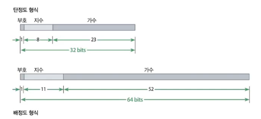
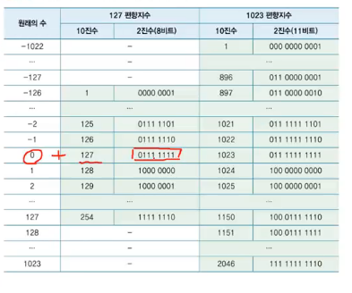

### 1.컴퓨터의 자료표현

- 10진수
  - 10 = 기수(base)
- 컴퓨터 내부 자료 표현
  - on, off 두 가지 전기 신호만을 표현 가능
  - 트랜지스터를 이용
  - 2진수 체계를 사용 (참(on) = 1, 거짓(off) = 0)
- 2진수
  - 2진수의 기수는 2
  - **라이프니츠**
    - 0과 1의 이분법을 개발
- 비트와 바이트
  - 비트(bit)
    - 컴퓨터의 정보 처리 단위 중에서 가장 작은 정보 단위
  - 바이트(byte)
    - 비트가 연속적으로 8개 모인 정보 단위 (1byte = 8bit)
  - 워드
    - 일반적으로 워드는 4byte, 총 32bit로 구성한다.
- 저장 용량
  - 바이트가 정보의 용량 단위. 킬로, 메가, 기가, 테라, 페타...
- 8진수와 16진수
  - 16진수 : 0에서 9까지 그리고 A에서 F까지
- **10진수의 소수를 2진수로 변환**
- 2진수, 8진수, 16진수간 상호관계
  - 변환이 간편
    - 정수 부분은 왼쪽으로, 소수 부분은 오른쪽으로
    - 2진수 -> 16진수 : 2진수의 4자리씩을 16진수로 변환
    - 2진수 -> 8진수 : 2진수의 3자리씩을 8진수로 변환
- 2진수의 음수 표현 : 1의 보수
  - 2진수의 음수를 표현하는 가장 **일반적인 방법은 2의 보수** 표기 방법
  - 1의 보수
    - 0100 -> 1011
    - +0은 0000, -0은 1111
- **2진수의 음수 표현 : 2의 보수**

  - 방법1
    - n비트에서 -a의 2의 보수 계산 방법 : 2^n - a
    - -4를 4비트로 2의 보수로 표현 : 2^4 - 4 = 12 = 1100(2)
  - 방법2 (우리가 아는 그 방법)
    - 음수의 절대값인 양의 정수의 이진수를 n비트에서 구한다.
      - 4의 이진수 -> 0100
    - 단계1에서 얻은 이진수의 1의 보수를 n비트에서 구한다.
      - 0100의 1의 보수 -> 1011
    - 단계2에서 얻은 이진수에 1을 더한 n비트만을 취한다.
      - 1011에 1을 더함 -> 1100
  - 방법3

    - 가장 오른쪽의 0에서 처음으로 나오는 1까지 그대로 두고 나머지 왼쪽 비트를 모두 1의 보수로 바꾸는 방법
    - 0100 -> 0 100 -> 1 100 -> 1100

- 4비트의 2진수의 표현
  - 1의 보수 단점
    - 0이 두가지로 표현되므로 -8 표현 불가능
  - 2의 보수
    - 1의 보수의 단점을 보완하고 -8에서 +7까지 표현이 가능
- 2진수의 표현 : 최상위 비트(MSB)
  - 부호 비트(sign bit)
    - 보수 표현에서는 MSB가 부호를 나타내므로 부호비트라고도 부름
    - 2의 보수에서 모든 음수는 4비트의 가장 왼쪽 비트가 1
- 부호가 있는 정수 표현
  - 8비트의 메모리 : 2^8(256)의 정보를 표현 가능
  - n개의 비트로 정수의 양수와 음수를 모두 표현. -2^(n-1)에서 +2^(n-1)-1까지 표현 가능
- 부호가 없는 정수 표현 (unsigned)
- 오버플로우
  - n비트의 메모리에 표현 범위를 초과하는 수의 값을 저장하는 경우
- 부동소수점 수와 정규화

  - 부동소수점 수(floating point number)
  - 정규화(normalization)
    - 10진수의 실수 352.45는 3.5245 x 10^2으로도 표현이 가능
    - 정규화는 실수의 소수점을 이동
      - 소수점 왼쪽에 단 하나의 자릿수가 오도록 하고
      - 소수점의 원래 위치는 진수의 지수로 표현하는 방법
      - 314.1592 = 3.141592 x 10^2
    - 부동 소수는 수의 소수점의 위치를 움직일 수 있게 한다는 의미

- 정규화에서 지수와 가수

  - 소수 부분 = 가수, 지수 부분 = 지수
    - 가수 : 수의 정밀도
    - 지수 : 수의 크기
  - 부동소수의 표현

    - 부호부, 지수부, 가수부로 나누어 이진 표현으로 저장

      - 2진수 실수 : 101.11
      - 정규화 : 1.0111 x 2^2
      - 부호 : 0(+)
      - 지수 : 2
      - 가수 : 0111

- 부동소수의 저장 표현
  - 단정도 형식 : 32비트, 배정도 형식 : 64비트
  - 부호부 : 양수이면 0, 음수이면 1이 저장
  - 지수부 : 단정도에서는 127 초과 이진수로, 배정도에서는 1023 초과 이진수로 지수를 저장
  - 가수부 : 부동소수의 가수를 왼쪽부터 저장하고, 오른쪽 나머지 비트는 모두 0으로 채움 
- 지수를 표현하는 편향지수
  - 단정도에서는 127 편향지수, 배정도에서는 1023 편향지수 사용
  - 127 편향지수
    - 원래의 수에 127을 더하고, 그 수를 이진수로 표현한 수
  - 1023 편향지수
    - 원래의 수에 1023을 더한 수를 이진수로 표현한 수
  - 
- 부동소수점 수로의 변환

  - 10진수 5.625가 메모리에 저장된 단정도 형식

    - 5.625를 2진수로 변환하면 101.101
    - 정규화를 하면 +1.01101 x 2^2
    - 부호 : + => 부호부 : 0
    - 지수 : 2 => 지수부 : 2+127인 129의 이진표현 10000001 (지수 2의 127 편향지수)
    - 가수 : 01101 => 가수부 : 01101에 나머지 오른쪽 18개 비트가 모두 0으로 채워진 이진 표현

    > 0 10000001 01101000000000000000000  
    > 컴퓨터는 이 수를 5.625로 표현

- 부동소수의 저장 표현
  - 10진수 0.15625를 2진수로 변환하면 0.00101이며, 이것을 정규화하면 1.01 x 2^-3
  - 부호 : + => 부호부 : 0
  - 지수 : -3 => 지수부 : 127 편향지수로 계산하면 124의 이진수 01111100
  - 가수 : 01 => 가수부 : 01 이후에 나머지 21개 비트를 모두 0으로 채움

### 4.문자와 논리 표현

- 문자와 코드표
  - 컴퓨터에서 문자는 하나의 정해진 수로 표현. C는 1000011, O는 1001111
  - 영문자는 7개의 비트의 조합으로 표현
  - 국제 표준인 문자 코드 <아스키코드, 유니코드>
- 아스키코드
  - **7비트를 사용**.
  - **실제로 한 문자를 8비트**인 1바이트에 저장
    - **시작은 0**으로, 나머지는 코드 값으로 구성
- 유니코드
  - 세계의 문자를 모두 표현하기 위해 **2바이트**, 16비트로 확장
- 논리표현
  - 0 : off, false
  - 1 : on, true
  - 부울대수

### 5.컴퓨터의 연산

- 정수 연산

  - 정수의 덧셈 : 정해진 비트를 넘어서는 올림은 무시
  - 정수의 뺄셈 : 2의 보수 표기를 이용

- 논리 연산자
  - NOT, AND, OR
  - 단항 연산자 : NOT / 이항 연산자 : AND, OR
- 논리 연산 법칙
  - 흡수 법칙 : x + (x \* y) = x, x \* (x + y) = x
- 논리함수
- 논리 회로 설계
  - 게이트
