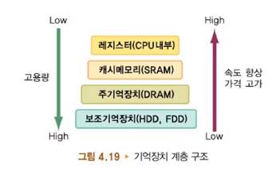
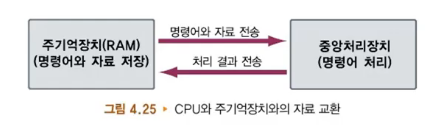

### 1.폰 노이만의 저장 프로그램

- 프로그램 내장 방식 (저장 프로그램 방식)
  - 메모리에 자료와 프로그램이 함께 저장
  - 폰 노이만이 고안
  - CPU : 저장된 명령을 순차적으로 실행
- 명령어 형식
  - 명령어는 연산 부분과 피연산 부분으로 구성
    - 연산부분은 명령어가 수행해야 할 기능을 의미하는 코드
    - 피연산 부분은 연산에 참여하는 자료를 의미하는 코드
  - 명령어가 16비트로 구성
    - 4비트는 연산 종류 (opcode)
    - 12비트는 피연산자의 메모리 주소
    - 피연산자 수는 없거나 2개 또는 3개
- 명령어 종류
  - 연산자
    - ADD, LDA, STA, HLT 등의 기호 단어를 이용
  - 피연산자
    - A, B, C 등으로 기술
  - ADD A, LDA B, STA C, HLT 등으로 사용
- 저급 언어
  - 기계어
    - 컴퓨터가 알아듣는 언어는 기계어(0과 1로 이루어진)밖에 없다.
  - 어셈블리어
    - 자연 언어와 유사하게 만든 언어 (ADD A, HLT 등)

### 2.다양한 기억장치

- 주기억장치
  - 명령어와 자료를 저장
  - 구조
    - 주소
    - 버스 (주소버스, 자료버스, 제어버스)
      - 관련 자료 전달 경로
- 주기억장치 RAM
  - **소멸성** 기억장치 (휘발성 메모리)
  - DRAM, SRAM
- 기억장치 ROM
  - 읽기만 가능한 메모리
  - 비소멸성 메모리 (비휘발성 메모리)
  - Mask ROM, PROM, EPROM
- BIOS
  - 컴퓨터의 부팅을 위한 펌웨어
  - 컴퓨터의 전원이 연결되면 바이오스는 먼저 POST 실행
  - POST 과정에서 아무 문제가 없다면 운영체제를 컴퓨터의 메모리인 RAM에 로드
- 캐시 메모리
  - 주변기기의 속도를 빠르게 함
  - 주기억장치와 CPU의 속도의 차이를 해결
  - 저장 속도가 빠르고 고가인 SRAM을 이용
  - 수준1 캐시, 수준2 캐시, 디스크 캐시(임시메모리)
- 보조기억장치
  - 순차접근 방식
  - 직접접근 방식
  - HDD
- HDD를 보완하는 SSD
  - HDD에 비해 읽고 쓰는 속도가 빠르며 전력 사용량이 적고 충격에 강하며 발열과 소음도 적음
- 휴대가 간편한 외장하드와 USB 메모리

  - 외장하드
  - 플래시 메모리
    - RAM과 ROM의 장점을 합친 메모리
    - 소비전력이 적고, 비휘발성 메모리
    - TV, 캠코더, 휴대전화 등
  - USB 메모리
    - 휴대용으로 가장 많이 사용

- 저장장치의 계층
  - **기억장치 계층**의 필요
    - 저장장치의 속도와 용량, 가격과 그 쓰임새를 고려
    - 저장장치의 속도가 빠르면 가격이 비쌀 것이고, 또한 동일한 비용으로 속도를 유지하려면 용량은 작아져야 함.
    - 

### 3.중앙처리장치 CPU

- 중앙처리장치
  - 연산장치, 제어장치, 레지스터, 버스
- 연산장치(ALU)
  - 산술연산과 논리연산을 수행하는 회로
  - 누산 레지스터(Accumulator)와 자료 레지스터(Data Register)에 저장된 자료를 연산에 참여할 피연산자로 이용
- 제어장치(control unit)
  - 연산장치와 레지스터가 명령을 수행하게 함
- 레지스터
  - **임시 기억장소**
  - 레지스터의 종류
- 명령어 처리 과정
  - 
- 기계주기
  - 중앙처리장치는 하나의 명령어를 실행하기 위하여 **인출, 해독, 실행**의 세 과정을 거침
