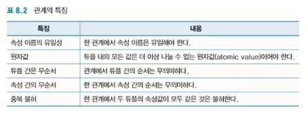

### 1. 데이터베이스 개요

- 데이터베이스 개요
  - 데이터는 **단순한 사실**에 불과한 **아직 처리되지 않은** **값**
  - 데이터와 정보
    - 데이터가 사람에게 유용한 의미로 쓰여질 수 있도록 처리되면 정보
    - 데이터 : 값, 사실, 처리되지 않은
    - 정보 : 데이터를 가공 처리한 결과
  - 데이터베이스 정의
    - 데이터베이스는 간단히 '관련 있는 데이터의 저장소'
    - 서로 논리적으로 연관되어 통합 관리되는 데이터의 모임
  - 특징
    - 데이터베이스는 **통합**된 **관련** 있는 데이터
    - **중복을 최소화**하여 보조기억장치에 저장
      
    - 학년 입력하는데 0으로 하면 무결성에 어긋남
- 데이터베이스 관리시스템
  - 데이터베이스 관리시스템 : DBMS는 사용자가 데이터베이스를 만들고, 유지 관리 할 수 있도록 돕는 프로그램
  - 데이터베이스 관리시스템
    - DBMS : Database Management System
    - 데이터와 응용 프로그램 사이에서 중재 역할로서 모든 프로그램들이 데이터베이스를 유용하게 활용할 수 있도록 관리해 주는 소프트웨어
    - 데이터베이스
      - 관련 있는 데이터의 **저장소**
    - 데이터베이스 관리시스템
      - 데이터베이스를 관리하는 **소프트웨어**

### 2. 데이터베이스 구조

- 필드와 레코드
  - 특정한 종류의 데이터를 저장하기 위한 영역을 필드라함
  - 필드
    - 특정한 종류란 그 필드에 저장될 수 있는 데이터의 종류
      - 데이터 유형
    - 사람에 대한 이름, 학번, 생년월일, 주소
      - 이름, 학번, 생년월일, 주소와 같이 논리적으로 의미 있는 자료의 단위가 필드
      - 이름 필드에는 문자열이 저장되어야 하므로 이름 필드의 자료 유형은 문자열 유형
      - 학번의 자료 유형은 정수
  - 레코드
    - 필드에는 실제 자료 값이 저장되며 이러한 **필드가 여러 개 모이면 하나의 레코드**가 됨
- 파일과 데이터베이스
  - 여러 개의 레코드가 모여 하나의 파일, 파일이 여러 개 모여 데이터베이스 구성
  - 데이터베이스
    - 서로 관련 있는 데이터들로 통합한 파일의 집합
    - 파일 1과 또 다른 정보를 저장하는 여러 파일이 모여서 만들어진 데이터베이스를 표현
    - 데이터베이스를 구성하는 하나의 파일인 파일1
      - 학번, 이름, 학과, 주소와 같이 동일한 형태의 필드 집합을 가지면
    - 파일 n과 같은 다른 파일은 그 파일의 고유한 다른 형태의 필드 집합을 가짐
    - 필드 < 레코드 < 파일 < DB
- 데이터베이스 추상화
  - 데이터베이스를 보는 관점인 뷰(view)를 세 단계로 추상화 시켜 가능한 수준을 바라보는 뷰만을 인지
  - 데이터베이스 추상화의 세 가지 단계
    - 물리적 단계 (physical level)
    - 논리적 단계 (logical level)
    - 뷰 단계 (view level)
  - 스키마
    - 데이터베이스의 전체적인 설계
    - 데이터베이스를 구성하는 정보의 종류와 관계의 구체적인 기술
- 추상화의 세 가지 단계
  - 물리적 단계에는 하나의 물리 스키마, 논리적 단계에는 하나의 논리 스키마, 뷰 단계에는 여러 개의 서브 스키마가 각각 대응
  - 물리적 단계 : 내부 단계 (internal level)
    - 저장 장치의 내부에 실질적으로 데이터가 저장될 구조와 위치를 결정
    - 하위 수준의 접근 방식을 다루고 바이트들이 어떻게 저장 장치로부터 변환이 되는지 다룸
    - 하드웨어와 직접적인 상호 작용을 다룸
    - 데이터베이스의 물리적 구조를 기술한 것으로 하위 데이터 모델을 통해 표현
  - 논리적 단계 : 개념 단계 (conceptual level)
    - 데이터베이스에 저장될 데이터의 종류와 데이터 간의 관계를 기술
    - 논리 스키마는 복잡한 데이터베이스의 내부 구조를 알 필요 없이 비교적 간단한 데이터 구조로 전체 데이터베이스를 기술
  - 뷰 단계 : 외부 단계 (external level)
    - 추상화의 최상위 단계, 사용자와 직접적인 상호작용
    - 논리적 단계에서 나온 데이터를 사용자에게 친숙한 형태의 뷰(테이블)로 변환하여 사용자에게 제공
    - 서브 스키마 또는 외부 스키마
      - 사용자마다 다른 뷰에서 본인의 관심인 데이터베이스의 일부분을 정의한 것
- 데이터 독립성
  - 데이터베이스의 추상화 과정에서 상위 수준의 스키마 정의에 영향을 주지 않고 해당 스키마 정의를 수정할 수 있는 능력을 데이터 독립성
  - 논리적 데이터 독립성
    - 사용자의 응용프로그램 자체에 영향을 주지 않고 논리적 단계에서의 논리 스키마를 수정할 수 있는 능력
  - 물리적 데이터 독립성
    - 사용자의 응용프로그램 자체나 데이터베이스의 논리 스키마에 영향을 주지 않고 데이터의 물리적 스키마를 수정할 수 있는 능력

### 3. 데이터베이스 모델

- 데이터베이스 모델

  - 데이터베이스 모델은 데이터의 논리적 설계와 그들 간의 관계를 표현
  - **계층적 모델** (hierarchical model)
    - 데이터는 위에서 아래로 **트리 형태**로 구성
    - 각 엔터티(entity)는 하나의 부모만을 가짐
  - **네트워크 모델** (network model)
    - 네트워크 모델은 레코드와 레코드 간의 관계를 서로 연결하는 **그래프**를 사용하여 표현
  - **관계형 모델** (relation model)
    - 데이터를 행과 열로 구성된 이차원 테이블의 집합으로 표현한 모델
    - 수학적 기초에 기본을 두고 있으며 현재 가장 널리 활용되는 관계형 데이터베이스 (relational database)의 데이터 모델

### 4. 관계형 모델

- 관계형 모델
  - 관계형 모델은 데이터를 행과 열로 구성된 이차원 테이블의 집합으로 표현한 모델
  - 관계의 구조
    - 관련성을 표현한 이차원 테이블을 관계 (relation)
    - 관계 스키마
      - 관계의 구조를 정의
        - 관계 이름인 학생
        - 학생 속성 구성인 [학생(학번, 이름, 학과, 주소, 지도교수)]
      - 정적인 특성
        - 관계 이름과 속성 이름이 처음에 한번 결정되면 시간의 흐름과 관계없이 동일한 내용이 계속 유지
    - 관계 사례(인스턴스)
      - 관계 스키마에 삽입되는 실제 데이터 값
      - 실제로 관계 내부에 삽입된 하나의 자료 : (2000003, 김근태, 001, 인천, 0002)
      - 동적인 특성 : 시간이 변함에 따라 실제 사례 값이 변함
- 속성과 튜플
  - 속성과 튜플은 DBMS에서 각각 열과 행을 의미
  - 속성 (속성, 애트리뷰트, 필드, 열, 컬럼)
    - 관계에서 각 열을 속성 (attribute)
    - 실제 데이터베이스에서는 필드
      - DBMS에서는 열(column)이라고 표현
  - 튜플 (튜플, 행, 로우, 레코드, 릴레이션, 인스턴스)
    - 하나의 관계에서 각 행을 튜플(tuple)
    - 관계에서 정의된 모든 속성 값들의 집합
    - 실제 데이터베이스에서는 레코드
      - DBMS에서는 행(row)이라고 표현
    - 도메인
      - 하나의 속성이 취할 수 있는 모든 값의 범위를 의미
  - 관계의 특징
    - 중복된 튜플은 불가
    - 원자 값(atomic value) - 튜플 내의 모든 값은 더이상 나눌 수 없는 값이어야 함
      
- 키
  - 키(key)는 관계에서 튜플들을 유일(uniqueness)하게 구별할 수 있는 하나 이상의 속성의 집합
  - 다양한 키의 종류
    - 후보키 (candidate key)
      - 하나의 관계에서 **유일성**과 **최소성**(minimality)을 만족하는 키
    - 주키 (primary key)
      - 주키는 관계에서 여러 튜플 중에서 하나의 튜플을 식별하는 역할을 수행
    - 외래키 (foreign key)
      - 외래키는 어느 관계의 속성들 중에서 일부가 다른 관계의 주키가 될 때, 이 키를 외래키라 함
      - 이 외래키를 이용하여 관계와 관계를 서로 연결할 수 있음
- 관계에 대한 연산 : 삽입
  - 삽입 연산은 관계에 하나의 튜플을 삽입(insert)하는 연산
  - Insert
    - 관계에서는 튜플의 순서는 의미가 없으므로 삽입되는 튜플의 순서는 상관하지 않음
    - 학생 관계에 튜플 (20073007, 김납훈, 19891018, 010-5948-2875)을 삽입한 결과
- 관계에 대한 연산 : 삭제
  - 삭제 연산은 관계에서 관련된 튜플을 삭제(delete)하는 연산
  - Delete
    - 학생 관계에서 핸드폰 번호가 011으로 시작하는 튜플을 삭제하는 연산을 실행
- 관계에 대한 연산 : 수정
  - 수정 연산은 관계에서 관련된 속성 값을 수정(update)하는 연산
  - Update
    - 학생 관계에서 학번이 20153004인 학생에 대한 생년월일을 19961010으로 수정하는 연산
- 관계에 대한 연산 : 조회
  - 관계에서 관련된 튜플에서 부분 집합의 튜플과 속성으로 구성된 새로운 관계를 생성하는 연산
  - Select
    - 주어진 관계에서 튜플을 선택하기 위하여 관계의 특정 속성만을 지정 가능
    - 학생 관계에서 태어난 년도가 1996년인 학생의 학번, 이름, 생년월일을 조회하는 연산을 실행

### 5. 데이터베이스 관리 시스템

- 데이터베이스 관리 시스템 정의와 구성
  - DBMS가 제공해야 하는 여러 기능을 수행하는 단위 프로그램으로 저장 관리자(Storage Manager), 질의 처리기(Query Processor), DBMS 인터페이스 도구(DBMS Interface Tool) 등으로 구성
  - 데이터베이스 관리 시스템
    - DBMS : Database Management System
      - 데이터베이스를 정의
      - 데이터베이스를 구축
      - 데이터베이스를 조작
      - 데이터베이스를 제어
    - 데이터베이스에서 정보를 쉽게 활용할 수 있도록 만든 프로그램이자 소프트웨어
  - DBMS 구성
    - 저장 관리자 (Storage Manager)
    - 질의 처리기 (Query Processor)
    - DBMS 인터페이스 도구 (DBMS Interface Tool)
- MySQL과 오라클
  - 기업용 DBMS로 가장 널리 활용되는 Oracle, 공개 DBMS인 MySql, 그리고 중소 규모에서 널리 활용되는 마이크로소프트의 MS SQL Server
  - MySql
    - MySQL은 대표적인 오픈 소스 DBMS 제품
    - MySQL은 원래 mSQL이라는 DBMS에서 기반이 되어 새로 개발된 DBMS
  - 오라클
    - 1977년 설립된 오라클(Oracle)사가 개발한 오라클은 세계적으로 가장 성공한 DBMS의 한 제품
- SQL 서버
  - 마이크로소프트사의 SQL 서버 (SQL Server)는 인텔 기반의 서버용 컴퓨터에서 널리 사용되는 DBMS
  - SQL 서버
    - 원래 사이베이스(Sybase)사의 DBMS 엔진을 윈도우 NT에 탑재하면서 시작
    - 버전 4.2까지 사이베이스와 공동 개발
    - 마이크로소프트 사는 사이베이스의 제품을 완전히 사들여 독자적으로 DBMS의 내부 커널을 재설계하여 SQL 서버 6.0을 발표함
- ODBC
  - ODBC는 데이터베이스를 사용하기 위해 마이크로소프트가 만든 표준 개방형 응용 프로그램
  - ODBC(Open Database Connectivity)
    - DBMS의 종류와 관계없이 어떤 응용 프로그램에서나 모두 접근하여 사용할 수 있도록 하기 위하여 마이크로소프트에서 개발한 데이터베이스 표준 접근 방법
    - 장점
      - ODBC API(Application Programming Interface)를 제공하여 데이터베이스 개발을 더 쉽게 가능하게 함
      - ODBC를 사용하면 여러 종류의 데이터베이스를 함께 사용 가능
      - 기존에 사용하던 데이터베이스를 교체하더라도 응용 시스템을 계속해서 사용할 수 있어 비용을 절감
- 임베디드 DBMS
  - 스마트폰, 태블릿과 같은 다양한 모바일 기기의 보급에 따라 모바일 기기에 기본적으로 탑재되는 작지만 빠른 개인용 임베디드 데이터베이스
  - SQLite
    - 데이터베이스 엔진을 위한 소프트웨어 라이브러리로 소스도 공개되어 있고 무료로 사용
    - 리차드 힙이 2000년에 DBMS를 사용하지 않고 활용할 수 있는 데이터베이스 엔진으로 개발
      - C로 구현되어 용량이 작고 가벼우면서도 안정적
      - 서버가 따로 필요하지 않아 임베디드 데이터베이스로 많이 활용
    - 세계에서 가장 널리 배포된 SQL 데이터베이스 엔진
      - iOS와 안드로이드 등 모바일 환경에 많이 내장되어 사용
