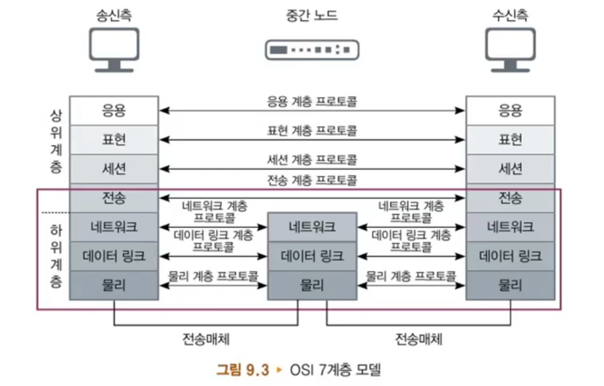
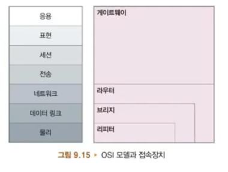
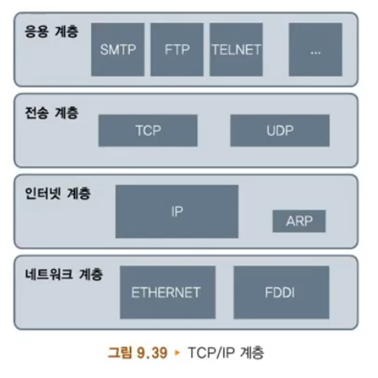
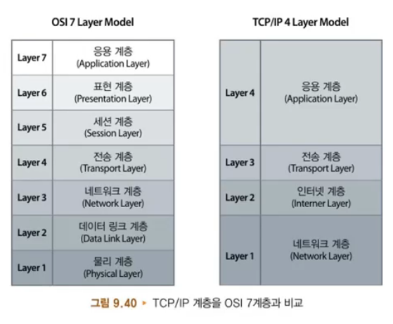

### 1. 네트워크 개요

- 컴퓨터 네트워크

  - 전송매체에 의해 연결된 컴퓨터들이 상호 간에 정보를 교환하는 시스템
  - 컴퓨터 네트워크
    - 송신자, 수신자, 전송매체
  - 전송매체
    - 케이블, 무선
  - **프로토콜**
    - 통신을 하는 두 개체간에 데이터를 전송할 때 무엇을 어떻게 어떠한 방식으로 교신할 것인가 하는 것을 정한 절차 또는 규약
    - 프로토콜 종류
      - TCP, IP, UDP, HTTP

- 전화통신망

  - 최초의 전기 통신은 1837년 사무엘 모스가 발명한 모스(Morse) 부호이며, 1876년 알렉산더 벨(Bell)이 전화 발명
  - 전화망은 기본적으로 아날로그 신호를 전송
    - 전달 거리가 길어지면 신호가 약해져 증폭기(amplitude) 필요
    - 초기의 컴퓨터 네트워크는 이러한 전화망을 사용
  - 초기에는 전화기를 일대일로 연결
    - 일대일 연결은 회선 수가 증가하여 비용이 많이 들고 비효율적
    - 1978년 처음으로 교환기가 등장
    - 우리나라는 1895년 최초의 교환기 설치, 1902년 서울, 인천간 전화 개통

- 컴퓨터 네트워크

  - 컴퓨터를 이용하여 네트워크를 구성한 역사는 그렇게 길지 않으며, 1960년대에는 하나의 컴퓨터에 여러 개의 터미널
    을 연결한 초보적인 방식이 사용
  - **ARPANET**(Advanced Research Projects Agency Network)
    - 1969년 미국 국방성에서는 미국 내 여러 곳에 분산되어 있는 프로젝트의 자원을 공유하고 전송할 수 있는 ARPANET 만듦 (군사적 목적)
  - SNA(System Network Architecture)
    - 1972년 IBM
  - **Ethernet**
    - 1974년 제록스(Xerox)
  - NSFNET
    - 1986년에는 NSF(National Science Foundation)가 그들의 네트워크인 NSFNET을 ARPANET에 연결함
  - TCP/IP
    - 1982년 인터넷 프로토콜로 사용되는 TCP/IP가 만들어짐
    - WWW
      - 1992년에는 인터넷의 급격한 확산을 가져온 WWW 개발

- OSI 모델

  - 국제표준화기구인 ISO(International Organization for Standardization)에서 만든 국제표준 모델
  - **OSI**(Open Systems Interconnect) 모델
    - 1978년에 국제표준화기구인 ISO(International Organization for Standardization)에서 서로 다른 두 가지 시스템이 통신을 할 수 있도록 국제 표준인 OSI 모델을 제정
  - 7계층
    - 물리(1계층), 데이터 링크(2계층), 네트워크(3계층), 전송(4계층), 세션(5계층), 표현(6계층), 응용(7계층)
      - 7개 계층은 서로 간에 독립적 : 어느 한 계층의 변경이 다른 계층에 영향을 미치지 않음
    - 네트워크 장치들은 7개의 계층 중 기능에 따라 필요한 몇 개의 계층만을 표준화에 따르면 정상적인 통신

- 팁: OSI 7계층 모델 암기법

  - 펭귄은 아무도 펩시를 마시지 않는다고 말했다(A-Penguin-Said-That-Nobody-Drinks-Pepsi)
  - 모든 사람은 데이터 처리가 필요한 듯 하다.
    - All-People-Seem-To-Need-Data-Processing
      

- 물리, 데이터링크, 네트워크, 전송 계층

  - OSI 7계층 중 1~4 계층
  - 물리 계층 (physical layer)
    - 전송 매체로 비트(bit)들을 전송하는 기능
    - 물리적인 네트워크 장치들의 기계적이고 물리적인 사양은 이 물리 계층에 의해 결정
  - 데이터링크 계층 (data link)
    - 비트들을 프레임(frame)이라는 논리적인 단위로 구성
    - 전송하려는 데이터에 인접하는 노드의 주소가 더해짐
    - 물리 계층에서 발생할 수 있는 오류를 검출하고 복구하는 오류 제어 기능
  - 네트워크 계층
    - 데이터의 발신지와 목적지 간의 패킷이 전송되는 경로를 책임
    - 논리 주소인 IP주소를 헤더에 포함하여 전송
  - 전송 계층 (transport)
    - 메시지가 발신지에서 목적지까지 실제 전송되는 것을 책임
    - 네트워크 계층에서는 각 패킷의 전송을 책임지는 반면에 전송 계층에서는 전송하려는 전체 메시지의 전달을 책임

- 세션, 표현, 응용 계층

  - OSI 7계층 중 5~7계층
  - 세션 계층 (session)
    - 전송하는 두 종단의 프로세스(process) 간의 접속(session)을 설정하고, 유지하고 종료시켜주는 역할
    - 세션을 연결하고 관리하고 동기화
    - 데이터의 단위를 전송 계층으로 전송하기 위한 순서를 결정하고 데이터에 대한 점검 및 복구를 위한 동기를 위한 위치를 제공
  - 표현 계층
    - 전송하는 정보의 표현 방식을 관리하고 암호화하거나 데이터를 압축하는 역할
    - 전송하려는 메시지를 수신자가 이해할 수 있도록 정의된 형식으로 변환
  - 응용 계층 (application)
    - 7개의 계층 중 가장 상위의 계층
    - 네트워크 가상터미널이나 파일의 전송, 우편서비스, 디렉토리 서비스 등을 응용 계층에서 책임

- 전송매체

  - 모든 네트워크에서는 송신자와 수신자를 서로 연결해 주는 전송매체가 필요하며, 각각의 전송매체는 대역폭, 전송 지연 등과 같은 고유한 특성을 지님
  - 대역폭(bandwidth)
    - 전송매체를 지나는 신호의 최대 주파수와 최저 주파수의 차이
    - 대역폭이 높을수록 단위 시간당 더 많은 데이터 전송 가능
  - 꼬임선(twisted pair)
    - 플라스틱으로 덮여진 두 가닥의 구리선을 나선형으로 꼬아서 만든 전송매체

- UTP(Unshielded Twisted Pair)
  - 플라스틱으로 덮여진 코팅 이외에 외부로부터의 차단이 없이 만든 것
- STP(Shielded Twisted Pair)
  - 은박지 등 금속형 물질로 한 번 더 싼 것
- 동축케이블(Coaxial cable)

  - 중앙의 전도체와 별도로 이를 감싸고 있는 절연체 밖에 또 하나의 전도체가 있음
  - 높은 대역폭과 빠른 데이터 전송을 할 수 있으나 비용이 다소 비쌈
    - 외부 신호에 대한 차단이 우수하고, 전자기파를 차단
    - 동축케이블은 유선 방송, CATV, 근거리 통신망 등에서 널리 사용

- 전송매체의 종류: 광섬유와 위성

  - 광섬유(optical fiber)는 꼬임선처럼 구리선에 전기를 통해 데이터를 전송하는 것이 아니라 머리카락보다 가는 **유리섬유**를 통해 광선을 전송

- 광섬유(Optical fiber)
  - 광선은 전기 신호보다 훨씬 고속으로 전송
    - 데이터를 아주 고속으로 전송할 수 있어 10Gbps 이상의 속도도 냄
  - 전자기파의 간섭을 거의 받지 않고 대역폭도 아주 큼
  - 다른 통신 장치로 인한 신호 간섭이 없어서 보안성에서도 다른 전송매체에 비해 우수
- 위성(Satellite)
  - 위성에 트랜스폰더(transponder)가 탑재되어 있어서 두 개의 지상국 사이의 신호를 전달해 주는 중계소 역할
  - 우리나라에서는 1995년 무궁화위성 1호를 시작으로 1999년 무궁화위성 3호를 발사하여 방송과 통신용으로 사용

### 2. 네트워크 장치와 교환방식

- 네트워크의 접속장치: 모뎀

  - 모뎀(Modem)은 디지털 신호를 아날로그 신호로, 아날로그 신호를 디지털 신호로 변환시켜 주는 장비
  - 모뎀(Modem)
    - 컴퓨터로 통신을 하는 초기에는 기존에 깔려 있는 전화망을 사용하여 컴퓨터 통신에 이용
    - 전화망은 음성과 같은 아날로그를 전송하기 때문에 전화망으로 컴퓨터 통신을 하기 위해서는 아날로그 신호를 디지털 신호로 변환하는 과정이 필요
  - 변조(Modulation)
    - 모뎀은 컴퓨터의 디지털 신호를 아날로그로 변환
  - 복조(Demodulation)
    - 아날로그 신호를 디지털 신호로 복원해 주는 기능

- 네트워크 인터페이스 카드와 허브

  - 네트워크 인터페이스 카드(NIC: Network Interface Card)는 흔히 **랜(LAN) 카드**, 이더넷(ethernet) 카드라고 부르는데 컴퓨터와 외부의 네트워크를 연결해 주는 장치
  - 네트워크 인터페이스 카드(NIC)
    - 모뎀이 아날로그 신호를 전송하는 전화선을 연결하는 것과는 달리 디지털 신호를 직접 전송
  - 허브
    - 여러 곳으로부터 들어온 데이터를 그대로 다른 여러 곳으로 데이터를 보내는 역할
    - 더미 허브(dummy hub)
      - 단순히 들어온 데이터를 네트워크에 있는 다른 컴퓨터로 전달
      - 전체 대역폭을 각 호스트가 분할하여 사용하기 때문에 호스트가 증가하면 속도 저하
    - 스위칭 허브(switching hub)
      - 단순히 전달하는 기능을 넘어 목적지 주소로 스위칭하는 기능을 가짐
      - 네트워크의 효율이 훨씬 높아짐 : 가격이 비쌈

- 리피터와 브리지

  - 리피터(repeater)는 네트워크의 전송 거리를 연장하기 위하여 사용되는 장치이며, 브리지(bridge)는 두 개 이상의 LAN을 서로 연결하여 하나의 네트워크로 만들어 주는 기기
  - 리피터(repeater)
    - 리피터는 전송 도중 약해진 신호를 다시 생성하여 전송 (증폭기)
  - 브리지(bridge)
    - 프레임의 주소를 보고 같은 LAN에 포함되어있는 주소의 프레임은 받아들임
    - 다른 LAN으로 보내야 할 것들은 브리지를 통해 해당하는 LAN으로 보냄
    - 전체 네트워크의 트래픽을 줄여 줌

- 라우터

  - 라우터(router)는 LAN 등과 같은 네트워크를 서로 연결하여 주는 장비
  - 라우터(router)
    - 라우터는 패킷의 논리주소(IP주소)에 따라 패킷을 라우팅
    - **네트워크의 연결 기능**을 라우터가 담당
    - 라우팅(routing)
      - 라우터는 라우터로 수신되는 패킷의 목적지 인터넷 주소를 보고 다음 경로를 결정

- 게이트웨이

  - 게이트웨이(gateway)는 다른 네트워크로 들어가는 입구 역할을 하거나, 나가는 출구 역할을 하는 네트워크의 연결점
  - 게이트웨이(gateway)
    - 프로토콜 변환기의 역할
      - 서로 다른 프로토콜의 두 개의 네트워크를 서로 연결
    - 현대에는 게이트웨이와 라우터를 서로 혼용하여 사용
      

- 회선 교환방식

  - 송신자와 수신자가 결정되면 여러 회선 중에서 적당한 경로를 설정
  - 회선 교환방식
    - 회선 : 설정된 경로의 집합
    - 회선이 설정되어 해제되기 전까지 데이터를 전송하지 않을 때에도 다른 컴퓨터들이 이 회선을 이용할 수 없으므로 **회선의 이용률 측면에서는 불리**
    - 한 번 설정되어 전송을 시작하면 다시 경로를 찾기 위한 노력이 필요 없으므로
      - 음성과 같은 실시간 데이터를 전송하는데 적합
      - 독점해서 사용하기 때문에 대량의 데이터를 고속으로 전송
    - 대표적인 예는 전화망

- 패킷 교환방식
  - 고정된 경로가 미리 설정되지 않고, 전송은 패킷 단위로 독립적
  - 패킷 교환방식
    - 각 패킷들은 네트워크의 트래픽 상태 등에 따라 각기 다른 전송 경로
    - 고정된 경로를 설정하지 않으므로
      - 동일한 경로를 다른 목적지로 가는 여러 패킷들이 공유하므로 통신회선을 보다 효율적으로 사용
  - 대표적인 경우 - 인터넷

### 3. 네트워크 분류

- LAN

  - LAN은 비교적 근거리에 있는 장치들을 연결하여 구성한 네트워크
  - LAN(Local Area Network)
    - 좁은 지역에 설치되어 있는 컴퓨터, 프린터, 기타 네트워크 장비들을 연결하여 구성한 네트워크
      - 비교적 가까운 거리지만 개념적으로 하나의 조직이 관리하는 지역
      - 한 회사의 건물이나 공장, 반경이 수백 미터 또는 수 킬로미터가 되는 대학의 캠퍼스 등에 설치된 네트워크
    - 초기에는 주로 10~100Mbps의 이더넷(ethernet)을 사용
    - 최근에는 보다 빠른 전송의 필요성에 따라 기가비트 이더넷, ATM, FDDI, 무선랜과 같은 다양한 네트워크가 사용

- LAN의 특징 및 표준

  - LAN은 통신 품질이 비교적 우수하고 전송속도도 빠른 편
  - **특징**
    - 전송지연 시간이 적고, 좋은 품질의 통신회선을 사용하고 관리
      - 비교적 통신 품질이 우수하며, 전송 시의 오류가 아주 낮고, 전송속도도 빠른 편
    - 컴퓨터뿐만 아니라 프린터 등과 같은 장치들을 쉽게 연결하여 사용할 수 있고 확장도 용이
  - LAN의 표준
    - 이더넷(ethernet)
      - 1976년 Xerox 사에서 개발
      - 10Mbps의 속도, CSMA/CD 알고리즘
    - 고속 이더넷(fast ethernet)
      - 100Mbps의 속도, 100BASE-T
    - 기가비트 이더넷(gigabit ethernet)
      - 1Gbps
    - FDDI(Fiber Distributed Data Interface)
      - 보통 전송매체로 광섬유(optical fiber)를 사용하여 고속의 LAN을 구현할 수 있음.
      - 많은 대역폭과 빠른 전송이 필요한 백본망(backbone network)에 많이 사용

- MAN

  - MAN(Metropolitan Area Network)은 LAN보다 좀 더 넓은 범위의 네트워크
  - MAN(Metropolitan Area Network)
    - LAN이 확장되거나 연결되어서 하나의 마을이나 도시를 연결하는 네트워크
    - 통신사업자가 이를 제공하고 관리
  - 전화 사업자들의 MAN 서비스
    - SMDS(Switched Multimegabit Data Services)를 제공

- WAN

  - WAN은 하나의 국가나 국가와 국가 간을 연결하는 네트워크
  - WAN(Wide Area Network)
    - 아주 넓은 범위의 네트워크
      - 가장 대표적인 WAN이 전 세계를 연결하는 인터넷
    - 일반적으로 WAN은 LAN에 비해 상대적으로 먼 거리를 연결
      - 네트워크를 구축하는데 많은 비용
    - 속도는 LAN에 비해 저속

### 4. 네트워크 활용 및 이해

- 회사에서 네트워크 설정

  - TCP/IP에서 고정 IP 주소 설정방법
  - 고정 IP 설정
    - 메뉴 [제어판]-[네트워크 및 인터넷]-[네트워크 및 공유센터]-[어댑터 설정 변경]-[로컬 영역 연결]의 속성
      - “Internet Protocol Version4(TCP/IPv4)”의 속성

- IP 주소

  - 인터넷으로 연결된 모든 컴퓨터 및 네트워크 장치들은 유일한 IP 주소를 가져야 함
  - IP 주소
    - 유일한 IP 주소
      - 인터넷에 연결된 세계의 다른 컴퓨터도 이와 동일한 IP 주소를 가져서는 안 된다는 뜻
      - 네 자리의 수로 모두 8 \- 4 = 32 bit
    - 구조
      - 네 자리의 수 중에서 앞의 두 자리 또는 세 자리는 네트워크의 주소
        : 나머지 수는 해당 네트워크 내에서 컴퓨터의 주소
      - 147.46.X.X는 네트워크 주소가 147.46.0.0으로
        : 그 네트워크 안에 모두 약 216개의 컴퓨터를 가질 수 있다는 뜻
      - 어떤 회사의 주소가 203.246.245.X 라면
        : 그 회사를 구성하는 네트워크 주소가 203.246.245.0이고
        : 그 네트워크 안에 약 28개의 컴퓨터를 수용 가능

- 서브넷

  - 하나의 네트워크 안의 작은 네트워크 단위가 서브넷
  - 서브넷(subnet)
    - 회사 안에도 여러 부서가 있고, 대학 안에도 여러 개 단과 대학이나 학과가 있듯이
    - 147.46.X.X 라는 네트워크
      - 147.46.10.X, 147.46.11.X …… 와 같이 여러 개의 작은 네트워크로 나눌 수 있는데 이를 서브넷 (subnet)이라 함
  - 서브넷 마스크 (subnet mask)
    - 서브넷 마스크를 255.255.255.0 으로 설정하는 것은 111111111 11111111 11111111 00000000 으로 패킷이 네트워크 안으로 들어올 때 1로 되어 있는 부분만을 보고 라우팅하면 자신의 서브넷으로 들어옴

- 기본 게이트웨이와 DNS 서버

  - IP 설정 시 주요 정보인 기본 게이트웨이와 DNS 서버 설정
  - 기본 게이트웨이
    - 내 컴퓨터의 패킷이 외부 네트워크로 나갈 거나 외부 네트워크의 패킷이 내 네트워크나 서브넷으로 들어올 때 꼭 거쳐야 하는 연결점
      - 회사나 학교 같은 곳에서는 현재 컴퓨터의 위치에 따라 게이트웨이 주소가 달라짐
  - DNS 서버
    - 도메인 네임을 IP 주소로 변환시켜 주는 서버
      - www.naver.com 과 같은 도메인 네임을 202.131.30.11과 같은 IP 주소로 변환시켜주는 서버
    - 도메인 이름
      - IP 주소는 www.naver.com과 같은 알파벳으로 이루어진 도메인 이름을 사용
      - 숫자로 이루어진 IP 주소는 외우거나 사용하기가 번거롭기 때문

- 가정에서 네트워크 설정

  - 가정에서는 주로 유동 IP 주소 설정 방법을 따름
  - 유동 IP 주소(dynamic IP address) 설정
    - 유동 IP
      - 자기 집에서 가입한 KT 와 같은 통신망 회사의 서버가 자동으로 DNS 서버와 IP 주소를 할당
    - 집에서는 컴퓨터를 켤 때마다 서버에서 할당해 주는 IP 주소가 달라질 수 있으므로 유동(dynamic) IP 주소
    - 자동으로 IP 주소와 DNS 서버주소를 받는 것으로 설정

- 네트워크 상태 확인

  - [시작]-[실행]에서 “cmd”를 치면 창이 열리고 ipconfig, nslookup, tracert 등의 명령어로 여러 가지 상태 및 설정을 확인 가능
  - ipconfig
  - 현재 네트워크의 연결 상태들을 나열
    - 물리주소, IP 주소, DHCP 서버 등

- 네트워크 상태 확인: nslookup
  - 도메인네임을 IP 주소로 변환
  - nslookup
    - 알파벳으로 된 도메인 네임(domain name)을 IP 주소로 변환
      - www.naver.com의 IP 주소가 222.239.74.201
- 네트워크 상태 확인: tracert
  - 네트워크 경로를 보여주는 명령어
  - tracert
    - 주어진 목적지(www.naver.com)까지의 경로
    - 요즈음은 보안상의 이유로 자신의 네트워크에 이러한 추적을 막아 놓는 경우도 많아 경로가 끝까지 나오지 않을 수도 있음

### 5. 인터넷 개요

- 인터넷 역사

  - 1957년 러시아의 인공위성 스푸트니크(sputnik)의 발사 성공은 미국이 국방성에 고등연구계획국인 알파 (ARPA : Advanced Research Projects Agency)와 같은 고급 기술을 연구하는 연구소를 창설
  - 인터넷의 시초 : 알파넷
    - 1968년에 알파에서 구축한 알파넷(ARPANet)
    - UCLA를 중심으로 캘리포니아 산타바바라 주립대학(UCSB), 스탠퍼드 연구소(SRI), 유타 대학 (UTAH) 사이에 전화선을 통한 하나의 네트워크 탄생
    - 대규모 패킷(packet) 교환망
    - 구 소련과 미국의 냉전체제에서 나온 산물

- 알파넷 발전

  - 1980년대에 ARPANET 상의 모든 네트워크들은 TCP/IP 프로토콜로 완전히 교체
  - 1971년
    - 알파넷에 미국 전역의 23개의 호스트 컴퓨터가 연결
  - 1972년
    - 전자메일(email)이 개발되어 사용
    - 텔넷(telnet), FTP(FileTransfer Protocol) 등 개발

- 1983년
  - 알파넷은 군사용 네트워크인 MILNET과 민간용인 ARPANET 으로 구분
- 1980년대

  - 미국과학연구기금(NSF: National Science Foundation)이 정부와 대학연구기관의 연구를 목적으로 미국 전역에 4 대의 수퍼컴퓨터센터를 중심으로 NSFNET를 구축
  - NSFNET는 TCP/IP를 프로토콜로 채용하게 되며 이때부터 인터넷은 더욱 큰 네트워크로 성장

- 인터넷 발전

  - 컴퓨터는 물리적인 하드웨어와 컴퓨터의 행동을 지시하는 프로그램인 소프트웨어로 구성
  - 인터넷
    - 지구 전역에서 서로 다른 기종의 컴퓨터들이 통일된 프로토콜을 사용해 자유롭게 통신을 주고 받을 수 있는 세계 최대의 통신망
    - 1969년 미국 국방부에서 시작된 ARPANET이 모체
    - 인터넷은 네트워크의 네트워크
  - 1980년 이후
    - 전 세계의 호스트 컴퓨터가 인터넷에 연결되면서 인터넷에 연결된 호스트 컴퓨터의 수는 해마다 증가

- WWW

  - 하이퍼텍스트(Hypertext) 기반의 하이퍼미디어(Hypermedia) 정보를 인터넷의 HTTP(Hyper Text Transfer Protocol) 규약을 이용하여 저장 공유하는 기술
  - World Wide Web(줄여서 Web 또는 WWW, W3)
    - 클라이언트/서버(Client/Server) 구조 방식
      - 서버의 정보를 요청하는 클라이언트에게 정보를 제공하는 방식
      - 정보를 검색하는 클라이언트는 웹 브라우저(Web Browser)라는 클라이언트 프로그램을 이용
  - 1993년부터 본격적으로 서비스가 시작된 웹
    - 인터넷의 발전과 맞물려 전 세계적으로 폭발적인 사용 증가
    - 기존의 모든 인터넷 서비스가 WWW 환경으로 통합되는 계기

- 전자우편

  - 전자메일은 문자 중심의 메시지에 여러 멀티미디어 파일을 첨부하여 전송이 가능한 기능으로 SMTP (Simple Mail Transfer Protocol)라는 통신 규약을 사용
  - 전자메일
    - 자신의 컴퓨터에 내려 받아 우편을 보려면 POP(Post Office Protocol) 서버를 지정
  - 전자우편 주소
    - 사용자 이름이 kdhong이고 전자우편 계정을 제공하는 도메인 이름이 korea.com
    - kdhong@korea.com

- FTP

  - 파일을 인터넷상에서 주고 받는 서비스에 이용하는 프로토콜
  - FTP(File Transfer Protocol)
    - 서버에서 FTP 서버를 실행
    - 클라이언트에서 웹 브라우저를 이용하거나 FTP 전용 클라이언트 프로그램을 이용
    - FTP 전용 클라이언트 프로그램
      - WS_FTP, CUTE_FTP 등
  - 카이스트 ftp 접속
    - 브라우저의 주소창
    - ‘ftp://ftp.kaist.ac.kr’을 기술

- 국내의 인터넷 역사

  - 우리나라의 인터넷은 1982년 서울대학교와 한국전자기술연구소(Korea Institute of Electronics Technology, KIET, 한국전자통신연구원(ETRI)의 전신) 사이에 연결
  - 1982년
    - 1200bps 모뎀을 사용하여 시스템 개발 네트워크(SDN: System Development Network)가 연결된 것이 그 시초
  - 1983년: 미국과 유럽에 UUCP(USENet, CSNet)를 연결하여 사용
  - 1987년: 교육전산망(KREN)을 구성
  - 1990년
    - 한국과학기술원(KAIST)을 중심으로 대학과 연구소가 공동으로 설치한 하나망(HANA/SDN)이 전용회선으로 인터넷에 연결
  - 국내 상용 인터넷 서비스
    - 1994년 한국통신에서 KORNet 서비스를 시작한 이후에 데이콤, 아이네트, 넥스텔, 한국PC통신 등에서 상용 서비스를 시작하면서 국내 인터넷 서비스가 대중화
    - 인터넷 초창기인 1995년의 국내 인터넷 연결 현황

### 6. 인터넷의 동작원리

- TCP/IP 프로토콜

  - 서로 다른 통신망, 서로 다른 통신 프로토콜을 이용하더라도 서로 통신할 수 있는 통신 프로토콜의 필요성에 의해 개발된 통신 프로토콜
  - TCP/IP(Transmission Control Protocol/Internet Protocol) 특징
    - 개방된 프로토콜 표준, 컴퓨터 하드웨어 또는 소프트웨어 그리고 네트워크 망의 종류에 관계없이 이용이 가능
    - 인터넷 주소를 유일하게 보장하여 인터넷 상에서 언제 어디서나 쉽게 통신
  - **4개 계층**으로 구분
    - 네트워크 계층(Network Interface Layer)
      - 네트워크 계층은 물리적 계층, 즉 이더넷 카드(Ethernet card)와 같은 하드웨어
    - 인터넷 계층(Internet Layer)
      - 데이터를 정의하고 데이터의 경로를 배정하는 일인 라우팅(routing) 업무를 담당
      - 데이터를 정확히 라우팅하기 위해서 IP프로토콜을 사용
    - 전송 계층(Transport Layer)
      - 도착을 원하는 시스템까지 데이터를 전송하기 위한 작업을 처리하는 계층
      - 각각의 시스템을 연결하고, TCP 프로토콜을 이용하여 데이터를 전송
    - 응용 계층(Application Layer)
      - 인터넷을 사용하는 FTP, Telnet, SMTP 등과 같은 응용프로그램으로 이루어지는 계층

- 전송계층의 TCP와 UDP

  - 전송 계층은 TCP(Transmission Control Protocol)와 UDP(User Datagram Protocol)라는 프로토콜로 구성되며, 이 TCP와 UDP는 모두 데이터를 전송하는데 필요한 규약임
  - TCP는 연결형
    - 자체적으로 오류를 처리하고, 네트워크 전송 중 순서가 뒤바뀐 메시지를 교정해 주는 기능
    - 연결형
      - 전송하기 전에 항상 상대방이 데이터를 받을 수 있는지 우선 확인한 후
      - 데이터를 전송하는 측과 데이터를 수신받는 측에서 전용의 데이터 전송 선로(Session)를 만든다는 의미
      - 데이터의 신뢰도가 중요한 응용 프로그램에서 주로 사용
  - UDP는 비연결형
    - 오류를 처리하거나 순서를 재조합시켜 주는 기능이 없음
    - 데이터를 전송하거나, 수신하는 기능만 있는 프로토콜
    - 전송 중간에 패킷이 분실되더라도 큰 문제가 없는 프로그램에 적합
      

- TCP/IP 4 계층과 OSI 7 계층

  - TCP/IP의 계층구조를 OSI 7층 계층구조와 대응시켜 보면 TCP/IP의 응용 계층은 OSI의 응용 계층과 표현 계층, 그리고 세션 계층과 대응
  - TCP/IP의 계층구조를 OSI 7층 계층구조와 대응
    - TCP/IP의 전송 계층
      - OSI의 전송 계층과 대응
    - TCP/IP의 인터넷 계층
      - OSI의 네트워크 계층과 대응
    - TCP/IP의 네트워크 계층
      - OSI의 데이터 링크 계층과 물리 계층에 대응
        

- TCP/IP에서 데이터 전송

  - TCP/IP에서 메시지를 전송할 때 일단 메시지를 일정한 길이로 나누어 전송하는데 이를 패킷(packet) 이라 함
  - 패킷을 전송하는 역할을 TCP가 담당
    - TCP는 패킷에 패킷 번호와 수신 측의 주소, 그리고 에러 검출용 코드를 추가
    - 패킷으로 쪼개진 메시지는 IP에 의해서 수신 컴퓨터로 보냄
  - ARP(Address Resolution Protocol)
    - 인터넷 계층의 IP 주소가 실제 네트워크 계층에서는 MAC(Media Access Control) 주소라 부르는 물리적 네트워크 주소로 바뀌어 이용
    - ARP는 IP 네트워크 상에서 IP 주소를 물리적 네트워크 주소로 대응시키기 위해 사용되는 프로토콜
    - 물리적 네트워크 주소
      - 이더넷 또는 토큰링의 48bits **네트워크 카드 주소**를 의미
    - 모든 네트워크 인터페이스 카드
      - 00-D0-59-0B-3A-7B와 같은 값으로 유일한 MAC 주소를 가짐
  - IP 주소
  - TCP/IP 기반하에서 인터넷에 연결된 전 세계의 모든 컴퓨터를 식별하게 하는 것이 인터넷 프로토콜 주소 (Internet Protocol Address: 줄여서 IP 주소)
  - IP 주소
    - 네 부분으로 나뉘어 각각 0에서 255사이의 값
    - IP 주소는 203.237.160.218의 형태
    - IP주소는 32비트로 구성되므로 전세계의 모든 IP 주소 수는 최대 232개보다 적은 유한개
      - 32비트로 이뤄진 IPv4는 최대 약 40억 개의 주소를 부여

- IPv6
  - 늘어나는 사용자 수요를 감안할 때, 현재 사용되고 있는 IPv4 체계로는 계속해서 요구되는 인터넷 어드레스 수요를 충족시킬 수 없으며 약 IPv4의 주소는 거의 소진된 상태
  - IPv6
    - 1995년 인터넷 엔지니어링 태스크 포스(IETF ; Internet Engineering Task Force)에서 개발
    - 차세대 IP라 하여 IPng(IP next generation)라고도 명명
      - IPv4의 대안으로 나온 IP 주소인 IPng를 IPv6
      - 인터넷 프로토콜 버전 6(internet protocol version 6)라는 의미
    - 128비트 주소 체계로 최대 1조 개 이상의 주소를 제공
  - 특징
    - 모든 전자제품, 자동차 등의 다양한 사물, 작게는 전자제품의 일부 회로가 서로 다른 IP주소를 갖게 됨
    - 일정한 수준의 서비스 품질(QoS)을 요구하는 실시간 서비스를 더욱 쉽게 제공
    - 인증, 데이터 무결성, 데이터 기밀성을 지원하도록 보안 기능을 강화
- 도메인 이름

  - 사람들은 숫자로 된 IP 주소를 기억하기 어렵고 사용하기도 불편하기 때문에 그에 대응하는 단어로 된 주소인 도메인 이름(Domain Name)을 더 많이 사용
  - 도메인 이름(Domain Name)
    - IP Address가 211.218.150.250인 컴퓨터의 도메인 이름은 www.naver.com
  - 계층구조
    - 최상위 도메인(Top-level domain)
    - 두 번째 도메인(Second-level domain)
    - 세 번째 도메인(Third-level domain)
    - 마지막은 컴퓨터 이름을 나타내는 호스트(Host)

- DNS

  - DNS는 도메인 이름 시스템(Domain Name System) 또는 도메인 이름 서비스(Domain Name Service)의 약자
  - DNS(Domain Name System or Service)
    - 도메인 이름의 체계 또는 도메인 이름을 실제의 IP의 주소로 바꾸는 시스템
  - DNS 서버
    - 컴퓨터(호스트)에 할당된 도메인 이름을 IP 주소로 변환시키는 역할을 수행하는 컴퓨터(호스트)
  - URL(Uniform Resource Locator)
    - 서비스 프로토콜, 도메인이름, 호스트 내부위치로 구성
    - 도메인 이름은 대소문자를 구분하지 않으나 호스트 내부 위치는 호스트의 종류에 따라 대소문자를 구분하기도 함

- 웹페이지 표시 과정

  - 웹 브라우저에서 다른 컴퓨터의 웹 페이지를 요청하면 도메인 이름을 IP 주소로 변환하기 위해 가장 먼저 지정된 DNS 서버를 접속하여 여러 과정을 거쳐 IP 주소를 알아냄
  - 컴퓨터의 웹 페이지를 요청
    - 알아낸 IP주소를 이용하여 실제 웹 서비스를 이용하려는 웹 서버에 접속하여 요청한 웹 페이지를 받아 브라우저를 이용하여 화면에 표시

- 서버 찾기 과정
  - DNS 서버는 DNS를 요청하는 컴퓨터에게 여러 DNS 서버에 계층적 이름 구조를 갖는 분산형 데이터 베이스로 구성된 자료를 이용하여 요청한 도메인 이름의 IP 주소를 알아냄
  - DNS 서버에 세계의 모든 도메인에 대한 IP 주소 정보가 저장된 것은 아님.
  - 여러 DNS 서버에 계층적 이름 구조를 갖는 분산형 데이터베이스
    - 즉 처음 요청을 받은 지역 DNS 서버는 루트 도메인 서버에게 이 요청을 전달
  - 루트 서버는 전세계에 십여 대가 가동 중
    - 루트 서버는 이 요청을 받으면 그 도메인의 IP주소 대신, IP 주소를 찾기 위한 그 다음 단계의 DNS 서버 주소를
      알려줌.

### 7. WWW(월드 와이드 웹)

- 웹 개요

  - 유럽입자물리연구소(CERN: the European Laboratory for Particle Physics)의 연구원인 팀 버너스 리 (Tim Berners Lee)가 1989년에 제안하여 개발된 정보 공유 방안
  - WWW: 월드와이드웹(World Wide Web) 역사
    - 전 세계의 연결된 인터넷 기반에서 하이퍼텍스트(hypertext) 기반의 정보를 구축하여 누구나가 쉽게 공유할 수 있는 정보 구축 방법
    - 하이퍼미디어(hypermedia)
      - 하이퍼텍스트를 구성하는 정보는 문자, 그림, 동영상, 음악, 파일 등의 멀티미디어 정보로 구성될 수 있으며, 이 멀티미디어 정보를 강조한 용어
      - 하이퍼텍스트 자료들은 HTML이라는 언어를 통해 표현
      - 이러한 문서들은 HTTP라는 통신 프로토콜을 사용하여 전송
  - 클라이언트 서버 구조
    - 요청과 응답

- 웹 브라우저와 모자이크
  - 웹 브라우저(Web Brower)는 웹의 정보를 쉽게 참조할 수 있도록 고안된 응용프로그램
  - 웹 브라우저(Web Brower)
    - 웹의 정보를 쉽게 참조할 수 있도록 고안된 응용프로그램
  - 모자이크(Msaic)
    - 1993년 처음으로 공용 웹브라우저인 모자이크가 개발
    - 모자이크는 미국 일리노이대학의 연구소인 NCSA(National Center forSupercomputer Applications) 연구소의 마크 앤더슨(MarcAndreessen)과 에릭 비나(Eric Bina)가 개발하여 공개한 최초의 웹 브라우저
- 넷스케이프 사의 내비게이터(Navigator)

  - 1994년 12월에 모자이크 브라우저보다 더 성능이 우수한 웹 브라우저인 내비게이터 1.0을 개발
  - 넷스케이프 커뮤니케이터(Netscape Communications)
    - 넷스케이프 커뮤니케이터(Netscape Communications) 회사
      - 1994년 2월, 모자이크를 개발한 앤더슨과 NCSA의 그의 동료들, 그리고 스탠포드 대학의 교수겸 실리콘 그래픽스사의 설립자였던 짐 클라크(Jim Clark)가 설립
      - 내비게이터 1.0은 모질라(Mozilla)라는 이름으로도 알려져 있음
    - 1998년 이후 마이크로소프트 익스플로러에 눌려 시장 점유율이 급격히 떨어짐
      - 넷스케이프 커뮤니케이션즈 사는 1999년에 아메리칸 온라인 회사에 인수

- 크롬과 브라우저 시장 점유율
  - 크롬(chrome)은 2008년 구글이 개발한 웹 브라우저
  - 구글의 크롬
    - 애플 주도로 개발된 웹 브라우저 엔진 웹킷(Webkit)을 사용했으나 현재는 구글이 자체 제작한 블링크 (Blink) 엔진을 사용하여 개발
      - 윈도우와 OS X, 두 가지 운영체제를 모두 지원
    - 오픈 소스 프로젝트인 크로미엄
      - 크로미엄(오픈 소스 브라우저 개발 프로젝트)과 크로미엄 운영체제를 개발하는 단체
      - 크로미엄은 블링크 등 웹 브라우저 엔진을 개발
  - 웹 브라우저 시장 점유율
    - 2012년 5월 이후 현재 전 세계에서 가장 많이 사용되는 웹 브라우저
- 웹 서버

  - 웹 서버는 서버의 역할을 수행하기 위해 항상 실행되어 있어야 하며 클라이언트가 요청한 페이지 또는 프로그램을 실행하여 파일이나 그 결과를 사용자들에게 제공함
  - 웹 서버 정의
    - 웹 서버는 웹의 HTTP를 사용하여 클라이언트의 요청에 응답을 하는 프로그램
  - 웹 서버 종류
    - 아파치(Apache)
    - IIS(Internet Information Server)

- 아파치
  - 아파치(Apache) 웹 서버는 Apache Software Foundation에서 열린 소스(Open Source)로 개발되고 있는 공개 프로젝트인 아파치 HTTP 서버(Apache HTTP Server)에서 개발하는 웹 서버
  - 아파치(Apache)
    - NCSA(National Center for Supercomputing Applications: 미국 국립 슈퍼컴퓨터 활용센터) 소속 개발자들이개발
      - 1995년 처음 발표된 웹 서버인 NCSA httpd 프로그램을 수정 발전시킨 웹 서버
      - 아파치(a + patch)는 NCSA httpd 1.3 서버에 패치(patch) 파일을 제공했던 개발자들이 ‘APAtCH
        server’라는 용어에서 아파치라는 이름을 따왔다고 함
    - 장점
      - 리눅스와 같이 누구나 자유롭게이용할 수 있다는 장점
      - 그 성능도 뛰어나 현재 가장많이 이용하는 웹 서버
    - 다운로드
      - 홈페이지http://httpd.apache.org/download.cgi

### 8. 웹 프로그래밍

- HTML

  - HTML(Hypertext Markup Language)은 웹을 통하여 정보를 전달하기 위한 문서를 작성하는 표준 언어
  - HTML(Hypertext Markup Language)
    - 하이퍼미디어를 생성하고 문서 요소를 묘사하는 태그로 구성된 언어
    - 표준 범용 마크 언어인 SGML(Standard Generalized Markup Language) 기반 정의
    - HTML은 문서의 구성 요소를 태그를 이용하여 표현
    - 2014년에 발표된 HTML5
      - HTML 4.01, XHTML 1.0의 차기 버전
      - 비디오, 오디오 등 다양한 부가 기능과 최신 멀티미디어 콘텐츠를 액티브X 없이 브라우저에서 쉽게 볼 수 있게 하기 위한 목적으로 발표

- XML

  - XML은 1996년 W3C의 후원으로 형성된 XML Working Group에 의해 개발된 것으로 HTML의 단점을 보완하고 SGML의 장점을 결합시킨 마크업 언어로, XML 1.0이 1998년 2월에 발표
  - XML
    - 1996년 W3C(World Wide Web Consortium)의 후원으로 형성된 XML Working Group에 의해 개발
    - XML 문서의 가장 큰 장점은 원하는 문서 내용을 태그로 정의하여 이용할 수 있을 뿐 아니라 그 내용과 디자인이 완전히 분리할 수 있다는 것
      - 문서의 구조와 프리젠테이션을 분리하여 구현
    - 문서형식정의(DTD: Data Type Definition)를 지원
      - HTML은 하이퍼텍스트와 멀티미디어 처리가 가능한 정보를 표현하기 위해
      - HTML 태그를 구성하는 DTD의 구성 요소(element)가 정의된 파일
      - 웹 브라우저는 표준화된 HTML DTD와 스타일 정보를 내장하여 HTML 문서를 사용자에게 적절히 해석하여 보여 줌

- 스크립트 언어

  - 컴파일 없이 웹 브라우저 상에서 직접 수행이 가능한 스크립트 언어로 HTML 문서에서 태그로 표현할 수 없는 로직처리를 담당하기 위해 개발된 언어
  - 스크립트 언어
    - 스크립트 언어는 태그 <script>를 이용해 HTML 문서에서 이용 가능
  - JavaScript
    - 선마이크로시스템즈 사와 넷스케이프 커뮤니케이션스사가 공동 개발한 스크립트 언어
    - 1996년 2월에 발매한 웹 브라우저인 넷스케이프 내비게이터 2.0에서부터 사용 가능
  - VBScript
    - JavaScript에 대항하여 마이크로소프트사가 비주얼베이직(Vusual Basic) 언어를 기초로 만든 스크립트 언어

- 웹 표준

  - 웹 서버가 서비스하는 정보가 다양한 브라우저와 정보 기기에 관련 없이 사람들에게 동일한 정보를 전달할 수 있게 하는 여러 공식 기관에서 권고하는 구조화된 웹 기술 지침
  - 웹 페이지가 웹 표준 지침
    - W3C와 같은 공식 기관의 가이드에 따라 올바른 HTML, CSS(Cascading Style Sheets), 자바스크립트와 웹 접근성(WCAG: Web Contents Accessibility Guidelines)을 사용
    - 웹 접근성은 W3C가 1999년에 장애인 등의 웹 접근성을 고려하여 제정한 국제 지침 표준
  - 웹 표준
    - 인터넷 익스플로러를 사용하든 크롬을 사용하든 문제없이 동일한 정보를 획득

- ASP와 JSP
  - ASP와 JSP는 각각 마이크로소프트와 선 마이크로시스템 사가 개발한 웹 서버 프로그램 방식
  - ASP
    - 마이크로소프트사가 1995년도에 IIS 3.0을 발표하면서 함께 발표한 기술
      - VBScript를 HTML 문서에 직접 코딩하여 동적인 웹 페이지를 구현하는 기술
- JSP

  - 선마이크로시스템즈 사가 1996년경에 개발한 인터넷 서버 프로그래밍 기술
    - 과거의 CGI(Common Gate Interface) 개발 방식을 대체
    - 자바 기반으로 하는 인터넷 서버 프로그래밍 방식인 서블릿(Servlets)을 먼저 개발
  - PHP, ASP 등과 같이 HTML 코드 내에 직접 비즈니스 로직을 삽입할 수 있는 개발 방식

- PHP

  - PHP는 하이퍼텍스트 전처리기(“PHP: Hypertext Preprocessor”)를 의미하며, 다양하게 쓰이는 오픈 소스 일반 프로그래밍 언어의 일종
  - PHP
    - 원래 1995년에 Rasmus Lerdorf에 의해 개발
      - 현재 사용되는 버전 PHP5는 2004년에 처음 소개
    - PHP의 원래 목적은 웹 개발에서 동적 웹 페이지를 빠르게 개발하기 위해 설계
      - HTML 소스 문서 안에 PHP로 작성된 코드를 넣어 구현
    - PHP 처리 기능이 있는 웹 서버에서 해당 코드를 인식

- 웹 서버 프로그래밍 방식의 비교
  - 현재 ASP, JSP, PHP 모두 실무 프로젝트에서 활발히 사용되고 있음
- 노드 js
  - 노드 js(Node.js)는 서버 사이드 자바스크립트로 자바스크립트 언어를 활용하여 서버를 구축하는 네트워크 애플리케이션 소프트웨어 플랫폼
  - 자바스크립트를 이용한 서버 프로그래밍 방식
  - 일반적인 자바스크립트가 클라이언트의 웹 브라우저에서 실행되는 클라이언트 사이드 스크립트
- 노드 js 특징
  - 입출력에 의한 차단(I/O blocking)이 없으며,
  - 단일 스레드 이벤트 루프를 통한 높은 처리 성능
  - 내장 HTTP 서버 라이브러리를 포함
    - 웹 서버에서 아파치 등의 별도의 소프트웨어 없이도 동작 가능한 특징
- 인터넷 검색포털: 네이버와 다음
  - 네이버(Naver)는 삼성 SDS의 글라이더(glider)라는 내부 기업으로 시작해 1996년 6월에 검색 포털로 서비스되기 시작
  - 네이버
    - 2004년 국내 검색 포털 1위 자리에 등극
    - 검색 서비스뿐만 아니라 블로그, 카페, 게임 등의 다양하고 재미있는 서비스를 제공
    - 세계적인 검색 엔진인 구글을 제치고 당당히 검색 포털 1위 자리를 수성
    - 인터넷의 공룡기업
      - 2014년 기준 점유율: 무려 83%
      - 검색 이외에도 광고 등의 부가 기능으로 속도와 검색 결과에 만족하지 못하는 사용자
- 다음(Daum)

  - 1995년에 시작된 검색 포털
  - 2005년까지 국내 검색 엔진 점유율 1위
  - 1997년에는 대한민국 최초로 무료 웹메일 서비스 한메일(hanmail) 서비스를 시작해 국내에도 1인 1메일 시대

- 구글

  - 구글(Google)은 1998년에 창업하여 현재 전 세계 검색 시장의 약 69%의 점유율을 보이는 대표적인 검색엔진 서비스
  - 구글
    - 많은 사용자들이 영어나 전문 검색에 구글을 활용
  - 구글 검색 엔진의 검색 원리
    - 크롤링(crawling) 과정
      - 스파이더(spider) 또는 크롤러(crawler)
      - 전세계 웹 사이트의 링크(link)를 따라 웹페이지를 방문하여 정보를 수집하는 과정
    - 인덱싱(indexing) 과정
      - 빠른 검색에 적합하게 의미있는 단어를 빼내 데이터베이스로 저장 과정
    - 요청에 대한 검색 과정
      - 데이터베이스에서 적절한 검색 알고리즘으로 검색
      - 적합도와 중요도 등을 고려하여 그 결과를 표시

- 웹 2.0

  - 웹 2.0(Web 2.0)은 웹 2.0은 새로운 기술이 아니라 미래의 인터넷 또는 웹에 대한 방향성을 제시한 일종의 패러다임
  - 패러다임
    - 정보의 개방성, 이동성, 연결성 등과 관련된 개념이나 기술표준
  - 대표적 기술표준
    - RSS(Really Simple Syndication 또는 Rich Site Summary)
      - 수정되는 웹 사이트 정보를 쉽게 확인할 수 있도록 만들어진 기술 표준
    - 위키피디아(Wikipedia)
      - 개인화된 정보를 공유하는 블로그(blog)인 웹로그(Weblog), 기존의 게시판을 대체하면서 어떤 주제에 대한 집단지성을 가능
    - Ajax(Asynchronous Javascript And XML)
      - 효율적인 대화식 웹 페이지의 개발 기술
  - 대표적 사이트
    - 구글이 제공하는 구글 맵 API를 이용
      - 개인의 홈페이지에서 구글 맵을 활용하여 부동산 사업이나 여행 안내 사업 가능

- 웹 3.0
  - 웹 3.0(Web 3.0)은 웹 2.0 이후 2010년대의 패러다임으로 개인 중심의 서비스로 창의성이 최대한 발휘될 수 있는 웹
  - 웹의 진화
    - 웹 3.0은 시맨틱웹 기술에 의한 지능화된 웹 환경을 구축
      - 컴퓨터가 정보자원의 의미까지 이해하고 이를 바탕으로 논리적 추론
        : 이용자의 패턴을 추론해 사용자가 요청하는 적절한 서비스를 제공하는 지능형 웹
      - 웹을 창시한 팀 버너스 리
        : 시맨틱웹은 전혀 다른 새로운 웹이 아니라 현재의 웹을 확장
        : 컴퓨터와 사람이 협력작업을 할 수 있도록 의미가 잘 정의된 웹이라고 규정
- 웹 진화 개념
  - 웹 진화의 축은 정보 연결의 발달과 사회적 연결 유형의 진화로 봄
  - 시대별 분류 및 기술 및 개념의 진화
    - 웹 1.0 시대
      - 1990년 웹이 만들어진 후 콘텐츠 포털 중심의 웹이 웹 1.0
    - 웹 2.0 시대
      - 2000년부터 10년간은 참여, 공유, 개방 중심의 웹 2.0
    - 웹 3.0 시대
      - 2010년부터 2020년까지는 시맨틱웹 구축으로 지능형 검색 중심의 웹 3.0
