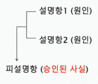

### 1.문장과 명제

1. 단어와 개념의 차이

- 총각, bachelor
- 단어는 서로 다르지만 각각의 의미는 동일하다. 이 때 이 단어들은 **같은 개념(뜻)**이라고 한다.

2. 문장과 명제의 차이

- 철수는 총각이다.
- 철수는 결혼하지 않은 성인 남자이다.
- Chulsoo is a bachelor.
- 위의 세 문장은 서로 다르지만 그 의미(내용)은 같다.

- **문장**이란 문법에 맞춰 단어들을 배열한 덩어리
- 상이한 문장들이지만, 동일한 의미를 담고 있는 **명제**를 언표
- 명제란 문장이 **주장하는 내용**을 가리킨다.
- 문장의 차이에도 각 문장이 의미하는 동일한 내용을 명제라고 한다.

- 명제와 달리 문장은 여러가지 기능을 가진다.
- 오직 평서문의 경우에만 **참과 거짓**을 판단 할 수 있다.
- 그러나 모든 평서문이 참 또는 거짓의 판별 적용이 가능한 것은 아니다.

- 명제는 **진리치(truth-value)**를 갖는 문장이다.

### 2.논증과 추론

1. 논증(argument)

- **어떤 주장을 담고 있는 명제**와 **그 주장에 대한 근거에 해당하는 명제들**로 이루어져있다.
- 논증이란 **명제들의 집합**이라고 할 수 있다.
- 논증은 **주장을 펴기 위해서 사용된** 명제들의 집합이다.
- 논증자가 옹호하는 명제를 **결론**이라고 하고, 그 근거나 이유로서 제시하는 명제를 **전제**라고 한다. 논증은 전제와 결론의 구조로 이루어져 있다.

나는 생각한다.(전제) -> (추론) -> (결론)그러므로 나는 존재한다.

2. 추론(inference)

- 추론은 **사고 과정**이다. 이 사고의 과정을 언어로 표현하는 것이 **논증**이다.
- 즉, 논증은 주장을 펴기 위해서 사용하는 명제들의 집합으로서 논리적 설득을 위해 사용하는 **추론의 형식**이라고 할 수 있다.

### 3.전제와 결론

1. 전제와 결론의 구분

- 논증에서 전제와 결론의 순서나 위치는 문제가 되지 않는다.
- 논증의 사용목적은 결론에 해당하는 주장을 옹호(증명)하기 위한 것이다.
- 따라서 논증에서 중요한 것은 항상 **전제와 결론의 상관관계**이다.
- 어떤 논증이 좋은 논증인지를 결정하는 것은 바로 결론과 전제의 지지관계에 있다.

2. 전제와 결론의 수

- 논증에서 전제는 하나 혹은 그 이상의 여러 개로 이루어져 있을 수 있으나 결론은 꼭 하나이어야 한다.
- 물론 어떤 주장을 하고 있는 글을 분석해 보면 그 속에 독립된 여러 개의 논증이 포함된 경우도 있다(복합논증 또는 연쇄논증)

  > ① 금년부터 강화되는 차량의 매연검사가 저소득층에게는 심각한 부담이다. ② 왜냐하면 저소득층은 몇 년 된 중고차를 가지고 있는데, 그 차들은 보통 현재의 매연검사를 통과하기 어렵기 때문이다. ③ 몇 년 전에 나온 차량은 공기오염의 심각성을 고려하지 못했을 때 제작된 것이다. 
  > 1과 2의 관계는? 결론과 전제 
  > 2와 3의 관계는? 결론과 전제 
  > 최종결론은?  

- 논증에서 모든 문장이 전제 혹은 결론에 해당하는 것은 아니다.
- 논증과는 관계가 없지만 글의 유려한 흐름을 위해 또는 독자의 이해를 돕기 위해 삽입된 문장들도 있기 때문이다.
  > ① 어제 수업시간에 그 선생님이 뭐라고 하셨는지 아니? ② 그 선생님은 보신탕을 일종의 건강식이고 ③ 건강식은 권장되어야 하기 때문에, ④ 보신탕을 허용해야 한다는 거야. ⑤ 그래, 그 문제에 대해서 조금 더 생각해 봐야겠는데. 
  > 전제 또는 결론의 역할을 하지 않는 문장은? 1번과 5번 
  > 논증을 구성하는 명제는? 2번 3번 4번(결론) 
  > 1과 5는 위의 글에서 어떤 역할을 하는가? 일상적인 어투 

3. 전제지시어와 결론지시어

3-1) 전제지시어 (premise indicator)
왜냐하면, ...이므로, ...이기 때문에
...이니까, ...인 까닭에, ...라는 이유로
...를 고려한다면, ...로부터 추론된다/ 될 수 있다

3-2) 결론지시어 (conclusion indicator)
그러므로/그러니까, 따라서/그래서
결국/결과적으로/결론적으로...임이 틀림없다.
그런 이유로/때문에...하다.
...결과로...이다, ...라고 결론내린다/추론한다
...함축한다.

- 아래와 같이 전제지시어나 결론지시어가 전혀 드러나 있지 않은 경우도 있다.
  > ① 누군가가 이 아파트에서 강아지를 키우고 있나 보다. ② 밤에 강아지 짖는 소리가 나며, ③ 화단에 강아지 발자국이 있다. 
  > 이 글은 논증을 포함하고 있는가? Y 
  > 전제 또는 결론을 암시하는 지시어가 있는가? 없다. 
  > 결론은? 그리고 그것을 지지하는 전제는? 결론:1번, 전제:2번,3번 

### 4.문제풀이

- 논증의 전제와 결론을 찾아보자.

1. (전제)혜성들은 태양계의 역사에서 매우 일찍이 형성된 것으로 보여지기 때문에 (결론)결국 혜성들의 구조는 태양계의 진화를 밝히는 단서가 된다.
2. (결론)KT&G는 일체의 담배 판매를 즉각 중단해야 한다. (전제)필경 흡연은 우리가 피할 수 있는 가장 중요한 사망 원인이 되고 말 것이다.
3. (결론)모든 법은 악이라고 하는데, (전제)그 까닭은 모든 법이 자유를 침해하고 있기 때문이다.

### 5.논증과 비논증

1. 논증과 비논증의 구분

- 논증에서는 논자가 주장하는 바에 어떤 증거나 이유가 제시되어야 한다. 이처럼 논증은 **주장을 포함하며 그에 대한 근거를 제시(증명)**하는 글이다.
- 논증은 쟁점이 되는 주장을 정당화하고 합리적으로 상대방을 설득하는 최선의 수단이다.
- 이에 반해 논증이 아닌 글은 주장을 포함하지 않으며, 이에는 **기술, 믿음, 보고, 예시, 해설, 설명** 등이 있다.

2. 비논증적인 글

- 자신의 **믿음**이나 **생각**(의견)을 표현한 글은 논증이 아니다.

  > 나는 우리 사회에서 타인을 위한 배려가 곧 자기 자신의 권리를 보장받는 길이라고 믿는다. 그리고 나는 타인의 권리를 침해하지 않는 범위 내에서 자신의 권리를 주장하는 것이 현실적으로 자신의 권리를 보장 받을 수 있는 길이라고 생각한다.

- 어떤 장면이나 경치, 풍경 등을 있는 그대로 묘사하거나 표현하는 **기술**은 비논증의 한 예이다.

  > 형사들이 사건 현장에 도착했을 때, 방 안은 몹시 어질러져 있었다. 여기저기 빈 소주병들이 있었고, 사람들의 옷가지가 널려 있었다. 또 TV가 켜져 있었으며 창문이 활짝 열려 있었다.

- 어떤 글은 상황에 대한 **기술**이면서 동시에 **보고(report)**인 경우가 있다. 이런 글은 다음의 예처럼 어떤 상황이나 사건에 관한 정보를 전달한다.

  > 암은 단순히 질병이 아니라 여러 가지 질병을 일으킨다. 그 중 어떤 형태는 특히 방사선 치료로 회복 될 수 있다. 방사선을 암세포 조직에만 투사시키려고 주의 깊게 시도한다. 만약 암세포가 방사선의 파괴적인 효력으로 죽게 되고 다른 세포들을 상하게 하지 않으면, 치료는 성공적이다.

- **해설**하는 글의 목적은 화제가 되는 문장을 증명하는 것이 아니라 그것을 계속해서 확장시켜 자세하게 전개해 나가는 것이다.
  > 독서의 속도는 전적으로 독자에 따라 다르다. 어떤 독자는 필요에 따라 아주 천천히 읽기도 하고 아주 빨리 읽기도 한다. 만약 그가 내용을 잘 이해하지 못했다면, 자신이 읽은 곳에서 멈추고 그 부분을 다시 읽을 수도 있고, 그 내용을 곰곰이 생각해 볼 수도 있으며, 메모를 할 수도 있다. 그런데 만약 그 내용이 친숙하거나 쉬운 것이라면 아주 빨리 읽을 수 있다.

3. 설명과 논증의 구분

- 논증과 가장 혼동하기 쉬운 것은 **설명(explanation)**이다. 특히 설명은 "왜냐하면...", "...때문에" 등과 같은 전제지시어를 자주 사용하기 때문에 그 구조가 논증과 흡사하기 때문.
- 다시 말해 설명이나 논증이나 모두 이유를 제시하기 때문.
- 논증에서 흔히 나타나는 오류 중 하나가 논증 없이 설명만으로, 그리고 그것이 마치 논증인 것처럼, 자신의 주장을 표현하는 경우이다.

- 다음 글은 논증인가 설명인가?
  > 나는 어제 영화관에 갔는데, 그 친구는 거기에 함께 가지 않았어. 왜냐하면 그는 집에서 할 일이 있었거든.
  > 그 창문은 여름 내내 닫혀 있었고 날씨는 덥고 습하였다. 따라서 그가 돌아왔을 때 방에서는 쾌쾌한 냄새가 났다.
  > -> 설명
- 이 글은 어떤 주장의 참을 증명하고 있는가? 아니면 어떤 사실에 대한 이유가 무엇인지를 말하고 있는가? -> 어떤 사실에 대한 이유가 무엇인지를 말하고 있다.

- 논증과 설명의 차이:
- 글에서 어떤 명제가 참인지 또는 거짓인지에 대해서 말하는 사람이나 듣는 사람이나 듣는 사람 모두에게 명백한 경우, 그에 대한 정당화나 증명을 위한 논증이 필요하지 않다.
- 이처럼 **설명**은 모두에게 명백한 것, 즉 **승인된 사실**에 대해 왜 그러한지 그 이유를 해명하는 내용의 명제들을 제공한다.
- 이에 반해 정당화나 증명이 필요한 경우는 어떤 주장이 참임을 밝히려는 데에 있다.

- 설명은 설명되어야 할 것(피설명항:explanandum)과 그것을 설명하는 것(설명항:explanans)로 구성된다.
- 이 때 승인된 사실은 피설명항에 해당하고, 그 사실이 일어난 원인은 설명항에 해당
- 이에 반해 논증은 승인된 사실(또는 명백히 참인 명제=근거)를 이용해서 논의의 여지가 있는 또 다른 명제(주장)의 참/거짓 여부를 확립하기 위한 것이다.
- 결국 설명인지 논증인지의 구분은 승인된 사실의 원인을 밝혀 더 자세히 해명해 보기 위한 것인지 또는 승인된 사실을 이용해서 또 다른 주장을 지지하려는 것인지에 달려 있다
- 논증 : 승인된 사실을 바탕으로 논의의 여지가 있는 주장을 증명/정당화  
- 설명 : 승인된 사실의 원인을 규명  

> 최근에 사형제도가 범죄 억제 수단이라는 논리가 반박 당하고 있다. 가장 범죄율이 높은 20개 주 가운데 18개 주가 사형제도를 채택하여 실행하고 있다. 범죄율이 가장 높은 대도시 가운데 17개 도시가 사형제도 시행 구역 내에 있다. 텍사스는 지난 10년 동안 다른 어떤 주보다도 많은 사람들을 사형에 처했지만, 여전히 범죄율 상위 25개 도시 중 3개 도시가 텍사스 주에 속해 있다. 거의 20년 넘게 이웃하고 있는 두 주, 즉 사형제도가 없는 미시간 주와 사형제도가 있는 인디애나 주는 살인 범죄율에서 거의 차이가 없었다. 
> -> 설명

> 아마 저 건물이 회의가 개최되는 장소인 것 같다. 거기를 봐, 차들이 많이 주차해 있잖아. 
> -> 주장

### 6.문제풀이

1. 논증인가 (인과적) 설명인가?

- 뉴욕 세계무역센터 빌딩은 비행기의 충돌로 기둥을 지지하는 하중이 약해졌기 때문에 무너졌다. : 설명
- 죄송합니다. 타이어에 펑크가 나서 늦었습니다. : 논증
- 꽃신이 : 오늘 날씨 참 좋은데 
  씩씩이 : 이게 뭐 좋은 날씨니? 
  꽃신이 : 바람도 선선하고 하늘도 맑잖아. : 논증
- 꽃신이 : 오늘 날씨 참 좋은데 
  씩씩이 : 왜 그럴까? 
  꽃신이 : 대기 중에 불순물이 적어서 그렇지. : 설명
- 만약 사회의 근본적인 가치가 위협당한다면 그 사회는 커다란 문제가 있다고 볼 수 있다. 가족은 우리가 추구하는 사회의 근본적인 가치 중 하나이다. 요즘 이혼율이 너무 급격히 상승해 가족이 해체되고 있다. 그래서 우리 사회는 이 커다란 문제를 해결해야 한다. -> 논증

2. 각 대답에서 논증과 인과적 설명을 구분 해 보자.
   > A : 방 안이 아까보다 밝은데. 
   > B : 왜? 
   > A : 보조등을 켰거든.  : 설명
   > B : 아니, 나는 방이 밝아진 줄 모르겠는데? 
   > A : 아까는 신문의 글씨가 잘 안 보였는데 지금은 잘 보여.  : 논증
