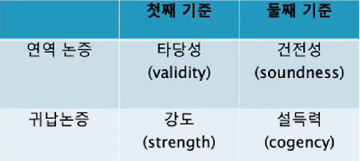

### 1.논증의 평가기준

- 논증은 전제와 결론의 지지관계에 관한 기준에 따라 연역과 귀납으로 분류된다.
- 논증은 두 가지 기준에 따라 평가된다.

  a) 먼저 논증의 전제를 참이라고 가정했을 때, 결론은 필연적 또는 개연적으로 도출되고 있는가? 즉, 논증에서 전제와 결론의 지지관계를 **형식적** 측면에서 평가한다.

  b) 다음으로 제시된 전제가 참인가? 즉, 논증에서 전제와 결론의 지지관계를 **내용적** 측면에서 평가한다.

- 이 두 기준에 따라 논증을 평가할 때,
- 첫째 기준(형식적 측면)에 따라 논증의 타당성(연역)과 강도(귀납)를 따지고,
- 둘째 기준(내용적 측면)에 따라 논증의 건전성(연역)과 설득력(귀납)을 따진다.

  

### 2.연역 논증의 기준 : 타당성과 건전성

**a) 첫째 기준에 따른 연역의 평가 : 타당한 논증과 부당한 논증**

- 타당과 부당은 연역논증에만 적용되는 평가용어다.
- **타당한 논증**은 전제가 참이라고 가정했을 때, 그 전제가 결론의 참을 확실하게/필연적으로 보증해 주는 연역 논증이다.
- 반대로 전제가 참이라고 가정했을 때, 그것이 결론의 참을 확실하게/필연적으로 보증해 주지 못하는 연역논증을 **부당한 논증**이라고 한다.

- 연역 논증은 결론의 내용은 전제 속에 이미 포함되어 있다.
- 따라서 결론이 전제 속에 이미 들어 있거나 암암리에 함축되어 있는 연역 논증은 타당하고(valid) 그렇지 못한 연역논증은 부당하다(invalid).

> 모든 사람은 죽는다. 
> 소크라테스는 사람이다. 
> 그러므로 소크라테스는 죽는다. 
> -> 타당한 (연역)논증 

> 예1) 모든 말은 귀가 셋이다. 
> 이 동물은 말이다. 
> 그러므로 이 동물은 귀가 셋이다. 
> -> 위의 예는 타당한 논증인가? 
> -> 타당하다.

> 예2) 어떤 사람은 동물이다. 
> 어떤 동물은 땅 위에 산다. 
> 그러므로 어떤 사람은 땅 위에 산다. 
> -> 이 경우 전제의 참을 가정할 때 그 결론이 필연적으로 도출되는가? 
> -> 필연적으로 도출되지는 않는다. 부당하다.

- 실제로 전제와 결론의 내용이 실제로 참이어야 타당한 논증이 되는 것은 아니다.
- **타당성**은 전제와 결론의 (형식적) 지지관계가 필연적인가 아닌가를 평가하는 것이기 때문이다.

> 모든 개는 깃털을 가지고 있다. 
> 모든 새는 개이다. 
> 그러므로 모든 새는 깃털을 가지고 있다. 
> -> 타당

> 모든 새는 부리를 가지고 있다. 
> 모든 고양이는 새이다. 
> 그러므로 모든 고양이는 부리를 가지고 있다. 
> -> 타당

> 모든 식물은 죽는다. 
> 모든 백합은 식물이다. 
> 그러므로 모든 백합은 죽는다. 
> -> 타당

> 모든 개구리는 날개가 있다. 
> 모든 말은 개구리다. 
> 그러므로 모든 말은 날개가 있다. 
> -> 타당

전제와 결론의 형식적 지지관계가 필연적인가 아닌가만 평가.

b) 참과 타당성

- 논증은 명제들의 집합이고, 각 명제는 진리값을 가진다.
- ★ **참**과 **거짓**은 명제(전제나 결론)에 적용되는 것이지 논증 자체에 적용되는 용어가 아니다.
- ★ '참인 논증' 또는 '거짓인 논증'이란 표현은 불합리하다.
- 연역 논증에서 논증이 타당하다 또는 부당하다, 또는 건전하다든지 건전하지 않다라고 말한다.
- **논증의 타당성**은 일반적으로 논증을 구성하고 있는 명제들이 실제로 참인지 거짓인지 무관하다.

- 어떤 연역 논증에서 전제들 중 일부 또는 전부가 실제로는 거짓이고, 결론이 실제로 참인 타당한 논증이 있을 수 있다.
- 또한 전제들 일부 혹은 전부가 실제로는 거짓이고, 결론도 거짓인 부당한 논증이 있을 수 있다.
- 모든 전제와 결론이 참인데도 부당한 논증이 있는 반면, 모든 전제와 결론이 거짓인 타당한 논증이 있다.

- 논증의 타당성을 말하면?

> 1)만약 존 레논이 암살되었다면 그는 죽었다. 
> 그는 죽었다. 
> 그러므로 그는 암살되었다. 
> -> 부당하다. 

> 2)모든 생명에는 한계가 있다. 
> 한계가 있는 것은 모두 아름답다. 
> 그러므로 모든 생명은 아름답다. 
> -> 타당하다. 

### 3.보충설명

- 타당성 검토에서는 일단 전제의 참을 가정하므로 논증의 타당성과 부당성은 오직 논증의 형식에만 관계한다.
- 논증에는 논증 형식을 구성하는 부분(논리적 용어)과 그 외 부분(비논리적 용어)로 구분 할 수 있다.
- 그런 다음, 연역논증의 논리적 용어를 그대로 두고 비논리적 용어를 다른 말로 대체해서 평가

> **어떤/모든** _대학생은_ _정의롭_ **다**/_정의롭지_ **못하다**.  **굵은글씨**는 논리적 용어라 하고, *이탤릭체*는 비논리적 용어라고 한다. 

- 타당한 연역논증은 논리적 용어를 그대로 두고 비논리적 용어를 다른 말로 대체해도 여전히 타당하다.
- 부당한 연역논증은 논리적 용어를 그대로 두고 비논리적 용어를 다른 말로 대체하더라도 여전히 부당

1. **약간의** *대학생*은 공학도**이다.** **약간의** *공학도*는 여학생이다. 그러므로 **약간의** *대학생*은 여학생이다.

- 만약 논증이 부당하다면, 비논리적 용어를 다른 말로 대체해서 **명백하게 참인 전제와 명백하게 거짓인 결론을 구성할 수 있다.**
- 논증1에서 비논리적 용어는?

1. **약간의** *남학생*은 공학도**이다.** **약간의** *공학도*는 여학생이다. 그러므로 **약간의** *남학생*은 여학생이다.

- 따라서 1은 부당하다.
- 약간의 A는 B이다. 약간의 B는 C이다. 그러므로 약간의 A는 C이다. (부당한 논증형식)

2. **약간의** *대학생*은 _어리석지_ **않다.** **모든** 대학생은 _논리적_**이다.** 그러므로 약간의 논리적인 사람은 어리석지 않다.

- 만약 타당한 논증이라면 이 용어를 다른 말로 대체하여 **명백하게 참인 전제와 명백하게 거짓인 결론을 구성할 수 있다.**
- 2에서 비논리적 용어는?
- 용어를 대체하여 명백하게 참인 전제와 명백하게 거짓인 결론을 구성할 수 없다. 따라서 타당하다.
- 약간의 A는 B가 아니다. 모든 A는 C이다. 그러므로 약간의 C는 B가 아니다. (타당한 논증형식)

> 오늘날 목사는 예수의 사도와 같다. 
> 그런데 예수는 여성을 자신의 사도로 세운 적이 없다. 
> 그러므로 여성에게 목사직을 허용해서는 안 된다. 

- 이 논증은 타당한가 부당한가?
- 비논리적 용어는?
- 이 용어를 다른 말로 대체해서 명백하게 참인 전제와 명백하게 거짓인 결론을 구성해 낼 수 있는가?
- 예컨대 '여성'을 '한국사람'으로 대체해 보면?

> 오늘날 목사는 예수의 사도와 같다. 
> 그런데 예수는 한국사람을 자신의 사도로 세운 적이 없다. 
> 그러므로 한국사람에게 목사직을 허용해서는 안 된다. 
> -> 명백하게 참인 전제와 명백하게 거짓인 결론. -> 부당하다.

4. 논리적 사고는 훈련을 통해서 얻어질 수 있다. 수학적 추리도 훈련을 통해서 얻어질 수 있다. 그러므로 수학적 추리도 일종의 논리적 사고라고 할 수 있다. 
   -> 어린아이는 양육을 통해서 자랄 수 있다. 강아지도 양육을 통해서 자랄 수 있다. 그러므로 강아지도 일종의 어린아이라고 할 수 있다.  -> 부당

- 다음 논증의 타당성과 건전성을 평가해 보아라.

> (전제1) 만일 국제 평화가 유지된다면, UN은 불필요하다. 또 만일 국가 간에 전쟁이 일어난다면, UN은 전쟁방지라는 목적을 성취하지 못한 것이기 때문에 불필요하다. 
> (전제2) 국가 간에는 평화 아니면 전쟁 상태만이 존재한다. 
> (결론) 따라서 UN은 불필요하다. 

- 이 논증은 타당한가? 그리고 논증의 건전성은? 
  -> 타당하다. 전제 1과 2모두 참이 아니다. 건전하지 않다.

- 다음 진술에 대해 참과 거짓으로 답하시오.

1. 귀납 논증은 다양한 정도의 강도를 가진다. -> 참
2. 부당한 연역 논증과 약한 귀납 논증은 결국 같은 것이다. -> 거짓
3. 설득력 있는 논증은 결론이 거짓으로 판명될 수 있다. -> 참

- 다음의 귀납 논증에 어떤 전제를 덧붙이면 강한 논증 또는 약한 논증이 되겠는가?

> 옆집에 사는 아저씨는 직업이 없나보다. 평일 아침이나 낮에도 항상 집에만 있으니까. 
> for 강한 논증 : 평일 아침이나 낮에도 낮잠을 잔다.
> for 약한 논증 : 책상에 앉아서 뭔가 집중해서 작업을 한다.
