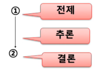
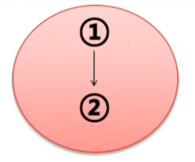
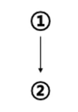
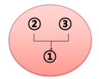
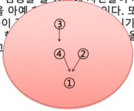

### 1.개괄

##### A. 용어정리

- **논증**이란 어떤 주장에 대하여 어떠한 형태로든 근거를 제시하는 것이다.
- 이 때 하나의 주장(A)에서 도출한 다른 주장(B)을 결론으로 제시하는 것이다. 이 때 A는 **전제/근거**가 되고, B는 **결론/주장**이 된다.
- A로부터 B를 끌어내는 과정을 **도출/추론**이라고 한다.
- 논증을 재구성(분석)하는 목적은 논증을 정확히 이해하고 평가하기 위함이다.
- 논증의 재구성(분석)은 전제(근거 또는 논거)와 결론의 관계를 정리하는 것에서부터 시작한다.
- 논증의 재구성(분석)에는 **논증도**(다이어그램)의 방법을 이용할 수 있다.

##### B. 논증도(다이어그램)

> ① 나는 생각한다. ② 그러므로 나는 존재한다.  

- 이 때 '전제는 결론을 지지한다/뒷받침한다/정당화한다"라고 말한다.

> 예)① 고래는 물고기다. ② 그러므로 고래에게는 배꼽이 없을 것이다.  

### 2.논증의 재구성

##### A. 논증의 재구성 과정

- 논증 여부 결정 : 주장에 대한 근거를 제시하고 있는가? 아니면 사태에 대한 인과적 설명에 불과한가?
- 전제와 결론의 분리 : 숨은 전제나 결론은 없는가? (결론은 하나밖에 없다.)
- 논증의 재구성(논증도) : 전제가 어떻게 결론을 지지하고 있는가?
- 논증의 평가 : 전제가 결론을 충분히 지지하는가

- 논증의 표준틀 : 전제1 전제2 전제3 ... 그러므로 결론
- 글의 형태로 제시된 논증은 명확하지 못한 경우가 허다
- 전제와 결론을 분리하고 정돈하는 재구성을 통해 논증을 명확하게 이해하도록 한다.

###### B. 전제와 결론 찾기

- 논증의 재구성은 전제와 결론을 찾는 것에서 시작한다.
- 전제와 결론의 위치 :
  > 미군은 한국에 계속 주둔해야 한다. 주한미군이 있는 것만으로도 한반도의 전쟁 억제력이 있기 때문이다. (첫 문장이 결론) 
  > 시베리아에 사는 고니는 우리나라에서 겨울을 지내는데, 이번 겨울에도 날아 올 것이다. (마지막 문장이 결론) 
  > 결론이 중간에 있을 수도 있다.

- 전제와 결론은 문장의 위치와는 상관없다.
- 전제는 다수일 수 있지만, 한 논증에서 결론은 하나다.
- 형식적인 측면에서 전제지시어(왜냐하면, 이기때문에, 그 이유로는, 첫째, 둘째...)와 결론지시어(따라서, 그러므로, 결국, 이에 따라, 결론적으로...) 등의 도움을 얻을 수 있다. 그러나 지시어가 전혀 없는 논증도 있다.

##### C. 숨은 전제와 결론 찾기

- 전제는 하나 이상이고, 그 중 일부는 명백하게 표현되어 있지 않은 경우도 있다.
- 이와 같이 **생략된 전제(숨은 전제)**는 문맥에서 파악해 낼 필요가 있다.
- 표준틀로 논증을 재구성할 때, 명백히 제시되지 않은 부분이 있다면 그 생략된 부분을 보충해 준다.
- 이것은 상대방의 논증을 긍정적으로 해석하려는 열린 태도이고, 이 태도를 **자비의 원리**라고 부른다.

> 서태지는 유부남이다. 그러므로 그는 남자이다.

1. 전제 : 서태지는 유부남이다.
2. 숨은 전제 : 유부남은 결혼한 남자다.
3. 결론 : 따라서 서태지는 남자이다.

- 예1) 이 DVD는 미성년자 관람불가야. 너는 볼 수 없다. (너는 미성년자야)
- 예2) 저 토마토는 빨갛구나. 잘 익었네. (빨간 토마토는 잘 익은 토마토이다.)
- 예3) 나는 내일 스키를 타러 가려고 한다. 그러므로 나는 주말에 강원도에 있을 것이다. (내가 스키 타러 가는 스키장은 강원도에 있다. 내일은 주말이다.)
- 예4) 박정희가 성군이면 내가 네 아들이다. (나는 네 아들이 아니다.)

> 음주운전은 살인행위다. 그러므로 어느 누구도 음주 운전을 해서는 안 된다.

1. 전제 : 음주운전은 살인행위다.
2. 숨은 전제 : 살인을 저질러서는 안 된다.
3. 결론 : 그러므로 어느 누구도 음주 운전을 해서는 안 된다.

> 서울시를 누비고 다니는 디젤 기관의 시내버스가 이제 천연가스 버스로 대체되었다. 그러므로 서울시의 공기는 상당히 깨끗해졌을 것이다.

1. 전제 : 서울시를 누비고 다니는 디젤 기관의 시내버스가 이제 천연가스 버스로 대체되었다.
2. 숨은 전제1 : 디젤 기관의 시내버스는 서울시 대기 오염의 주원인 중 하나였다.
3. 숨은 전제2 : 천연가스 버스는 대기를 덜 오염시킨다.
4. 결론 : 따라서 서울시의 공기는 상당히 깨끗해졌을 것이다.

> 육체의 생은 악이고 허위이다. 그러므로 우리는 죽음을 희망해야 한다.

1. 전제 : 육체의 생은 악이고 허위이다.
2. 숨은 전제 : 악이고 허위인 것은 피하도록 희망해야 한다.
3. 중간 결론 : 육체의 생을 피하도록 희망해야 한다.
4. 숨은 전제 : 육체의 생을 피하는 길은 죽음 뿐이다.
5. 결론 : 따라서 죽음을 희망해야 한다.

##### 정리

- 논증의 재구성/분석이란 주어진 글을 논증의 표준틀에 맞도록 전제와 결론의 순서로 배열하는 것이다.
- 이 때 **생략된(또는 숨은) 전제나 결론을 찾아** 채운다.
- 주어진 글을 치밀한 논증으로 재구성할 때, 글쓴이의 의도를 최대한 유리하게 파악한다. (자비의 원리)

##### C. 논증의 재구성(논증도 그리기)

- 먼저 주어진 글을 치밀하고 호의적으로 재구성한다. 즉 숨은 결론을 보충한다.
- 다음으로 전제와 결론의 관계를 구조적으로 파악하는 작업을 진행한다.
- 다시 말해 주어진 글 속에서 논증을 구성하고 있는 명제들의 역할(지지관계)을 분석한다.

- 논증의 기본적인 구조는 도출/추론 관계의 양태에 따라 네 가지 유형으로 분류할 수 있다.

a) 단순논증
b) 결합논증
c) 합류논증 (단순 + 결합)
d) 복합논증 (단순 + 합류 or 결합 + 합류)

##### a. 단순논증

- **하나의 명제에** 근거해서 하나의 결론을 도출/추론

> ① 고래는 물고기다. ② 그러므로 고래에게는 배꼽이 없을 것이다.  

> 예)플라톤에 의하면, ① 선은 한 사람의 진정한 이익을 증진시키는 것이므로, ② 어떤 경우든 선이 알려지는 경우 사람들은 그것을 추구한다.

##### b. 결합논증

- **여러 명제가 결합하여 하나의 근거**를 이루어 하나의 결론을 끌어낼 때 
  => 다수 전제가 결합하여 결론을 지지할 때

> ① 만일 네가 달에 간다면 더 날씬하게 보일 것이다. ② 만일 네가 달에 가면 체중이 줄어들 것이고, ③ 만일 네가 체중이 줄어들면 더 날씬하게 보일 것이기 때문이다.  

> 자연은 설계도가 있음을 보여준다. 어떤 것이든 설계도가 있다면, 그것은 설계자가 있다. 그러므로 자연은 설계자의 작품이다.

##### c. 합류논증

- **여러 근거**가 제시되고 그것들에서 결론이 도출될 때 
  => 여러 전제가 각각 부분적으로 결론을 지지할 때

> ① 아이들 교육을 위해서는 TV가 없는 편이 낫다. ② 가족간의 대화시간이 줄어들 뿐만 아니라 ③ 아이들을 수동적인 인간으로 만들기 쉽기 때문이다.  

##### d. 복합논증

> ① 사형제도는 범죄를 막지 못한다. ② 왜냐하면 범죄자들은 범행을 할 당시에 자신들이 체포되리라는 생각을 아예 하지 않기 때문이다. 또 ③ 많은 범죄자들이 정신적으로 정상이 아니기 때문에, ④ 자신들이 행한 불합리한 행동이 가져올 합리적인 결과를 고려하지 못한다.

> 1이 결론이고 2,3 그리고 4는 전제의 역할을 한다. 그 중 3은 4를 지지하는 전제의 구실을 하고 있다.  

> ① 자연선택이 없다면 진화는 멈출 것이다. ② 그런데 자연선택은 이제 인간에게는 적용되지 않는다. ③ 자연선택이 이루어지려면 강한 개체보다도 훨씬 많은 수의 약한 개체가 번식하기 전에 죽어야 하는데, 현대의 의학은 약한 자도 강한 자에 못지않게 살아남고 또 번식할 수 있도록 만들어 놓았기 때문이다. ④ 따라서 인간은 더 이상 진화하지 않는다.

> 4가 결론이고 1,2 그리고 3이 전제의 역할을 한다. 그 중 3은 2를 지지하는 전제의 구실을 하고 있다.

### 3.연습문제

- 숨은 전제 또는 숨은 결론을 찾아보시오.

1. 아름다운 사람은 머문 자리도 아름답습니다.
2. 당신이 정말로 나를 사랑한다면 내가 원하는 것을 해줬을거야.
3. 김현수씨는 국회의원에 출마할 수 없다. 그의 국적은 한국이 아니다.
4. 낙태는 금지되어야한다. 왜냐하면 살인은 금지되는 것이기 때문이다.

- 논증도를 이용해서 다음의 글들을 재구성해보시오.

①②③④

1. ① 지난 30년 간의 주식 시장이 보여 주듯이, 주식은 경기 침체 후 회복되는 처째 해에 채권보다 대체로 수익성이 높다. ② 올해가 그 해이기 때문에, ③ 주식은 채권보다 수익성이 높아야 한다.

2. ① 한자 혼용을 주장하는 사람들은 한자어는 한자로 표기돼야 그 듯이 얼른 들어온다고 한다. ② 이런 주장이 터무니없는 것은 아니다. ③ 낱말에 따라서, 맥락에 따라서 한자어의 표의성이 크게 효과를 발휘하는 경우가 있기는 하다. ④ 또 한자 혼용문에 익숙한 나이든 세대의 경우, 한자어가 한글로 표기됐을 때보다는 한자로 표기됐을 때 뜻이 더 쉽게 파악될 수도 있다.

3. ① 정부의 구조조정은 옳지 못하다. ② 서민층의 희생만을 강요하는 경제 정책은 옳지 못한데, ③ 정부의 구조조정은 서민들에게 너무 많은 것을 빼앗아 가고 있기 때문이다. 더구나 ④ 구조조정이 이루어진다 하더라도 경제가 개선될지 장담할 수 없다.

4. ① 사형은 폐지해야 한다. ② 사형도 살인에 지나지 않기 때문에 ③ 살인이 비인도적인 행위인 이상, ④ 사형도 비인도적인 행위임에 틀림없다. ⑤ 사형에 범죄 억제력이 있다는 주장도 의심스럽다. ⑥ 사형에 대한 우려 때문에 하려던 범죄를 중단한 자가 지금까지 어느 정도나 있다는 것인가.

5. ① 인간은 절대로 확실한 지식을 얻을 수 없다. ② 지식은 최종적으로는 관찰에 기초해야 하는 것인데, ③ 원래 관찰이란 잘못도기 쉽다. 왜냐하면 ④ 관찰은 관찰자의 관심에 의해 통제되는 것이며, 따라서 ⑤ 관찰은 본질적으로 무언가의 선입관에 의해 영향을 받을 수밖에 없기 때문이다. 나아가 ⑥ 지식은 관찰을 넘어서서 추측행위에 의해 얻어지는 것인데, ⑦ 추측은 관찰 이상으로 잘못되기 쉬운 특성을 갖고 있다.

6. ① 정상적이라는 것은 어디까지나 비정상적인 것의 관점에서만 제한적으로 정의될 수 있다. ② 비정상적이라는 개념은 단지 주관적인 것이므로 ③ 정상적이라는 개념도 주관적이다. ④ 단순히 주관적인 개념은 사회적인 결정의 기초로 사용될 수 없으므로 ⑤ 우리는 "정상적인 것이 무엇인가"에 대한 개념을 기초로 사회적인 결정을 하지 않아야 한다.

