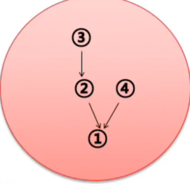
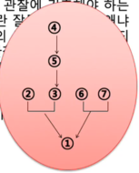

### 연습문제

- 숨은 전제 또는 숨은 결론을 찾아보시오.

1. 아름다운 사람은 머문 자리도 아름답습니다.

-> (전제)당신의 머문 자리는 아름답다. (결론)당신은 아름다운 사람이다.
or (전제)당신은 아름다운 사람이다. (결론)당신의 머문자리는 아름답다.

2. 당신이 정말로 나를 사랑한다면 내가 원하는 것을 해줬을거야.

-> (전제)당신은 내가 원하는 것을 해 주지 않았다. (전제)당신은 나를 사랑하지 않았다.

3. 김현수씨는 국회의원에 출마할 수 없다. 그의 국적은 한국이 아니다.

-> (전제)한국인만 국회의원에 출마할 수 있다.

4. 낙태는 금지되어야한다. 왜냐하면 살인은 금지되는 것이기 때문이다.

-> (전제)낙태는 살인이다.

- 논증도를 이용해서 다음의 글들을 재구성해보시오.

1. ① 지난 30년 간의 주식 시장이 보여 주듯이, 주식은 경기 침체 후 회복되는 처째 해에 채권보다 대체로 수익성이 높다. ② 올해가 그 해이기 때문에, ③ 주식은 채권보다 수익성이 높아야 한다. 

2. ① 한자 혼용을 주장하는 사람들은 한자어는 한자로 표기돼야 그 듯이 얼른 들어온다고 한다. ② 이런 주장이 터무니없는 것은 아니다. ③ 낱말에 따라서, 맥락에 따라서 한자어의 표의성이 크게 효과를 발휘하는 경우가 있기는 하다. ④ 또 한자 혼용문에 익숙한 나이든 세대의 경우, 한자어가 한글로 표기됐을 때보다는 한자로 표기됐을 때 뜻이 더 쉽게 파악될 수도 있다. 

3. ① 정부의 구조조정은 옳지 못하다. ② 서민층의 희생만을 강요하는 경제 정책은 옳지 못한데, ③ 정부의 구조조정은 서민들에게 너무 많은 것을 빼앗아 가고 있기 때문이다. 더구나 ④ 구조조정이 이루어진다 하더라도 경제가 개선될지 장담할 수 없다.  

4. ① 사형은 폐지해야 한다. ② 사형도 살인에 지나지 않기 때문에 ③ 살인이 비인도적인 행위인 이상, ④ 사형도 비인도적인 행위임에 틀림없다. ⑤ 사형에 범죄 억제력이 있다는 주장도 의심스럽다. ⑥ 사형에 대한 우려 때문에 하려던 범죄를 중단한 자가 지금까지 어느 정도나 있다는 것인가. 

5. ① 인간은 절대로 확실한 지식을 얻을 수 없다. ② 지식은 최종적으로는 관찰에 기초해야 하는 것인데, ③ 원래 관찰이란 잘못도기 쉽다. 왜냐하면 ④ 관찰은 관찰자의 관심에 의해 통제되는 것이며, 따라서 ⑤ 관찰은 본질적으로 무언가의 선입관에 의해 영향을 받을 수밖에 없기 때문이다. 나아가 ⑥ 지식은 관찰을 넘어서서 추측행위에 의해 얻어지는 것인데, ⑦ 추측은 관찰 이상으로 잘못되기 쉬운 특성을 갖고 있다.  

6. ① 정상적이라는 것은 어디까지나 비정상적인 것의 관점에서만 제한적으로 정의될 수 있다. ② 비정상적이라는 개념은 단지 주관적인 것이므로 ③ 정상적이라는 개념도 주관적이다. ④ 단순히 주관적인 개념은 사회적인 결정의 기초로 사용될 수 없으므로 ⑤ 우리는 "정상적인 것이 무엇인가"에 대한 개념을 기초로 사회적인 결정을 하지 않아야 한다. 
