# 1. 논리적 사고

### 1.논리적인 것과 비논리적인 것

- 논리적 vs 비논리적

1. "아이, 졸려." / "야, 저 사람 환상적이야."
2. "버스정류장과 같이 여럿이 모인 곳에서 담배 피우는 건 옳지 않아."

- 1은 일상생활 속에서 가지는 신체적 또는 정신적 상태나 느낌에 관한 진술 (비논리적)
- 2는 일상적 생활 속에서나 특별한 경우에 어떤 주장을 하거나 결정/선택을 포함하는 진술 (논리적)
- 나름대로 근거/이유를 가지고 자기 주장을 하거나 다른 사람의 주장도 충분한 이유를 가지고 수용하거나 거부하는 경우에 해당

### 2.논리적 사고란?

- **논리적**이란 어떤 주장과 관련이 있고, 주장은 일정한 근거나 이유를 가진다.
- **논리적 사고** 또는 **비판적 사고**란

1. 주장을 할 때, 어떤 근거나 이유를 가지고 말하고,
2. 남의 주장을 수용하거나 거부할 때, 그럴 만한 충분한 이유가 있는지 신중하게 생각하는 것을 말한다.

- 반대로 아무런 **근거도 없는** 주장을 하거나, 남의 주장을 **정당한 이유/ 근거 없이** 수용 또는 거부하는 태도를 **비논리적** 또는 **무비판적 사고**라고 부른다.
- 한편 논리적 사고는 생각 속에서 멈추는 것이 아니라 언어/말/글로써 표현되어야 한다.

### 3.논리

- 인간은 이성적/합리적 동물이다.
- 이성은 logos(말한 것)에서 유래
- 논리란 **언어와 이성의 복합체**라고 할 수 있다.
- 논리는 제기된 물음(문제)에 대하여 어떤 근거나 이유가 제시되었을 때, 그 근거나 이유가 적절하고 수용할만한 것인가를 비판적으로 검토하고 판단하는 작업을 뒷받침해주는 도구의 역할을 한다.

### 4.논리적/비판적 사고의 자세

- 주장은 어떤 문제에 대하여 타당한 근거를 가진 해결책의 제시나 방안의 모색을 담고 있다.
- 주장이 타당하고 적절한 근거를 바탕으로 논리적이고 합리적일 때 설득력을 가질 수 있으며 다수로부터의 동의도 가능해진다.
- 만일 감정에 의존해서 주장한다면? 감정은 개인적인 차이가 있으므로 감정에 의존한 주장은 많은 사람들의 동의를 이끌어 낼 수 없다.
- 일상생활에서 우연히 시작된 토론이 종종 바람직하지 못한 결과를 초래 
  -> 일상적 대화나 언쟁에서 효율적인 토의나 토론을 하는 **합의된 규칙**이 없기 때문 / **암묵적 규칙**이 있으면 좋은 결과 가능

- 긍정적 측면의 규칙

1. 상대방이 제대로 이해할 수 있도록 자기 의견을 표현
2. 상대방의 발언을 방해하지 않고 듣고자 하는 성의

- 금지의 측면

3. 발언을 독점하여 중언부언하면서 장황하게 말하지 않기
4. 상대방의 인격 등을 모독하거나 손상하는 발언 금지

- 우리가 논증을 펼치는 이유는 자기 주장이 문제 해결에 더 적합하다고 생각하기 때문
- 즉 논증의 목적은 상대방을 설득하기 위함 (상대방도 마찬가지)
- 따라서 설득의 과정은 억지스럽거나 강압적인 방식이 아니라 합리적 방식으로 이루어질 필요
- 특히 민주 사회에서는 더더욱 요구되는 덕목

- 이런 맥락에서 암묵적 규칙1은 상대방이 제대로 이해할 수 있도록 자기 주장을 논리적으로 전개해야 할 필요성을 강조
- 암묵적 규칙2 또한 역지사지의 관점에서 상호 토론이 진지하게 진행될 수 있또록 하는 자세를 강조
- 암묵적 규칙3은 규칙1의 반대로서 주장을 비논리적으로 전개하지 말 것과 상대방의 진지한 토론 자세를 악용하지 말라는 의미로 이해
- 암묵적 규칙4는 상대방의 인격이나 가치관(예를 들어, 종교나 신념 체계 등)을 모독하여 불필요한 감정대립을 유발하여 합리적 토론을 저해하지 말자는 의미
- 암묵적 규칙4를 어겼을 때 논리학에서는 논증의 오류(인신공격의 오류)를 범했다고 말함

- 논증의 오류

1. 힘에 호소하는 오류 (자기 주장을 받아들이지 않는다면 불이익 발생)

- 종강파티 참여 안하면 학점 불이익

2. 연민에 호소하는 오류 (어려운 상황을 근거로 주장을 정당화)

- 선거에 계속 실패해서 어려우니 뽑아달라

3. 나이에 의한 논증 (우리나라만)

- 우리는 세련된 토론을 할 수 있기를 기대 : 나를 포함한 모두가 교육이나 경험을 통하여 암묵적 규칙을 내면화할 필요

- **주장의 오류가능성**을 항상 전제하는 태도 : 주장을 무조건 받아들이지 않고 그 근거를 캐묻는 것
- **열린 태도**와 **비판적 태도**는 논리적 사고의 기본 자세일 뿐만 아니라 민주적 시민사회의 바탕

# 2-1. 논증이란 무엇인가

### 1.문장과 명제

1. 단어와 개념의 차이

- 총각, bachelor
- 단어는 서로 다르지만 각각의 의미는 동일하다. 이 때 이 단어들은 **같은 개념(뜻)**이라고 한다.

2. 문장과 명제의 차이

- 철수는 총각이다.
- 철수는 결혼하지 않은 성인 남자이다.
- Chulsoo is a bachelor.
- 위의 세 문장은 서로 다르지만 그 의미(내용)은 같다.

- **문장**이란 문법에 맞춰 단어들을 배열한 덩어리
- 상이한 문장들이지만, 동일한 의미를 담고 있는 **명제**를 언표
- 명제란 문장이 **주장하는 내용**을 가리킨다.
- 문장의 차이에도 각 문장이 의미하는 동일한 내용을 명제라고 한다.

- 명제와 달리 문장은 여러가지 기능을 가진다.
- 오직 평서문의 경우에만 **참과 거짓**을 판단 할 수 있다.
- 그러나 모든 평서문이 참 또는 거짓의 판별 적용이 가능한 것은 아니다.

- 명제는 **진리치(truth-value)**를 갖는 문장이다.

### 2.논증과 추론

1. 논증(argument)

- **어떤 주장을 담고 있는 명제**와 **그 주장에 대한 근거에 해당하는 명제들**로 이루어져있다.
- 논증이란 **명제들의 집합**이라고 할 수 있다.
- 논증은 **주장을 펴기 위해서 사용된** 명제들의 집합이다.
- 논증자가 옹호하는 명제를 **결론**이라고 하고, 그 근거나 이유로서 제시하는 명제를 **전제**라고 한다. 논증은 전제와 결론의 구조로 이루어져 있다.

나는 생각한다.(전제) -> (추론) -> (결론)그러므로 나는 존재한다.

2. 추론(inference)

- 추론은 **사고 과정**이다. 이 사고의 과정을 언어로 표현하는 것이 **논증**이다.
- 즉, 논증은 주장을 펴기 위해서 사용하는 명제들의 집합으로서 논리적 설득을 위해 사용하는 **추론의 형식**이라고 할 수 있다.

### 3.전제와 결론

1. 전제와 결론의 구분

- 논증에서 전제와 결론의 순서나 위치는 문제가 되지 않는다.
- 논증의 사용목적은 결론에 해당하는 주장을 옹호(증명)하기 위한 것이다.
- 따라서 논증에서 중요한 것은 항상 **전제와 결론의 상관관계**이다.
- 어떤 논증이 좋은 논증인지를 결정하는 것은 바로 결론과 전제의 지지관계에 있다.

2. 전제와 결론의 수

- 논증에서 전제는 하나 혹은 그 이상의 여러 개로 이루어져 있을 수 있으나 결론은 꼭 하나이어야 한다.
- 물론 어떤 주장을 하고 있는 글을 분석해 보면 그 속에 독립된 여러 개의 논증이 포함된 경우도 있다(복합논증 또는 연쇄논증)

  > ① 금년부터 강화되는 차량의 매연검사가 저소득층에게는 심각한 부담이다. ② 왜냐하면 저소득층은 몇 년 된 중고차를 가지고 있는데, 그 차들은 보통 현재의 매연검사를 통과하기 어렵기 때문이다. ③ 몇 년 전에 나온 차량은 공기오염의 심각성을 고려하지 못했을 때 제작된 것이다. 
  > 1과 2의 관계는? 결론과 전제 
  > 2와 3의 관계는? 결론과 전제 
  > 최종결론은?  

- 논증에서 모든 문장이 전제 혹은 결론에 해당하는 것은 아니다.
- 논증과는 관계가 없지만 글의 유려한 흐름을 위해 또는 독자의 이해를 돕기 위해 삽입된 문장들도 있기 때문이다.
  > ① 어제 수업시간에 그 선생님이 뭐라고 하셨는지 아니? ② 그 선생님은 보신탕을 일종의 건강식이고 ③ 건강식은 권장되어야 하기 때문에, ④ 보신탕을 허용해야 한다는 거야. ⑤ 그래, 그 문제에 대해서 조금 더 생각해 봐야겠는데. 
  > 전제 또는 결론의 역할을 하지 않는 문장은? 1번과 5번 
  > 논증을 구성하는 명제는? 2번 3번 4번(결론) 
  > 1과 5는 위의 글에서 어떤 역할을 하는가? 일상적인 어투 

3. 전제지시어와 결론지시어

3-1) 전제지시어 (premise indicator)
왜냐하면, ...이므로, ...이기 때문에
...이니까, ...인 까닭에, ...라는 이유로
...를 고려한다면, ...로부터 추론된다/ 될 수 있다

3-2) 결론지시어 (conclusion indicator)
그러므로/그러니까, 따라서/그래서
결국/결과적으로/결론적으로...임이 틀림없다.
그런 이유로/때문에...하다.
...결과로...이다, ...라고 결론내린다/추론한다
...함축한다.

- 아래와 같이 전제지시어나 결론지시어가 전혀 드러나 있지 않은 경우도 있다.
  > ① 누군가가 이 아파트에서 강아지를 키우고 있나 보다. ② 밤에 강아지 짖는 소리가 나며, ③ 화단에 강아지 발자국이 있다. 
  > 이 글은 논증을 포함하고 있는가? Y 
  > 전제 또는 결론을 암시하는 지시어가 있는가? 없다. 
  > 결론은? 그리고 그것을 지지하는 전제는? 결론:1번, 전제:2번,3번 

### 4.문제풀이

- 논증의 전제와 결론을 찾아보자.

1. (전제)혜성들은 태양계의 역사에서 매우 일찍이 형성된 것으로 보여지기 때문에 (결론)결국 혜성들의 구조는 태양계의 진화를 밝히는 단서가 된다.
2. (결론)KT&G는 일체의 담배 판매를 즉각 중단해야 한다. (전제)필경 흡연은 우리가 피할 수 있는 가장 중요한 사망 원인이 되고 말 것이다.
3. (결론)모든 법은 악이라고 하는데, (전제)그 까닭은 모든 법이 자유를 침해하고 있기 때문이다.

### 5.논증과 비논증

1. 논증과 비논증의 구분

- 논증에서는 논자가 주장하는 바에 어떤 증거나 이유가 제시되어야 한다. 이처럼 논증은 **주장을 포함하며 그에 대한 근거를 제시(증명)**하는 글이다.
- 논증은 쟁점이 되는 주장을 정당화하고 합리적으로 상대방을 설득하는 최선의 수단이다.
- 이에 반해 논증이 아닌 글은 주장을 포함하지 않으며, 이에는 **기술, 믿음, 보고, 예시, 해설, 설명** 등이 있다.

2. 비논증적인 글

- 자신의 **믿음**이나 **생각**(의견)을 표현한 글은 논증이 아니다.

  > 나는 우리 사회에서 타인을 위한 배려가 곧 자기 자신의 권리를 보장받는 길이라고 믿는다. 그리고 나는 타인의 권리를 침해하지 않는 범위 내에서 자신의 권리를 주장하는 것이 현실적으로 자신의 권리를 보장 받을 수 있는 길이라고 생각한다.

- 어떤 장면이나 경치, 풍경 등을 있는 그대로 묘사하거나 표현하는 **기술**은 비논증의 한 예이다.

  > 형사들이 사건 현장에 도착했을 때, 방 안은 몹시 어질러져 있었다. 여기저기 빈 소주병들이 있었고, 사람들의 옷가지가 널려 있었다. 또 TV가 켜져 있었으며 창문이 활짝 열려 있었다.

- 어떤 글은 상황에 대한 **기술**이면서 동시에 **보고(report)**인 경우가 있다. 이런 글은 다음의 예처럼 어떤 상황이나 사건에 관한 정보를 전달한다.

  > 암은 단순히 질병이 아니라 여러 가지 질병을 일으킨다. 그 중 어떤 형태는 특히 방사선 치료로 회복 될 수 있다. 방사선을 암세포 조직에만 투사시키려고 주의 깊게 시도한다. 만약 암세포가 방사선의 파괴적인 효력으로 죽게 되고 다른 세포들을 상하게 하지 않으면, 치료는 성공적이다.

- **해설**하는 글의 목적은 화제가 되는 문장을 증명하는 것이 아니라 그것을 계속해서 확장시켜 자세하게 전개해 나가는 것이다.
  > 독서의 속도는 전적으로 독자에 따라 다르다. 어떤 독자는 필요에 따라 아주 천천히 읽기도 하고 아주 빨리 읽기도 한다. 만약 그가 내용을 잘 이해하지 못했다면, 자신이 읽은 곳에서 멈추고 그 부분을 다시 읽을 수도 있고, 그 내용을 곰곰이 생각해 볼 수도 있으며, 메모를 할 수도 있다. 그런데 만약 그 내용이 친숙하거나 쉬운 것이라면 아주 빨리 읽을 수 있다.

3. 설명과 논증의 구분

- 논증과 가장 혼동하기 쉬운 것은 **설명(explanation)**이다. 특히 설명은 "왜냐하면...", "...때문에" 등과 같은 전제지시어를 자주 사용하기 때문에 그 구조가 논증과 흡사하기 때문.
- 다시 말해 설명이나 논증이나 모두 이유를 제시하기 때문.
- 논증에서 흔히 나타나는 오류 중 하나가 논증 없이 설명만으로, 그리고 그것이 마치 논증인 것처럼, 자신의 주장을 표현하는 경우이다.

- 다음 글은 논증인가 설명인가?
  > 나는 어제 영화관에 갔는데, 그 친구는 거기에 함께 가지 않았어. 왜냐하면 그는 집에서 할 일이 있었거든.
  > 그 창문은 여름 내내 닫혀 있었고 날씨는 덥고 습하였다. 따라서 그가 돌아왔을 때 방에서는 쾌쾌한 냄새가 났다.
  > -> 설명
- 이 글은 어떤 주장의 참을 증명하고 있는가? 아니면 어떤 사실에 대한 이유가 무엇인지를 말하고 있는가? -> 어떤 사실에 대한 이유가 무엇인지를 말하고 있다.

- 논증과 설명의 차이:
- 글에서 어떤 명제가 참인지 또는 거짓인지에 대해서 말하는 사람이나 듣는 사람이나 듣는 사람 모두에게 명백한 경우, 그에 대한 정당화나 증명을 위한 논증이 필요하지 않다.
- 이처럼 **설명**은 모두에게 명백한 것, 즉 **승인된 사실**에 대해 왜 그러한지 그 이유를 해명하는 내용의 명제들을 제공한다.
- 이에 반해 정당화나 증명이 필요한 경우는 어떤 주장이 참임을 밝히려는 데에 있다.

- 설명은 설명되어야 할 것(피설명항:explanandum)과 그것을 설명하는 것(설명항:explanans)로 구성된다.
- 이 때 승인된 사실은 피설명항에 해당하고, 그 사실이 일어난 원인은 설명항에 해당
- 이에 반해 논증은 승인된 사실(또는 명백히 참인 명제=근거)를 이용해서 논의의 여지가 있는 또 다른 명제(주장)의 참/거짓 여부를 확립하기 위한 것이다.
- 결국 설명인지 논증인지의 구분은 승인된 사실의 원인을 밝혀 더 자세히 해명해 보기 위한 것인지 또는 승인된 사실을 이용해서 또 다른 주장을 지지하려는 것인지에 달려 있다
- 논증 : 승인된 사실을 바탕으로 논의의 여지가 있는 주장을 증명/정당화  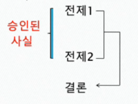
- 설명 : 승인된 사실의 원인을 규명  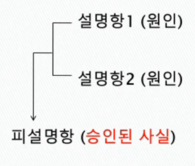

> 최근에 사형제도가 범죄 억제 수단이라는 논리가 반박 당하고 있다. 가장 범죄율이 높은 20개 주 가운데 18개 주가 사형제도를 채택하여 실행하고 있다. 범죄율이 가장 높은 대도시 가운데 17개 도시가 사형제도 시행 구역 내에 있다. 텍사스는 지난 10년 동안 다른 어떤 주보다도 많은 사람들을 사형에 처했지만, 여전히 범죄율 상위 25개 도시 중 3개 도시가 텍사스 주에 속해 있다. 거의 20년 넘게 이웃하고 있는 두 주, 즉 사형제도가 없는 미시간 주와 사형제도가 있는 인디애나 주는 살인 범죄율에서 거의 차이가 없었다. 
> -> 설명

> 아마 저 건물이 회의가 개최되는 장소인 것 같다. 거기를 봐, 차들이 많이 주차해 있잖아. 
> -> 주장

# 2-2. 논증이란 무엇인가-문제

### 문제풀이

1. 논증인가 (인과적) 설명인가?

- 뉴욕 세계무역센터 빌딩은 비행기의 충돌로 기둥을 지지하는 하중이 약해졌기 때문에 무너졌다. : 설명
- 죄송합니다. 타이어에 펑크가 나서 늦었습니다. : 논증
- 꽃신이 : 오늘 날씨 참 좋은데 
  씩씩이 : 이게 뭐 좋은 날씨니? 
  꽃신이 : 바람도 선선하고 하늘도 맑잖아. : 논증
- 꽃신이 : 오늘 날씨 참 좋은데 
  씩씩이 : 왜 그럴까? 
  꽃신이 : 대기 중에 불순물이 적어서 그렇지. : 설명
- 만약 사회의 근본적인 가치가 위협당한다면 그 사회는 커다란 문제가 있다고 볼 수 있다. 가족은 우리가 추구하는 사회의 근본적인 가치 중 하나이다. 요즘 이혼율이 너무 급격히 상승해 가족이 해체되고 있다. 그래서 우리 사회는 이 커다란 문제를 해결해야 한다. -> 논증

2. 각 대답에서 논증과 인과적 설명을 구분 해 보자.
   > A : 방 안이 아까보다 밝은데. 
   > B : 왜? 
   > A : 보조등을 켰거든.  : 설명
   > B : 아니, 나는 방이 밝아진 줄 모르겠는데? 
   > A : 아까는 신문의 글씨가 잘 안 보였는데 지금은 잘 보여.  : 논증

# 3-1. 논증의 종류

### 1.연역과 논증의 사전적 정의

- 논증(명제들의 집합)은 두 종류이다.

  1)**연역논증**(deductive argument) = **연역**(deduction)

  2)**귀납논증**(inductive argument) = **귀납**(induction)

- 그런데 연역과 귀납의 일상적인 구분과 이해에는 문제가 있다.

#### 연역

- **일반적 원리**를 전제로 하여 **특수한 다른 원리**를 이끌어 내는 추리(<국어대사전>, 민중서림)
- **일반적인** 명제나 진리를 전제로 하여 보다 **특수하고 개별적인** 명제나 진리를 이끌어 내는 추리(<새우리말큰사전>, 삼성출판사)

#### 귀납

- 개개의 **특수한** 경험 사실로부터, 공통 요소를 찾아내어 **일반적인** 원리, 법칙으로 인도하는 방법에 의한 일(<국어대사전>, 민중서림)
- **개개의 사례**를 관찰함으로써 이러한 사례들이 포함되는 **일반명제**를 확립시키는 추리(<두산세계대백과사전>)

- 연역의 일반적 예1
  > 모든 사람은 죽는다. 
  > 소크라테스는 사람이다. 
  > 그러므로 소크라테스는 죽는다.
- 귀납의 일반적 예2
  > 소크라테스는 사람이며 죽는다. 
  > 크산티페는 사람이며 죽는다. 
  > 사포는 사람이며 죽는다. 
  > 그러므로 모든 사람이 죽는다는 것은 필연적 사실이다.

##### 연역은 일반명제(전제)->특수명제(결론)

##### 귀납은 특수명제(전제)->일반명제(결론)

- 이 구분법에 따르면 연역논증과 귀납논증은 전제와 결론의 보편적이냐 아니면 특수하냐가 중요

  1)연역논증은 **보편적인 것**으로부터 **특수한 것**을 추론하는 것

  2)귀납논증은 **특수한 것**으로부터 **보편적인 것**을 추론하는 것

- 이런 구분방식은 고대 철학자 아리스토텔레스가 귀납을 "특수자/개별자들로부터 보편자에게 향하는 통로"라고 규정한 것에서 유래한 듯하다.
- 그러나 그는 연역을 귀납의 경우를 뒤집어서, 즉 보편자로부터 특수자/개별자에 이르는 과정으로 규정하지는 않았다.

- 연역과 귀납의 이러한 구분방식은 언제나 유효하지 못하고 부분적으로만 적용되므로 편협한 것이다.
- 가령 **일반적 예1**의 경우 보편명제로부터 특정명제의 연역적 추론이라고 할 수 있지만, 다음과 같이 연역추론의 또 다른 경우가 있다.

  > 모든 동물은 죽는다. 
  > 모든 사람은 동물이다. 
  > 그러므로 모든 사람은 죽는다. 
  > -> 보편에서 보편으로

  > 만일 소크라테스가 사람이라면, 소크라테스는 죽는다. 
  > 소크라테스는 사람이다. 
  > 그러므로 소크라테스는 죽는다. 
  > -> 특수에서 특수로

**-> 연역의 사전적 정의는 편협하다.**

- 이는 귀납논증에서도 마찬가지로 해당한다.
- 앞의 **일반적 예2**는 특수한 것으로부터 보편적인 것의 추론이지만, 귀납논증이 언제나 그러한 것은 아니다.

  > 모든 소는 포유류이며 폐를 가지고 있다. 
  > 모든 고래는 포유류이며 폐를 가지고 있다.  
  > 모든 사람은 포유류이며 폐를 가지고 있다.  
  > 그러므로 필시 모든 포유류는 폐를 가지고 있을 것이다. 
  > -> 보편에서 보편으로

  > 히틀러는 독재자였으며 잔인하다. 
  > 스탈린은 독재자였으며 잔인하다. 
  > 카스트로는 독재자이다. 
  > 그러므로 카스트로는 필시 잔인할 것이다. 
  > -> 특수에서 특수로

**-> 귀납의 사전적 정의 또한 편협하다.**

### 2.연역과 귀납의 올바른 구분방식

- 연역과 귀납은 논증을 구성하는 **전제와 결론의 지지관계**에 따라 구분해야 한다.
- **연역논증**이란 전제들이 결론을 **필연적**(necessary)으로 지지하는 논증
- 이 때 필연성이란 정도의 문제가 아니며 경우에 따라 변할 수 있는 것도 아니다.
- 연역논증에서 만약 전제가 참이라면, 결론은 **반드시** 그리고 **언제나** 참이라고 주장되는 논증이다.

- 이와는 대조적으로 **귀납논증**은 전제들이 결론에 대해 근거를 제공하기는 하나, 결정적인 근거가 아니라 어느 정도의 **개연적(probable) 근거**를 제공하는 논증이다.
- 따라서 전제들이 모두 참이라고 할지라도 그로부터 결론을 논리적 필연성을 가지고 도출할 수 있다고 기대하기 어렵다.
- 즉 귀납논증은 결론의 참을 증명하기 위해서 그럴 듯한 증거를 전제로 제시하는 논증으로 전제와 결론의 지지관계를 필연성보다는 **개연성의 정도**에 따라 규정한다.
- 이 때 개연성은 정도의 문제이며 경우에 따라 변한다.
- 귀납논증은 전제들이 참이면 결론이 참일 **개연성이 높음을 보여 줄뿐**, 결론이 반드시 그리고 필연적으로 참임을 보여주는 논증이 아니다.

- 귀납논증의 예

  > 이제까지 다른 나라에서 발견된 백조의 색깔은 희다. 
  > 이제까지 우리나라에서 발견된 백조의 색깔은 희다. 
  > 남극에서 백조가 발견된다면, 그 백조의 색깔도 흴 것이다. 
  > -> 반드시, 필연적으로는 아님. 개연성이 높음

- 이처럼 귀납은 경험에서 경험으로 나아가는 추론으로서, 우리가 관찰한 경우가 관찰하지 않은 경우에 대하여 말해줄 수 있다는 가정을 담고 있다.

- 다음을 비교해보자.

  > 어리석은 자들은 **대부분** 논리적 사고 훈련을 받지 못했다. 
  > 철이는 어리석다. 
  > 그러므로 철이는 논리적 사고를 훈련받지 못했을 것이다. 
  > -> 귀납

  > 비가 올 때는 **언제나** 땅이 젖는다. 
  > 그런데 지금 비가 온다. 
  > 그러므로 지금 틀림없이 땅이 젖을 것이다. 
  > -> 연역

#### 연역논증

- 전제가 결론에 결정적이고 확실한 근거를 제공
- 전제의 내용에 결론의 내용이 함축되어 있어, **전제가 참이면 결론도 필연적으로 참**
- 결론의 내용은 전제의 내용을 넘어서지 못한다.
- 전제와 결론 사이에 논리적인 비약이 없다.
- 연역논증의 목표는 **결론(주장)의 확실성을 보장**

#### 귀납논증

- 전제가 결론에 개연적인 근거를 제공
- 전제의 내용에 결론이 함축되어 있지 않으므로, **전제들의 참이 결론의 참을 확실하게 보장하지 못함.**
- 결론은 전제의 내용을 넘어선다고 기대됨.
- 전제와 결론 사이에 논리적인 비약이 있다.
- 귀납논증의 목표는 **전제의 내용을 넘어서는 지식의 확장**

# 3-2. 논증의 종류문제

### 연습문제

- 다음 진술에 대해 참 또는 거짓으로 답하시오

1. 귀납논증의 결론은 일반적 사실에 관한 것이다. -> 거짓

2) 귀납논증의 전제와 결론 모두가 특수한 사실을 기술하는 명제일 수 있다. -> 참

3) 귀납논증이란 특수한 사실을 바탕으로 하여 일반적 사실을 정당화하는 논증이다. -> 거짓

4) 연역논증은 전제가 말하는 내용 이상의 것을 결론에서 주장하는 논증이다. -> 거짓

5) 어떤 논증이 연역인지 귀납인지 결정하는 것은 전제와 결론 사이에 기대되는 지지관계다. -> 참

- 다음 논증이 연역논증인지 귀납논증인지 구분하고 그 이유를 설명해보시오.

1. 매년 겨울 평균 기온이 상승하는 추세를 보인 것은 이미 20년 전부터이다. 아마 계속 이런 식으로 나간다면, 내년 겨울도 아주 춥지는 않을 것이다.

-> 필연적으로 내년 겨울도 그러하리라 장담하지는 못함. 전제가 결론을 개연적으로 지지. 귀납논증.

2. 동성애적인 성향은 유전에 의한 것이거나 아니면 문화적인 것이다. 그런데 문화적인 것이 아니라는 것이 확실히 밝혀졌다. 그러므로 동성애적인 성향은 유전적인 것이다.

-> 전제가 결론을 필연적으로 지지. 연역논증.

3. 만약 헤밍웨이가 <킬리만자로의 눈>을 썼다면, 그는 자살했다. 그런데 그는 <킬리만자로의 눈>을 쓰지 않았다. 그러므로 그는 자살하지 않았을 것이다.

-> 연역논증. p->q, ~q, ~p

4. 빛나는 모든 것은 금이 아니다. 어떤 금은 값진 장식품이다. 그러므로 빛나는 어떤 것은 값진 장식품이다.

-> 연역논증.

5. 내일 해가 뜰 것이다. 어제도 그저께도, 또 그 이전에도 계속 해가 떴기 때문이다.

-> 귀납논증.

6. 모차르트가 <피가로의 결혼>을 작곡했다면 <마술피리>도 작곡했다. 그런데 모차르트는 <마술피리>를 작곡했다. 따라서 그는 <피가로의 결혼>도 작곡했다.

-> 연역논증.

7. 일주일에 세 번 이상 토마토를 섭취하는 성인들은 그렇지 않은 사람보다 암에 걸릴 확률이 낮다고 한다. 영수 부모님은 암에 걸리지 않을 것이다. 그분들은 매일 토마토를 드신다고 한다.

-> 귀납논증.

8. 출구 조사 결과 이 후보자를 지지한 사람들이 57%였다. 따라서 이번 선거에는 이 후보자가 당선되리라고 생각한다.

-> 귀납논증.

### PSAT 문제

- 논증의 종류를 구분하여 보시오.

1. 우리 등산 동우회 회원은 모두 여덟 명이다. 그러므로 우리 동우회 회원 중 같은 요일에 태어난 사람이 적어도 두 명은 된다.

-> 연역논증

2. 올림픽 대회와 세계선수권 대회에서 모두 우승한 사람만이 유도의 일인자이다. 그런데 갑수는 올림픽 대회에 출전한 적이 없으므로 유도의 일인자가 아니다.

-> 연역논증

3. 오늘 아침 신문에 북아프리카에 리히터 규모 9.0의 강진이 일어나 많은 사망자가 발생했다는 충격적인 보도가 있었다. 따라서 많은 사람들이 무고하게 목숨을 잃었음에 틀림없다.

-> 귀납논증

# 4-1. 논증의 평가

### 1.논증의 평가기준

- 논증은 전제와 결론의 지지관계에 관한 기준에 따라 연역과 귀납으로 분류된다.
- 논증은 두 가지 기준에 따라 평가된다.

  a) 먼저 논증의 전제를 참이라고 가정했을 때, 결론은 필연적 또는 개연적으로 도출되고 있는가? 즉, 논증에서 전제와 결론의 지지관계를 **형식적** 측면에서 평가한다.

  b) 다음으로 제시된 전제가 참인가? 즉, 논증에서 전제와 결론의 지지관계를 **내용적** 측면에서 평가한다.

- 이 두 기준에 따라 논증을 평가할 때,
- 첫째 기준(형식적 측면)에 따라 논증의 타당성(연역)과 강도(귀납)를 따지고,
- 둘째 기준(내용적 측면)에 따라 논증의 건전성(연역)과 설득력(귀납)을 따진다.

  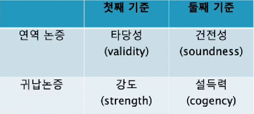

### 2.연역 논증의 기준 : 타당성과 건전성

**a) 첫째 기준에 따른 연역의 평가 : 타당한 논증과 부당한 논증**

- 타당과 부당은 연역논증에만 적용되는 평가용어다.
- **타당한 논증**은 전제가 참이라고 가정했을 때, 그 전제가 결론의 참을 확실하게/필연적으로 보증해 주는 연역 논증이다.
- 반대로 전제가 참이라고 가정했을 때, 그것이 결론의 참을 확실하게/필연적으로 보증해 주지 못하는 연역논증을 **부당한 논증**이라고 한다.

- 연역 논증은 결론의 내용은 전제 속에 이미 포함되어 있다.
- 따라서 결론이 전제 속에 이미 들어 있거나 암암리에 함축되어 있는 연역 논증은 타당하고(valid) 그렇지 못한 연역논증은 부당하다(invalid).

> 모든 사람은 죽는다. 
> 소크라테스는 사람이다. 
> 그러므로 소크라테스는 죽는다. 
> -> 타당한 (연역)논증 

> 예1) 모든 말은 귀가 셋이다. 
> 이 동물은 말이다. 
> 그러므로 이 동물은 귀가 셋이다. 
> -> 위의 예는 타당한 논증인가? 
> -> 타당하다.

> 예2) 어떤 사람은 동물이다. 
> 어떤 동물은 땅 위에 산다. 
> 그러므로 어떤 사람은 땅 위에 산다. 
> -> 이 경우 전제의 참을 가정할 때 그 결론이 필연적으로 도출되는가? 
> -> 필연적으로 도출되지는 않는다. 부당하다.

- 실제로 전제와 결론의 내용이 실제로 참이어야 타당한 논증이 되는 것은 아니다.
- **타당성**은 전제와 결론의 (형식적) 지지관계가 필연적인가 아닌가를 평가하는 것이기 때문이다.

> 모든 개는 깃털을 가지고 있다. 
> 모든 새는 개이다. 
> 그러므로 모든 새는 깃털을 가지고 있다. 
> -> 타당

> 모든 새는 부리를 가지고 있다. 
> 모든 고양이는 새이다. 
> 그러므로 모든 고양이는 부리를 가지고 있다. 
> -> 타당

> 모든 식물은 죽는다. 
> 모든 백합은 식물이다. 
> 그러므로 모든 백합은 죽는다. 
> -> 타당

> 모든 개구리는 날개가 있다. 
> 모든 말은 개구리다. 
> 그러므로 모든 말은 날개가 있다. 
> -> 타당

전제와 결론의 형식적 지지관계가 필연적인가 아닌가만 평가.

b) 참과 타당성

- 논증은 명제들의 집합이고, 각 명제는 진리값을 가진다.
- ★ **참**과 **거짓**은 명제(전제나 결론)에 적용되는 것이지 논증 자체에 적용되는 용어가 아니다.
- ★ '참인 논증' 또는 '거짓인 논증'이란 표현은 불합리하다.
- 연역 논증에서 논증이 타당하다 또는 부당하다, 또는 건전하다든지 건전하지 않다라고 말한다.
- **논증의 타당성**은 일반적으로 논증을 구성하고 있는 명제들이 실제로 참인지 거짓인지 무관하다.

- 어떤 연역 논증에서 전제들 중 일부 또는 전부가 실제로는 거짓이고, 결론이 실제로 참인 타당한 논증이 있을 수 있다.
- 또한 전제들 일부 혹은 전부가 실제로는 거짓이고, 결론도 거짓인 부당한 논증이 있을 수 있다.
- 모든 전제와 결론이 참인데도 부당한 논증이 있는 반면, 모든 전제와 결론이 거짓인 타당한 논증이 있다.

- 논증의 타당성을 말하면?

> 1)만약 존 레논이 암살되었다면 그는 죽었다. 
> 그는 죽었다. 
> 그러므로 그는 암살되었다. 
> -> 부당하다. 

> 2)모든 생명에는 한계가 있다. 
> 한계가 있는 것은 모두 아름답다. 
> 그러므로 모든 생명은 아름답다. 
> -> 타당하다. 

### 3.보충설명

- 타당성 검토에서는 일단 전제의 참을 가정하므로 논증의 타당성과 부당성은 오직 논증의 형식에만 관계한다.
- 논증에는 논증 형식을 구성하는 부분(논리적 용어)과 그 외 부분(비논리적 용어)로 구분 할 수 있다.
- 그런 다음, 연역논증의 논리적 용어를 그대로 두고 비논리적 용어를 다른 말로 대체해서 평가

> **어떤/모든** _대학생은_ _정의롭_ **다**/_정의롭지_ **못하다**.  **굵은글씨**는 논리적 용어라 하고, *이탤릭체*는 비논리적 용어라고 한다. 

- 타당한 연역논증은 논리적 용어를 그대로 두고 비논리적 용어를 다른 말로 대체해도 여전히 타당하다.
- 부당한 연역논증은 논리적 용어를 그대로 두고 비논리적 용어를 다른 말로 대체하더라도 여전히 부당

1. **약간의** *대학생*은 공학도**이다.** **약간의** *공학도*는 여학생이다. 그러므로 **약간의** *대학생*은 여학생이다.

- 만약 논증이 부당하다면, 비논리적 용어를 다른 말로 대체해서 **명백하게 참인 전제와 명백하게 거짓인 결론을 구성할 수 있다.**
- 논증1에서 비논리적 용어는?

1. **약간의** *남학생*은 공학도**이다.** **약간의** *공학도*는 여학생이다. 그러므로 **약간의** *남학생*은 여학생이다.

- 따라서 1은 부당하다.
- 약간의 A는 B이다. 약간의 B는 C이다. 그러므로 약간의 A는 C이다. (부당한 논증형식)

2. **약간의** *대학생*은 _어리석지_ **않다.** **모든** 대학생은 _논리적_**이다.** 그러므로 약간의 논리적인 사람은 어리석지 않다.

- 만약 타당한 논증이라면 이 용어를 다른 말로 대체하여 **명백하게 참인 전제와 명백하게 거짓인 결론을 구성할 수 있다.**
- 2에서 비논리적 용어는?
- 용어를 대체하여 명백하게 참인 전제와 명백하게 거짓인 결론을 구성할 수 없다. 따라서 타당하다.
- 약간의 A는 B가 아니다. 모든 A는 C이다. 그러므로 약간의 C는 B가 아니다. (타당한 논증형식)

> 오늘날 목사는 예수의 사도와 같다. 
> 그런데 예수는 여성을 자신의 사도로 세운 적이 없다. 
> 그러므로 여성에게 목사직을 허용해서는 안 된다. 

- 이 논증은 타당한가 부당한가?
- 비논리적 용어는?
- 이 용어를 다른 말로 대체해서 명백하게 참인 전제와 명백하게 거짓인 결론을 구성해 낼 수 있는가?
- 예컨대 '여성'을 '한국사람'으로 대체해 보면?

> 오늘날 목사는 예수의 사도와 같다. 
> 그런데 예수는 한국사람을 자신의 사도로 세운 적이 없다. 
> 그러므로 한국사람에게 목사직을 허용해서는 안 된다. 
> -> 명백하게 참인 전제와 명백하게 거짓인 결론. -> 부당하다.

4. 논리적 사고는 훈련을 통해서 얻어질 수 있다. 수학적 추리도 훈련을 통해서 얻어질 수 있다. 그러므로 수학적 추리도 일종의 논리적 사고라고 할 수 있다. 
   -> 어린아이는 양육을 통해서 자랄 수 있다. 강아지도 양육을 통해서 자랄 수 있다. 그러므로 강아지도 일종의 어린아이라고 할 수 있다.  -> 부당

- 다음 논증의 타당성과 건전성을 평가해 보아라.

> (전제1) 만일 국제 평화가 유지된다면, UN은 불필요하다. 또 만일 국가 간에 전쟁이 일어난다면, UN은 전쟁방지라는 목적을 성취하지 못한 것이기 때문에 불필요하다. 
> (전제2) 국가 간에는 평화 아니면 전쟁 상태만이 존재한다. 
> (결론) 따라서 UN은 불필요하다. 

- 이 논증은 타당한가? 그리고 논증의 건전성은? 
  -> 타당하다. 전제 1과 2모두 참이 아니다. 건전하지 않다.

- 다음 진술에 대해 참과 거짓으로 답하시오.

1. 귀납 논증은 다양한 정도의 강도를 가진다. -> 참
2. 부당한 연역 논증과 약한 귀납 논증은 결국 같은 것이다. -> 거짓
3. 설득력 있는 논증은 결론이 거짓으로 판명될 수 있다. -> 참

- 다음의 귀납 논증에 어떤 전제를 덧붙이면 강한 논증 또는 약한 논증이 되겠는가?

> 옆집에 사는 아저씨는 직업이 없나보다. 평일 아침이나 낮에도 항상 집에만 있으니까. 
> for 강한 논증 : 평일 아침이나 낮에도 낮잠을 잔다.
> for 약한 논증 : 책상에 앉아서 뭔가 집중해서 작업을 한다.

# 4-2. 논증의 평가-문제

### 연습문제

- 다음 연역논증의 타당성을 평가해 보시오.

1. 빨간색을 가진 모든 것은 세모꼴이다. 세모꼴은 세 개의 변을 갖는다. 그러므로 빨간색을 가진 모든 것은 세 개의 변을 갖는다. -> 삼단논법. 타당

2. 모든 동물은 하늘을 날아다닐 수 있거나 바다를 헤엄칠 수 있다. 그런데 이 동물은 하늘을 날 수 있다는 것이 확인되었다. 그러므로 이 동물이 바다를 헤엄친다는 것은 불가능하다. -> 부당

3. 물은 높은 곳에서 낮은 곳으로 흐른다. 강물도 물이니까 강물은 높은 곳에서 낮은 곳으로 흐르는 법이다. -> 타당

4. 논리적 사고는 훈련을 통해서 얻어질 수 있다. 수학적 추리도 훈련을 통해서 얻어질 수 있다. 그러므로 수학적 추리도 일종의 논리적 사고라고 할 수 있다. -> 부당

5. 마이클 조던이 최고의 농구선수라면 공중에 3초 이상 떠 있을 수 있어야 한다. 하지만 마이클 조던은 2.5초 밖에 공중에 떠 있지 못한다. 그러므로 마이클 조던을 최고의 농구선수라고 할 수 없다. -> 타당

# 5-1. 논증의 재구성

### 1.개괄

##### A. 용어정리

- **논증**이란 어떤 주장에 대하여 어떠한 형태로든 근거를 제시하는 것이다.
- 이 때 하나의 주장(A)에서 도출한 다른 주장(B)을 결론으로 제시하는 것이다. 이 때 A는 **전제/근거**가 되고, B는 **결론/주장**이 된다.
- A로부터 B를 끌어내는 과정을 **도출/추론**이라고 한다.
- 논증을 재구성(분석)하는 목적은 논증을 정확히 이해하고 평가하기 위함이다.
- 논증의 재구성(분석)은 전제(근거 또는 논거)와 결론의 관계를 정리하는 것에서부터 시작한다.
- 논증의 재구성(분석)에는 **논증도**(다이어그램)의 방법을 이용할 수 있다.

##### B. 논증도(다이어그램)

> ① 나는 생각한다. ② 그러므로 나는 존재한다.  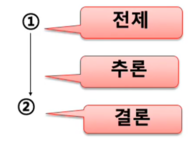

- 이 때 '전제는 결론을 지지한다/뒷받침한다/정당화한다"라고 말한다.

> 예)① 고래는 물고기다. ② 그러므로 고래에게는 배꼽이 없을 것이다.  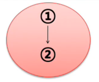

### 2.논증의 재구성

##### A. 논증의 재구성 과정

- 논증 여부 결정 : 주장에 대한 근거를 제시하고 있는가? 아니면 사태에 대한 인과적 설명에 불과한가?
- 전제와 결론의 분리 : 숨은 전제나 결론은 없는가? (결론은 하나밖에 없다.)
- 논증의 재구성(논증도) : 전제가 어떻게 결론을 지지하고 있는가?
- 논증의 평가 : 전제가 결론을 충분히 지지하는가

- 논증의 표준틀 : 전제1 전제2 전제3 ... 그러므로 결론
- 글의 형태로 제시된 논증은 명확하지 못한 경우가 허다
- 전제와 결론을 분리하고 정돈하는 재구성을 통해 논증을 명확하게 이해하도록 한다.

###### B. 전제와 결론 찾기

- 논증의 재구성은 전제와 결론을 찾는 것에서 시작한다.
- 전제와 결론의 위치 :
  > 미군은 한국에 계속 주둔해야 한다. 주한미군이 있는 것만으로도 한반도의 전쟁 억제력이 있기 때문이다. (첫 문장이 결론) 
  > 시베리아에 사는 고니는 우리나라에서 겨울을 지내는데, 이번 겨울에도 날아 올 것이다. (마지막 문장이 결론) 
  > 결론이 중간에 있을 수도 있다.

- 전제와 결론은 문장의 위치와는 상관없다.
- 전제는 다수일 수 있지만, 한 논증에서 결론은 하나다.
- 형식적인 측면에서 전제지시어(왜냐하면, 이기때문에, 그 이유로는, 첫째, 둘째...)와 결론지시어(따라서, 그러므로, 결국, 이에 따라, 결론적으로...) 등의 도움을 얻을 수 있다. 그러나 지시어가 전혀 없는 논증도 있다.

##### C. 숨은 전제와 결론 찾기

- 전제는 하나 이상이고, 그 중 일부는 명백하게 표현되어 있지 않은 경우도 있다.
- 이와 같이 **생략된 전제(숨은 전제)**는 문맥에서 파악해 낼 필요가 있다.
- 표준틀로 논증을 재구성할 때, 명백히 제시되지 않은 부분이 있다면 그 생략된 부분을 보충해 준다.
- 이것은 상대방의 논증을 긍정적으로 해석하려는 열린 태도이고, 이 태도를 **자비의 원리**라고 부른다.

> 서태지는 유부남이다. 그러므로 그는 남자이다.

1. 전제 : 서태지는 유부남이다.
2. 숨은 전제 : 유부남은 결혼한 남자다.
3. 결론 : 따라서 서태지는 남자이다.

- 예1) 이 DVD는 미성년자 관람불가야. 너는 볼 수 없다. (너는 미성년자야)
- 예2) 저 토마토는 빨갛구나. 잘 익었네. (빨간 토마토는 잘 익은 토마토이다.)
- 예3) 나는 내일 스키를 타러 가려고 한다. 그러므로 나는 주말에 강원도에 있을 것이다. (내가 스키 타러 가는 스키장은 강원도에 있다. 내일은 주말이다.)
- 예4) 박정희가 성군이면 내가 네 아들이다. (나는 네 아들이 아니다.)

> 음주운전은 살인행위다. 그러므로 어느 누구도 음주 운전을 해서는 안 된다.

1. 전제 : 음주운전은 살인행위다.
2. 숨은 전제 : 살인을 저질러서는 안 된다.
3. 결론 : 그러므로 어느 누구도 음주 운전을 해서는 안 된다.

> 서울시를 누비고 다니는 디젤 기관의 시내버스가 이제 천연가스 버스로 대체되었다. 그러므로 서울시의 공기는 상당히 깨끗해졌을 것이다.

1. 전제 : 서울시를 누비고 다니는 디젤 기관의 시내버스가 이제 천연가스 버스로 대체되었다.
2. 숨은 전제1 : 디젤 기관의 시내버스는 서울시 대기 오염의 주원인 중 하나였다.
3. 숨은 전제2 : 천연가스 버스는 대기를 덜 오염시킨다.
4. 결론 : 따라서 서울시의 공기는 상당히 깨끗해졌을 것이다.

> 육체의 생은 악이고 허위이다. 그러므로 우리는 죽음을 희망해야 한다.

1. 전제 : 육체의 생은 악이고 허위이다.
2. 숨은 전제 : 악이고 허위인 것은 피하도록 희망해야 한다.
3. 중간 결론 : 육체의 생을 피하도록 희망해야 한다.
4. 숨은 전제 : 육체의 생을 피하는 길은 죽음 뿐이다.
5. 결론 : 따라서 죽음을 희망해야 한다.

##### 정리

- 논증의 재구성/분석이란 주어진 글을 논증의 표준틀에 맞도록 전제와 결론의 순서로 배열하는 것이다.
- 이 때 **생략된(또는 숨은) 전제나 결론을 찾아** 채운다.
- 주어진 글을 치밀한 논증으로 재구성할 때, 글쓴이의 의도를 최대한 유리하게 파악한다. (자비의 원리)

##### C. 논증의 재구성(논증도 그리기)

- 먼저 주어진 글을 치밀하고 호의적으로 재구성한다. 즉 숨은 결론을 보충한다.
- 다음으로 전제와 결론의 관계를 구조적으로 파악하는 작업을 진행한다.
- 다시 말해 주어진 글 속에서 논증을 구성하고 있는 명제들의 역할(지지관계)을 분석한다.

- 논증의 기본적인 구조는 도출/추론 관계의 양태에 따라 네 가지 유형으로 분류할 수 있다.

a) 단순논증
b) 결합논증
c) 합류논증 (단순 + 결합)
d) 복합논증 (단순 + 합류 or 결합 + 합류)

##### a. 단순논증

- **하나의 명제에** 근거해서 하나의 결론을 도출/추론

> ① 고래는 물고기다. ② 그러므로 고래에게는 배꼽이 없을 것이다.  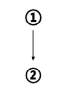

> 예)플라톤에 의하면, ① 선은 한 사람의 진정한 이익을 증진시키는 것이므로, ② 어떤 경우든 선이 알려지는 경우 사람들은 그것을 추구한다.

##### b. 결합논증

- **여러 명제가 결합하여 하나의 근거**를 이루어 하나의 결론을 끌어낼 때 
  => 다수 전제가 결합하여 결론을 지지할 때

> ① 만일 네가 달에 간다면 더 날씬하게 보일 것이다. ② 만일 네가 달에 가면 체중이 줄어들 것이고, ③ 만일 네가 체중이 줄어들면 더 날씬하게 보일 것이기 때문이다.  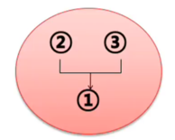

> 자연은 설계도가 있음을 보여준다. 어떤 것이든 설계도가 있다면, 그것은 설계자가 있다. 그러므로 자연은 설계자의 작품이다.

##### c. 합류논증

- **여러 근거**가 제시되고 그것들에서 결론이 도출될 때 
  => 여러 전제가 각각 부분적으로 결론을 지지할 때

> ① 아이들 교육을 위해서는 TV가 없는 편이 낫다. ② 가족간의 대화시간이 줄어들 뿐만 아니라 ③ 아이들을 수동적인 인간으로 만들기 쉽기 때문이다.  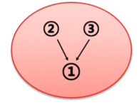

##### d. 복합논증

> ① 사형제도는 범죄를 막지 못한다. ② 왜냐하면 범죄자들은 범행을 할 당시에 자신들이 체포되리라는 생각을 아예 하지 않기 때문이다. 또 ③ 많은 범죄자들이 정신적으로 정상이 아니기 때문에, ④ 자신들이 행한 불합리한 행동이 가져올 합리적인 결과를 고려하지 못한다.

> 1이 결론이고 2,3 그리고 4는 전제의 역할을 한다. 그 중 3은 4를 지지하는 전제의 구실을 하고 있다.  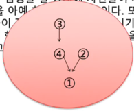

> ① 자연선택이 없다면 진화는 멈출 것이다. ② 그런데 자연선택은 이제 인간에게는 적용되지 않는다. ③ 자연선택이 이루어지려면 강한 개체보다도 훨씬 많은 수의 약한 개체가 번식하기 전에 죽어야 하는데, 현대의 의학은 약한 자도 강한 자에 못지않게 살아남고 또 번식할 수 있도록 만들어 놓았기 때문이다. ④ 따라서 인간은 더 이상 진화하지 않는다.

> 4가 결론이고 1,2 그리고 3이 전제의 역할을 한다. 그 중 3은 2를 지지하는 전제의 구실을 하고 있다.

# 5-2. 논증의 재구성-문제

### 연습문제

- 숨은 전제 또는 숨은 결론을 찾아보시오.

1. 아름다운 사람은 머문 자리도 아름답습니다.

-> (전제)당신의 머문 자리는 아름답다. (결론)당신은 아름다운 사람이다.
or (전제)당신은 아름다운 사람이다. (결론)당신의 머문자리는 아름답다.

2. 당신이 정말로 나를 사랑한다면 내가 원하는 것을 해줬을거야.

-> (전제)당신은 내가 원하는 것을 해 주지 않았다. (전제)당신은 나를 사랑하지 않았다.

3. 김현수씨는 국회의원에 출마할 수 없다. 그의 국적은 한국이 아니다.

-> (전제)한국인만 국회의원에 출마할 수 있다.

4. 낙태는 금지되어야한다. 왜냐하면 살인은 금지되는 것이기 때문이다.

-> (전제)낙태는 살인이다.

- 논증도를 이용해서 다음의 글들을 재구성해보시오.

1. ① 지난 30년 간의 주식 시장이 보여 주듯이, 주식은 경기 침체 후 회복되는 처째 해에 채권보다 대체로 수익성이 높다. ② 올해가 그 해이기 때문에, ③ 주식은 채권보다 수익성이 높아야 한다. 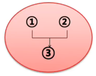

2. ① 한자 혼용을 주장하는 사람들은 한자어는 한자로 표기돼야 그 듯이 얼른 들어온다고 한다. ② 이런 주장이 터무니없는 것은 아니다. ③ 낱말에 따라서, 맥락에 따라서 한자어의 표의성이 크게 효과를 발휘하는 경우가 있기는 하다. ④ 또 한자 혼용문에 익숙한 나이든 세대의 경우, 한자어가 한글로 표기됐을 때보다는 한자로 표기됐을 때 뜻이 더 쉽게 파악될 수도 있다. 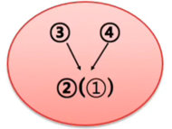

3. ① 정부의 구조조정은 옳지 못하다. ② 서민층의 희생만을 강요하는 경제 정책은 옳지 못한데, ③ 정부의 구조조정은 서민들에게 너무 많은 것을 빼앗아 가고 있기 때문이다. 더구나 ④ 구조조정이 이루어진다 하더라도 경제가 개선될지 장담할 수 없다.  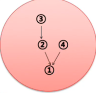

4. ① 사형은 폐지해야 한다. ② 사형도 살인에 지나지 않기 때문에 ③ 살인이 비인도적인 행위인 이상, ④ 사형도 비인도적인 행위임에 틀림없다. ⑤ 사형에 범죄 억제력이 있다는 주장도 의심스럽다. ⑥ 사형에 대한 우려 때문에 하려던 범죄를 중단한 자가 지금까지 어느 정도나 있다는 것인가. 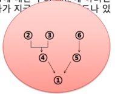

5. ① 인간은 절대로 확실한 지식을 얻을 수 없다. ② 지식은 최종적으로는 관찰에 기초해야 하는 것인데, ③ 원래 관찰이란 잘못도기 쉽다. 왜냐하면 ④ 관찰은 관찰자의 관심에 의해 통제되는 것이며, 따라서 ⑤ 관찰은 본질적으로 무언가의 선입관에 의해 영향을 받을 수밖에 없기 때문이다. 나아가 ⑥ 지식은 관찰을 넘어서서 추측행위에 의해 얻어지는 것인데, ⑦ 추측은 관찰 이상으로 잘못되기 쉬운 특성을 갖고 있다.  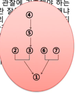

6. ① 정상적이라는 것은 어디까지나 비정상적인 것의 관점에서만 제한적으로 정의될 수 있다. ② 비정상적이라는 개념은 단지 주관적인 것이므로 ③ 정상적이라는 개념도 주관적이다. ④ 단순히 주관적인 개념은 사회적인 결정의 기초로 사용될 수 없으므로 ⑤ 우리는 "정상적인 것이 무엇인가"에 대한 개념을 기초로 사회적인 결정을 하지 않아야 한다. 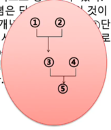

# 6-1. 언어와 정의

### 1.언어와 사고

- 언어와 사고
  - 인간 사고는 그 어떤 것으로 표현될 수 있어야 한다.
  - 이 때 인간은 주로 언어를 사용한다.
  - 인간이 언어를 사용하는 것은 의사소통을 위해서이다.
- 의사소통과 언어
  - 우리는 자신의 생각을 남에게 전달하기 위해 음성 언어 이외에도 몸동작이나 얼굴 표정, 심지어 시선을 사용한다.
  - 이러한 신체언어는 가장 단순한 의사소통을 위한 것으로 인간뿐만 아니라 여러 동물들에게도 일반적이다.
  - 인간의 언어 사용에서 다른 동물의 것과 구분되는 것은 언어 가운데 문자를 사용한다는 점이다.
  - 문자를 이용한 의사소통은 몸동작(신체언어)이나 말(음성언어)과는 다른 기호체계이다.
- 논증과 문자언어
  - 언어(문자)는 단순히 의사소통의 도구만을 의미하지는 않는다.
  - 인간은 그것으로 세계를 기술(description)할 뿐 아니라 어떤 것을 주장하고 이를 비판적으로 논의, 즉 논증(argument)하기도 한다.
  - 인간에게 문자 사용은 획기적인 것으로서, 인간은 문자를 통해 좀 더 높은 사고의 단계로 나아갈 수 있다.
  - 인간은 문자를 통해서 이 세계에 대한 구체적인 내용과 지식을 포함하는 문화적 관계를 형성한다.
- 언어의 사용과 언어의 언급

  > 1.대한민국은 동아시아에 위치하고 있다.  
  > 2.'대한민국'은 네 음절을 가진다.

  - 1과 2에서 대한민국이라는 주어로 쓰인 단어가 무엇을 의미하는지 살펴보자.
  - 1에서 대한민국은 무엇을 지시하는가?
    - 1에서 대한민국은 중국과 일본 사이에 있는 국가인 대한민국을 지시한다.
  - 그럼 2에서 ‘대한민국’은?
    - 반면 2의 ‘대한민국’은 바로 그 국가의 이름을 지시하는 것으로, ‘대한민국’이라는 단어에 대한 것이다. 즉 2는 한 국가가 아니라 단어 자체를 가리킨다.
  - 이처럼 어떤 기호가 어떤 대상을 가리키기 위해서 사용될 때, 우리는 그 기호가 **사용된다**(use)고 한다.
  - 그러나 그 기호가 대상이 아니라 기호 자체를 지시하기 위해서 쓰이면, 우리는 그 기호가 **언급된다**(mentioned)고 한다.

  > 3.'대한민국'은 동아시아에 위치하고 있다.  4.대한민국은 네 음절을 가진다.

  - 3과 4는 대한민국이라는 기호를 잘못 사용하거나 언급하고 있다.
  - 3은 대한민국이라는 **단어**가 동아시아에 있음을 말하고 있고,
  - 4는 대한민국이라는 **국가**가 네 음절이라고 말하고 있다.
  - 따라서 3과 4는 아무런 의미 없는 문장에 지나지 않는다.

### 2.언어와 의미

- 의견의 불일치

  - 1.**사실**에 대한 의견의 불일치 : 가령 코로나19 방경에서 한국이 잘 대처하고 있는가 아니면 일본이 더 잘 대처하고 있는가?
    - 해소방안 : 사실 확인
  - 2.**태도**의 차이로 인한 불일치 : 가령 자장면이 맛있는가 아니면 짬뽕이 더 맛있는가?
    - 해소방안??
  - 3.단어의 의미규정의 차이 때문에 생기는 불일치 : 가령 영화 “when harry met shally”의 한 장면에서 처럼…
    > 매력적인 여자와 친구가 될 수 있는 남자는 없다.  그녀와 섹스하기를 원하니까.
    - Harry가 말하는 친구와 shally가 말하는 친구의 의미는 동일하다고 말할 수 있는가?
    - 다른 예들
      - 푸른 (숲) vs 푸른 (바다)
      - 사과 (부사) vs 사과
      - (옥포 조선소의) 배 vs (청송) 배
  - 이처럼 우리는 대상을 지시하는 언어에 적당한 표상을 부여하여 언어를 사용
  - 앞선 예③과 같은 의견 불일치는 의사소통하는 사람끼리 사용하는 언어에서 지시 대상과 표상이 일치하지 않기 때문에 발생
  - 따라서 언어를 정확하게 사용하지 않으면, 즉 사용하는 언어에 의미를 정확하게 규정하지 않고 사용한다면, 이는 논리적 사고에 걸림돌로 작용

- 의미의 추상화

  - 논리적 사고의 걸림돌이 될 수 있는 또 다른 경우는 의미의 추상화가 맥락이나 상황과 맞지 않을 때이다.
  - 군대에서 고참의 신참교육 장면:
    > 고참 : 너 집이 어디야? 
    > 신병 : 네, 이병 씩씩이, 서울입니다. 
    > 고참 : 뭐, 서울? 서울이 다 네 집이야? 
    > 신병 : 아닙니다. 서울 삼선동입니다. 
    > 고참 : 아니, 삼선동이 다 네 집이냐?
  - 우리는 지시대상을 기호화할 때 언어에 적당한 표상을 부여하여 사용
  - 단어(가령 사과)는 그 사용 맥락에 따라 상이한 표상을 담을 수 있다.(개체로서 사과, 사과 일반, 과일 등).
  - 한 개체를 무엇 무엇이라고 표상하는 것은 **추상화**한다고 말한다.
  - 우리는 한 단어를 여러 단계에서 추상화할 수 있으며 상황에 따라 적당한 추상화를 이용한다.
    > 아롱 : 내 휴대폰 좀 갖다 줄래 (1) 
    > 다롱 : 음… 근데, 네 휴대폰이 어떤 거지? 
    > 아롱 : 몰라? 내거는 삼성 갤럭시야. (2) 
    > 다롱 : 여러 개인데…. 
    > 아롱 : 빨간색 없어? (3)
  - (1) → (2) → (3)으로 갈수록 추상화 단계는 낮아지고 있다. 즉 핸드폰의 정체성이 구체화되고 있다.
  - 한편 추상화의 수준과 방향은 매우 다양할 수 있다.
  - 추상화의 수준은 상황에 맞게 적절해야 한다.
  - 또 어느 정도의 추상화를 이용할 건지는 어느 정도의 지식과 정보를 가지고 있는가에 따라 달라진다.
  - 추상화의 단계가 지금 상황에서 적절한 것인지, 지금의 주제와 관련이 있는지도 잘 따져 보아야 한다.

- 문제풀이

  - 다음을 추상화 정도가 낮은 것부터 높은 것 순서로 나열하라.

    1. 탈 것
    2. 아반떼
    3. 자동차
    4. 현대 자동차
    5. 충북 12마 1234

    - 5-2-4-3-1

### 3.언어의 애매함과 모호함

- 용어의 뜻
  - **애매성**(ambiguity): 언어가 애매하다는 것은 그 언어가 **두 가지 이상의 의미**로 쓰일 때
  - **모호성**(vagueness): 언어가 모호하다는 것은 의미가 **적용되는 범위가 불확실**할 때
  - 애매하게 또는 모호하게 쓰인 언어는 비논리적인 사고(오류)로 이끈다.
- 동음이의어와 애매함

  - 같은 기호가 지시대상과 표상에서 두 가지 이상의 뜻을 가지는 경우
  - 예들: 배, 감다, 사장, 깎다, 매, 사과, 푸르다…
  - 동음이의어는 구체적인 맥락이 주어지면 대체로 무슨 뜻으로 쓰였는지 간파할 수 있다.

  > 이번에는 붉은 여왕이 다시 물었다. 
  > "유익한 문제를 내겠다. 빵을 어떻게 만드는지 아니?" 
  > "물론 그건 알죠! 먼저 밀가루(flour)가 있어야 돼요." 
  > 하얀 여왕이 물었다. 
  > "꽃(flower)을 어디서 뽑지? 정원, 아니면 울타리?" 
  > "밀가루는 뽑는 게 아니라 빻는(ground) 거예요." 
  > 하얀 여왕이 말했다. 
  > "얼마나 넓은 땅(ground)에서? 그렇게 많이 빼놓고 얘기하면 어떡하니?"

- 애매함

  - 임신중절에 관한 공방의 예

    > 태아는 **사람**이기에 태아를 죽이는 것은 살인 태아는 아직 **사람**이라고 할 수 없고 임신중절은 개인의 선택

  - 성인 기준의 예
    > 민법상 성인의 기준은 만 20세(부모 동의 없이 혼자서 신용카드 개설, 핸드폰 개통 등이 가능) 청소년보호법상으로는 만 19세(담배구입, 술집,피시방,클럽 출입가능 ) 선거권은 만 18세부터
  - 문장의 구조적 결함으로 인한 애매함

    > 씩씩이 : 나는 꽃신이보다 아이스크림을 좋아한다. 비교의 대상이 꽃신이와 아이스크림인지 아이스크림을 누가 더 좋아한다는 것인지 불명확

    > 씩씩이가 사랑하는 꽃신이의 언니는 연예인이다. 씩씩이가 사랑하는 사람이 꽃신이인지 그의 언니인지 불명확

- 모호함

  - 말의 의미가 부정확하여 적용되는 범위가 분명하지 않을 때

    > 요리는 과학이 아니라 감각이다. 적당할 때 적당히 넣어서 적당히 끓이는 거다.

    > 우리 3대국(미국, 영국, 소련)은 조선인민의 노예상태에 유의하여 적당한 시기에 조선을 자유, 독립시킬 것이다.

    > 대한민국의 공용문서는 한글로 쓴다. 다만 얼마 동안 필요한 때에는 한자를 병용할 수 있다. 이 법은 공표한 날부터 시행한다. – 1948년

    > 국가의 존립과 안전이나 자유민주적 기본질서를 위태롭게 한다는 점을 알면서 반국가단체나 그 구성원 또는 그 지령을 받은 자의 활동을 찬양, 고무, 선전 또는 이에 동조하거나 국가변란을 선전, 선동한 자를 처벌한다. (국가보안법)

- 문제풀이

  - 애매하거나 모호한 표현을 찾고 그 이유를 말해보시오.

    1. 우표를 제 자리에 붙이시오.

    - 제 자리. 모호

    2. 어느 회사의 여직원이 복사를 하러 갔을 때였다. 그때 잘생긴 신입사원이 그 곳에서 복사를 하고 있었다. 남자 신입사원은 못생긴 여직원을 한 번 쳐다보더니 한참을 머뭇거리다가 말했다. "저, 반 했습니다."

    - 반 했습니다. 애매

    3. 명찰을 항상 패용하십시오.

    - 항상. 모호

    4. 엄마는 기도할 때 '하나님 아버지'라고 하시네. 하나님이 엄마의 아버지면 나는 하나님의 손자겠네.

    - 아버지. 애매

    5. 철수: 나는 내 마누라를 사랑해. 
       영수: 나도 그래.

    - 애매

### 4.정의에 관하여

- 정의란?

  - 언어의 애매함과 모호함을 피하기 위해서는 올바른 용어를 사용해야 한다.
  - 언어는 지시하는 대상에 관한 적절한 표상을 담고 있으며, 올바른 용어란 어떤 구체적인 대상이나 어떤 추상적인 사유 형태를 적절하게 가리키는 것으로 문장에 포함되는 단어를 의미

  - 따라서 단어의 올바른 사용은 단어의 의미를 명확하게 규정

  - 단어에 명확한 의미를 부여하는 것이 **정의**
  - 아리스토텔레스는 정의를 ‘무엇인가의 본질을 나타내는 설명(또는 logos)라고 규정
  - 다시 말해, 정의란 단어에 대한 적절한 의미를 부여하는 일이며, 단어가 가리키는 대상의 본질을 명확하게 드러내는 일
  - 정의란 무엇을 설명하는 것으로 다음과 같은 구성으로 이루어진다.

  > 정의항(definiens) : 정의하는 단어

  > 피정의항(definiendum): 정의되어야 하는 단어

  > 산(山) [피정의항] : 둘레의 평편한 땅보다 우뚝하게 높이 솟아 있는 땅의 일부분 [정의항]

  - 이처럼 피정의항의 특성이나 성질을 정의항에서 보여주는 것이 정의하는 방식
  - 그런데 단어에 명확한 의미를 부여하기 위해서는 1) 단어가 가지는 정확한 **특성**을 알아야 하고, 2) 또 그 특성이 적용되는 **범위**를 따져야 한다.

- 단어의 의미: 내연와 외연
- **내연/내포**(intension) : 한 단어가 적용되는 사물이 가지는 모든 그리고 오직 그 **속성**들을 가리키는 용어

- **외연/외포**(extension) : 단어의 내포가 올바르게 적용되는 **대상들** 또는 사건들 (또는 그 집합)

- 내연와 외연의 관계:

  1. 내연이 증가하면 외연은 감소하거나 정지한다.

  2. 반대로 내연이 감소하면 그 외연은 증가하거나 정지한다.

  3. 하지만 내연과 외연이 동시에 증가하거나 감소하지는 않는다.

- 삼각형의 내연
  - 세 변으로 폐쇄된 면적을 갖는 모양
  - 세 변으로 폐쇄된 면적을 갖는 모양이고 세 각의 크기가 동일
- 삼각형의 외연

  - 이등변삼각형, 직각삼각형, 정삼각형
  - 정삼각형

- 그럼 '사람'이란 단어와 '여자'라는 단어의 내연와 외연을 따져 보자.
  1. 여자란 단어의 내연는 사람이란 단어의 내연보다 (크다/적어도 한 가지 많다.)
  2. 그러나 여자란 단어의 외연은 사람이란 단어의 외연보다 (적다/좁다.)
- 외연이 넓어질수록 내연을 줄어든다. 이를 **일반화**라고 한다.
- 외연이 좁아질수록 내연은 늘어난다. 이를 **구체화**라고 한다.

- 문제풀이

  - 다음 개념들을 내연이 커지는 방향으로 배열하시오.

    1. 영장류, 동물, 사람, 척추동물, 포유동물

    - 동물, 척추동물, 포유동물, 영장류, 사람

    2. 술, 음료, 포도주, 백포두주, 마주앙

    - 음료, 술, 포도주, 백포도주, 마주앙

    3. 운동선수, 구기종목선수, 야구선수, 수비수, 내야수, 유격수

    - 운동선수, 구기종목선수, 야구선수, 수비수, 내야수, 유격수

    4. 치즈, 일용식품, 유제품, 연치즈

    - 일용식품, 유제품, 치즈, 연치즈

  - 다음 진술의 진위를 말하시오.

    1. 단어의 정의항은 정의되어아 하는 말을 의미한다.

    - 거짓

    2. 어떤 단어는 외연이 없다.

    - 참

    3. 어떤 단어이든 내연을 가진다.

    - 거짓

    4. 어떤 단어가 모호하다면, 그 단어는 의미가 둘 이상이 있다는 것이다.

    - 거짓

    5. 미인은 그 뜻이 모호하다.

    - 참

    6. 단어의 내연이 많아질수록 외연은 좁아진다.

    - 거짓

  - 다음 물음에 답하시오.

    1. 외연이 없고 내연만 있는 단어는?

    - 둥근 삼각형, 황금산

    2. 외연은 있지만 내연이 없는 단어는?

    - 철수, 영희, 베이징과 같은 고유명사

    3. 내연과 외연이 전혀 없는 경우는?

    - 전치사나 접속사 같은 단어

### 5.정의의 유형

- 개념의 정의

  - 정의는 개념의 분명함을 확보하기 위한 수단이다.
  - 어떤 정의가 좋은 정의인가는 그 정의가 이루어지는 논의 영역과 정의의 목적에 따라 달라질 수 있기 때문에 일률적으로 말하기 어렵다
  - 하지만 아리스토텔레스가 제시한 올바른 정의가 지켜야 할 네 가지 규칙은 널리 적용되고 있다.
    > 정의는 정의되는 것의 본질(essence)을 제공해야한다. 
    > 정의는 순환적이어서는 안 된다. 
    > 긍정어로 정의가 가능하다면, 정의는 부정어를 사용해서는 안 된다. 
    > 정의는 비유적이거나 불분명한 언어로 해서는 안 된다.

- 정의의 방법과 유형

  - 단어에 의미를 부여하는 방식, 즉 정의의 방식은 다양하다.

  - 단어의 의미를 내연과 외연으로 나타낼 수 있듯이, 정의 역시 내연을 제공하는 정의(내연적 정의)와 외연을 제공하는 정의(외연적 정의)로 나눌 수 있다.

  - 하지만 내연적 정의와 외연적 정의가 모두 불가능한 개념의 경우 다른 방법을 적용해야 한다.

  - 이 경우 단어가 사용되는 맥락을 살피어 정의하는 맥락적 정의가 있다.

  - 이 경우 단어가 사용되는 맥락을 살피어 정의하는 맥락적 정의가 있다.

  - 또 자연과학 영역에서 사용되는 특수한 정의로서 조작적 정의가 있다.
    > 1.외연적 정의 : 단어의 외연에 따른 정의  2.내연적 정의 : 단어의 내연에 따른 정의  3.맥락적 정의 : 단어가 사용되는 문맥을 제시하는 정의  4.조작적 정의 : 자연과학에 적용되는 특수한 정의

- 외연적 정의

  - 정의하고자 하는 단어의 외연을 정의항으로 제시하는 정의
  - 이에는 크게 직시적 정의와 열거적 정의가 있다.

- 직시적 정의

  - 어떤 단어가 적용되는 개체, 사물 혹은 사건을 직접 가리켜 그 단어에 의미를 부여 (아이에게 언어를 가르칠 때를 생각해 보자.)
  - 직시적 정의는 단어와 그 단어로 지시되는 대상을 직접 연결하는 방식으로 그 단어의 외연을 정의하는 방식
  - 단어를 정의하는 가장 원초적이고 직접적이며 비언어적인 방식이기도 함(정의항이 언어적 형태로 제공되지 않기 때문에)
  - 지시적 또는 예시적 정의하고도 함
  - 간단하지만, 대상이 눈 앞에 없을 경우에는 정의가 불가능하다는 한계가 있다.
  - 직시적으로 대상을 가리킬 경우, 지시하는 대상이 어떤 것인 정확히 꼬집어 내기가 어렵다.

  > A가 navy blue의 의미를 설명하기 위해 마네킹의 머리 색깔을 지시했지만, B는 마네킹의 머리 색깔이 아니라 그 모양새를 그 단어의 의미로 이해할 수 있다.

  > 어린아이에게 고양이를 보여주면서 “이게 고양이란다”라고 말해 주었을 때, 그 아이는 다음에 강아지든 토끼든 인형이든, 부드러운 털을 가진 것을 보면 모두 ‘고양이’라고 부르는 경우

  - 나아가 국민총생산, 성적 등의 추상적 단어를 설명하려 할 때도 상당한 어려움이 생긴다.

- 열거적 정의

  - 직시적 정의가 비언어적 방식으로 단어의 외연을 정의하는 방식이라면, 열거적 정의는 언어로 단어의 외연을 정의하는 방식.
  - 단어가 적용되는, 즉 단어의 외연에 속하는 개체들을 나열해서 그 단어에 의미를 부여

  > 직시적 정의 -> **비언어**를 통한 외연적 정의

  > 열거적 정의 -> **언어**를 통한 외연적 정의

  - 나무란 {소나무, 참나무, 감나무, 단풍나무…} 등과 같은 식물을 말한다.
  - 꽃이란 {장미, 국화, 맨드라미, 분꽃….} 등을 말한다.
  - 열거적 정의는 구성원(그 단어가 적용되는 집합의 원소)이 제한되어 있는 경우에만 정확한 것이 될 수 있다.
  - 따라서 열거적 정의에도 분명한 한계가 있다.
  - 어떤 집합(가령 영화배우)의 모든 구성원을 나열한 완전한 열거적 정의를 제공하는 것은 불가능하며, 부분적 열거는 오해를 유발할 수 있다.
  - 만약 뉴욕이 뭔지도, 전화번호가 뭔지도 모르는 사람에게 뉴욕시 전화번호 모두를 열거해서 제시한다고 해서 그가 "뉴욕시 전화번호"라는 말의 의미를 이해할 수는 없다.
  - 또 사랑, 증오와 같은 추상적인 단어나 전혀 외연을 갖지 않는 단어는 열거적 방식으로는 정의될 수 없다.

- 내연적 정의

  - 사전적 정의

    - 가장 일반적인 정의 유형
    - 단어가 통상적으로 어떻게 사용되는가를 보여줌으로써 그 단어에 의미를 부여
    - 한 언어 안에 이미 정착된 의미를 올바르고 충실하게 반영하여 정의
    - 단어의 애매성을 제거하거나 어휘를 증가시키는 목적으로 사용
    - 정의항은 피정의항의 본질적인 의미를 잘 드러내야 한다.

      > 주변보다 상당히 높이 솟아오른 거대한 흙과 암석더미로 이루어진 지대(정의항) : 산(피정의항)

      > 석유나 가스 등을 연료로 하는 엔진의 힘으로 도로 위를 달리게 만든 수단

      > 자동차 : 네 개의 바퀴와 내연기관을 가진 운송수단 -> 정의가 지나치게 협소하다

      > 고양이 : 집에서 기르는 애완동물 -> 정의가 지나치게 포괄적이다.

      > 파트타임 직원 : 직장에서 파트타임으로 일하는 사람 -> 피정의항은 정의항의 단어를 사용하지 않아야 한다.

      > 사랑의 묘약 : 사랑의 감정을 불러일으키는 묘약 -> 정의항은 피정의항의 의미를 애매하지도 모호하지도 않게, 즉 분명하고 명료하게 부여해야 한다.

  - 약정적 정의

    - 어떤 단어를 새롭게 도입하여 사용할 때 필요
    - 예를 들어 인터넷 사용과 더불어 새로이 도입된 단어들

      > 아바타 : 사이버 공간 내에서 사용자의 이미지와 인성을 대변하는 주체

      > 화병 : 한국인에게만 나타나는 특수한 유형의 질환으로 우울증을 동반하며 복합적인 지능 장애를 유발하는 증후군

    - 약정적 정의는 언어의 규약적 성격을 잘 드러내준다.
    - 규약이란 꼭 그러해야만 할 필연성은 없지만 그렇게 하기로 약속하는 것을 말한다. 대표적인 규약의 사례로는 신호등을 꼽을 수 있다.

      > 10^5 : 10x10x10x10x10

      > 블랙홀 : 중력이 완전히 사라진 별

    - 새로운 개념의 도입은 1)편리성, 2)간결성 또는 경제성의 이유에서 이루어진다.
    - 정의가 이루어지기에 앞서서 미리 확립된 의미를 제공하는 정의가 아니라는 점에서 사전적 정의와 다르다.
    - 약정적 정의는 진정한 불일치를 해결하는 데에 기여하지는 못하지만, 무모한 언어적 혼란과 논쟁을 예방하는 데에 도움을 줄 수 있다.

  - 명료화 정의

    - 사전적 정의와 약저억 정의는 개념의 애매성을 감소시키는 데에 도움을 준다.
    - 이에 비해 모호한 단어의 의미를 더 정확하고 분명하게 하기 위해 사용되는 정의가 명료화 정의이다.
    - 가령 학교에 장학금을 신청할 때, "학업이 우수한 자"라는 자격요건이 있다. 문제는 그 적용범위가 불명확하다는 점이다.
    - 이 때 "학업이 우수한 자" 대신에 "평균 학점이 A 이상이고 D 학점이 없는 자"로 되어 있거나 이 문구를 괄호 속에 집어 넣으면 적용 범위가 명료해진다.
    - 이처럼 "부자"나 "성적우수자"와 같은 모호한 표현들은 그 표현이 적용되는 대상들의 경계를 약정함으로써 모호성을 감소시킬 수 있다.
    - 이처럼 이 정의 방식의 일차적 목적은 단어의 적용 범위가 불분명한 것, 즉 모호성을 제거하는 데에 있다.
      > 음주 운전자 : 도로교통법상 도로에서 운전 중 알코올 농도가 0.05mg 이상인 자
    - 특히 법률분야나 계약관계에서 널리 사용되는 개념적 도구가 명료화 정의이다.
    - 명료화 정의의 피정의항은 개념이 모호하지만 확정된 용법이 있는 개념이다.
    - 즉 정의하는 자가 선택한 의미를 마음대로 피정의항에 부여할 수 없다.
    - 정의하는 자는 가능한 한 확정된 용법에 충실해야 한다.

  - 이론적 정의

    - 특정한 이론을 바탕으로 단어의 의미를 정의하거나 또는 특수한 이론을 구성하기 위해 단어를 새롭게 정의하는 개념적 수단
    - 이론적 정의는 단어가 지시하는 대상의 특징을 체계적으로 또는 이론적으로 적절하고 충분하게 기술하는 것
    - 따라서 어떤 단어의 이론적 정의를 받아들이는 것은 그 정의의 배경을 이루는 하나의 특정한 이론을 받아들이는 것을 의미한다.
    - 이론적 정의는 시대에 따라서 또는 이론에 따라서 다르다.

      > 정의란 무엇인가?

      > 인간의 죽음이란 : 심장박동의 정지, 뇌 기능의 정지

      > (열역학 이론에서) 열이란 : 불규칙한 분자 운동 때문에 생기는 어떤 물체의 에너지

    - 하지만 처음 이론적 정의가 점차 일반화됨에 따라 평이한 사전적 정의로 받아들여지는 수도 있다.

  - 설득적 정의

    - 어떤 단어의 정의를 듣는 사람에게 우호적이거나 비우호적인 태도를 유발시키려고 의도할 때
    - 이런 의도에서 그 단어가 가지는 여러 의미 중 특정한 의미만을 강조하여 서술

      > 시다 : 재봉사의 일을 도와주는 조수

      > 동성애자 : 동일한 성을 가진 사람들에 대해 자연스럽지 못한 욕망을 느끼는 자

    - 낙태 문제에 대해 정의하는 사람의 우호적이거나 비우호적인 태도가 직접 또는 간접적으로 반영된 경우

      > 낙태란 죄 없는 생명을 앗아가는 잔혹하고도 비인간적인 살인 행위이다.

      > 낙태란 여성이 원하지 않는 짐으로부터 벗어나기 위해 선택하는 안전하고도 성숙한 의료적 절차이다.

- 맥락적 정의

  - 암묵적 정의의 한 형태로서 단어가 주어진 상황에서 어떻게 사용되는가를 보임으로써 정의하는 방식
  - 가령 전치사나 접속사와 같은 단어는 내연이나 외연을 가지지 않는다.
  - 하지만 이들 단어의 문법적 의미는 제대로 정의되어야 한다.
  - 이 때 "그 단어의 의미는 어떤 것이다"라고 명시적으로 단어의 의미를 부여하는 대신에 그것이 쓰이는 용례를 보인다.

    > 나는 그에게 맥주 **또는** 와인을 권할 것이다.

    > **단지** 온도가 섭씨 0도 이하인 경우**에만** 물은 언다.

- 조작적 정의

  - 이 정의의 기법은 1946년 노벨 물리학상을 수상한 브릿지만이 처음 시도하고 제안함
  - 그는 자연과학에서도 한 단어가 다양한 연상과 사용 맥락을 가지고 있으므로 여러 가지 다른 의미를 가질 수 있음을 깨닫고, 과학적으로 중요한 단어의 의미를 과학자들이 동일하게 사용하기를 원함
  - 어떤 단어가 과학적으로 중요한 용어가 되기 위해서는 공적이고 반복할 수 있는 조작에 대한 설명을 제공해야 한다.
  - 즉 누구나 관찰할 수 있고, 또 반복해서 수행할 수 있는 실험 절차를 기술함으로써 단어의 의미를 설명하여 그 단어를 과학자들이 동일하게 사용할 수 있도록 보장해 줌

    > 더 단단하다 : 두 물체를 서로 문질렀을 때 어떤 것이 다른 것에 흠집을 내는 것

    > 산성 : 푸른색 리트머스 시험지를 담궜을 때 붉게 변하는 액체

    > 불꽃이 푸르다 : 불꽃을 분광계로 분석했을 때 그 불꽃이 4240 옹스트롬과 4912 옹스트롬 사이의 치수를 기록할 때

### 연습문제

- 아래의 정의가 어떤 유형인지 말하시오
  1. (건국대 교정을 손으로 가리키며) "저게 건국대야!"
     -> 직시적 정의
  2. 최근 이동전화 가입자들 중에서 문자메세지를 빠르게 입력하면서 주로 문자메세지로 서로 대화하는 사용자들이 부쩍 늘었다. 이들을 "엄지족"이라고 부른다.
     -> 약정적 정의
  3. 악이 뭐냐고? 찰스 맨슨, 헨리 리 루카스, 유영철, 제프리 다머, 엘버트 피쉬, 이런 자들이 악이란 무엇인지를 행동으로 보여주었지.
     -> 열거적 정의
  4. 물리주의란, 사람은 물리적 물질로만 구성되어 있고 그들의 정신 상태는 두뇌의 물리적 상태라고 보는 견해이다.
     -> 이론적 정의
  5. 공평무사란 두 사람을 다르게 대우하는 것을 정당화할 적절한 이유가 없는 한 둘을 동등하게 대우하는 것을 의미한다.
     -> 사전적 정의
  6. 배타적 의미에서 '이거나'의 뜻은 '네가 그 시각에 도서관에 있거나 집에 있거나 할 것이다.'에서의 의미이다.
     -> 맥락적 정의
  7. 자외선은 태양광의 스펙트럼을 사진으로 찍었을 때 감광된 파장이 약 400nm 이하로 측정되는 눈에 보이지 않는 빛이다.
     -> 조작적 정의
  8. 천재는 IQ테스트에서 150 이상을 받은 사람을 말한다.
     -> 명료화 정의

# 7-1. 논증의 오류

### 1.논증의 오류

- 논증의 오류

  - 논증하거나 토론하는 사람이 근거를 바탕으로 자기 주장을 펼칠 때 논리적 오류를 범한다면, 그의 주장은 그만큼 설득력을 상실
  - 이와 같은 논증에서 범하는 논리적 오류를 논증의 오류
  - 대표적인 오류는 자기 모순
  - 모순을 담고 있으면 주장은 성립하지 않는다. 논증 속에 주장하는 바와 그 주장을 부정하는 바가 함께 있기 때문
  - 곧 무엇을 주장하면서 그 주장을 스스로 부정하는 꼴
  - 따라서 논리적 모순을 범하지 않도록 노력하는 일이 논증하거나 토론하는 사람의 가장 기본적 자질
  - 논증 혹은 토론 과정에서 자주 공격의 대상이 되고 지적되는 경우도 바로 논증의 논리적 모순
  - 논증의 오류는 모순만이 아니라 주장이나 논의 자체의 힘을 잃게 하는 여러 요인을 포함
  - 예로부터 논리학자들은 우리가 일상 대화나 학술적 토론에서도 알게 모르게 논리적 오류를 범하는 습관이 있다고 지적
  - 여러 논증의 오류를 미리 숙지하고 있다면 흔히 범하는 논리적 오류를 피할 수 있다.

- 논증의 오류 : 두 형태
- 논증의 형식적 측면이나 내용적 측면에서 일어나는 잘못이나 결함
  - 형식적 오류 : 논증의 잘못된 형식에 기인하며, 연역 논증에서만 나타남
  - 비형식적 오류 : 논증의 잘못된 내용에 기인하며, 주로 귀납 논증에서 나타나지만 드물게 연역 논증에서도 나타남 (예: 선결 문제요구의 오류)

### 2.논증의 형식적 오류

- "P이거나 Q이다. 그런데 P이다. 그러므로 Q가 아니다"
  > 모든 동물은 하늘을 날아다닐 수 있거나 바다를 헤엄칠 수 있다. 그런데 이 동물은 하늘을 날 수 있다는 것이 확인되었다. 그러므로 이 동물은 하늘을 날 수 있따는 것이 확인되었다. 그러므로 이 동물이 바다를 헤어친다는 것은 불가능하다.
  - 여기서 P가 참이라고 해서 반드시 Q가 거짓인 것은 아니다.
    
- 선언지 P와 Q가 서로 배타적인 경우에 "P이거나 Q이다. 그런데 P이다. 그러므로 Q가 아니다"의 논증 형식은 오류가 아니다.
  > 지난 번 국가대항 축구 경기에서 한국팀이 이겼거나 일본팀이 이겼다. 한국팀이 이겼다. 따라서 일본팀이 졌다.
- "만약 P라면 Q이다. 그런데 Q이다. 따라서 P이다."

  > 만약 존 레논이 암살되었다면, 그는 죽었다. 그는 죽었다. 그러므로 그는 암살되었다.

  - Q가 성립하는 조건에는 P이외에도 다른 것이 있을 수 있다.

- "만약 P라면 Q이다. 그런데 P가 아니다. 따라서 Q가 아니다."

  > 만일 수염이 있다면 남자이다. 그는 수염이 없다. 그러므로 그는 남자가 아니다.

  - Q가 아니라 하더라도 P일 수 있다.

### 3.논증의 비형식적 오류

- 힘에 호소하는 오류

  - 이런 식의 논증에는 '힘이 곧 정의'라는 생각이 자리
  - 이에 따라 어떤 주장이나 노선을 받아들이도록 강력하거나 지배하는 세력의 힘이나 권력에 의지해서 위협
  - 또는 힘 있는 사람이 무엇을 주장하거나 요구할 때 그가 지닌 힘이나 위력 때문에 그의 주장을 올바른 것으로 받아 들일 때 발생하는 오류
  - 즉, 합리적인 논거를 들어 상대방을 납득시키지 않고, 무형 또는 유형의 강압적인 수단(힘)을 동원하여 자신의 주장을 받아들이게 하는 오류

  > 당신이 아무리 강력하게 주장하더라도 우리 보스가 거절하면 아무 소용 없어요. 그러니 조용히 물러가시오.

  > 아들 : 아빠, 왜 난 일요일마다 교회를 가야 해? 아버지 : 내가 네 아빠니까. 아빠인 내가 그래야 한다면 그래야 하니까.

- 부적합한 권위에 호소하는 오류

  - 논제와 직접적인 관련이 없는 전문가나 권위자, 즉 부적합한 전문가나 권위자의 견해를 근거로 주장을 정당화하는 오류
  - 가령 수학 교수가 수학의 전문가이고 권위자라 하더라도 정치 분야에서도 권위자일 수는 없다.

  > 이봐, 내 생각이 믿어지지 않는 모양인데, 프로이트는 21세기는 종교가 세계를 지배할 것이라고 이미 예언했어.

  > 서울대학교 컴퓨터 공학과 교수님도 진화론을 안 믿는데 내가 왜 믿어야 하니?

  > 이 가방은 유명 연예인이 사용하니까 좋은 가방일꺼야.

